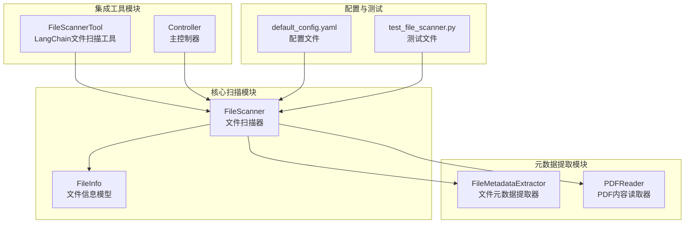
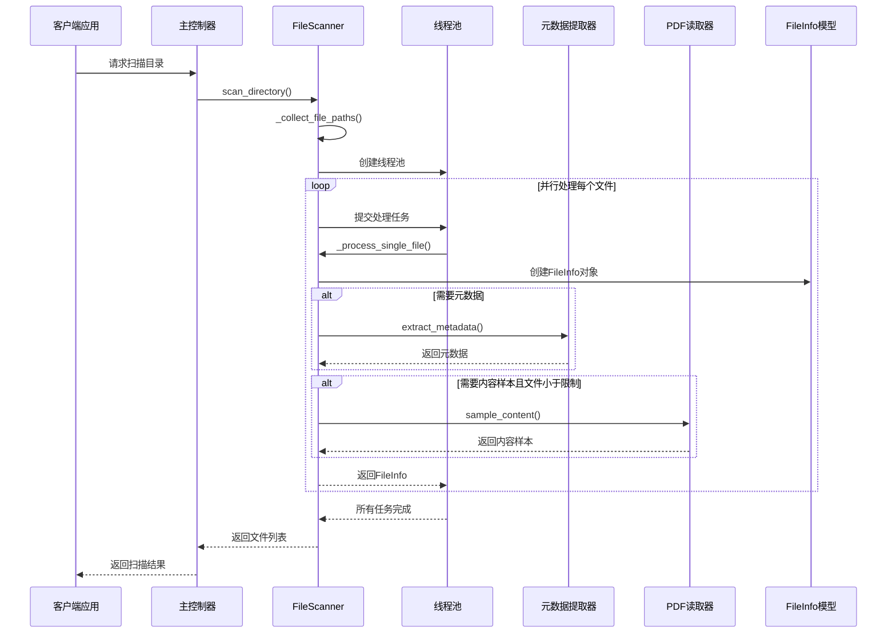
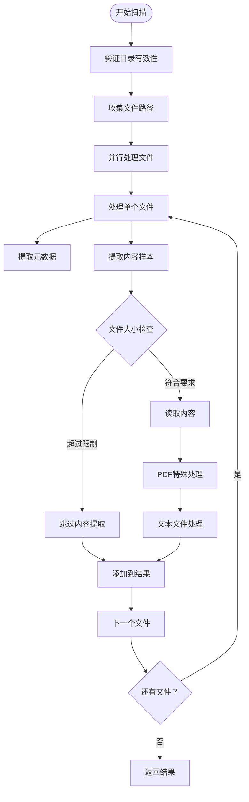
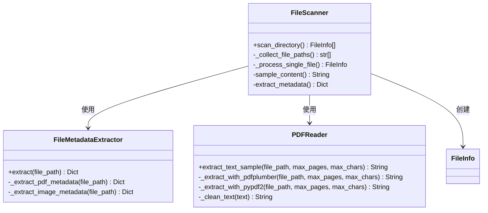
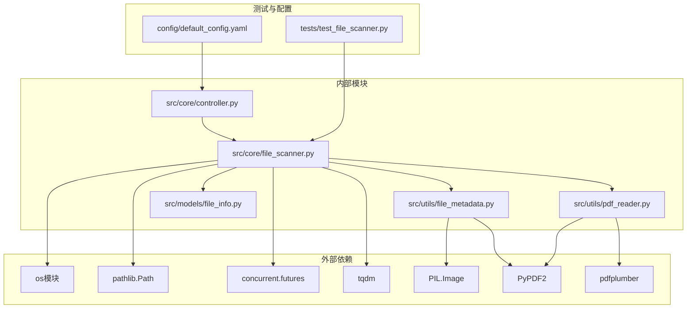

# 文件扫描与元数据提取

<cite>
**本文档引用的文件**
- [src/core/file_scanner.py](file://src/core/file_scanner.py)
- [src/utils/file_metadata.py](file://src/utils/file_metadata.py)
- [src/utils/pdf_reader.py](file://src/utils/pdf_reader.py)
- [src/models/file_info.py](file://src/models/file_info.py)
- [src/langchain_integration/tools/file_scanner_tool.py](file://src/langchain_integration/tools/file_scanner_tool.py)
- [src/core/controller.py](file://src/core/controller.py)
- [tests/test_file_scanner.py](file://tests/test_file_scanner.py)
- [config/default_config.yaml](file://config/default_config.yaml)
- [examples/basic_usage.py](file://examples/basic_usage.py)
</cite>

## 目录
1. [简介](#简介)
2. [项目结构](#项目结构)
3. [核心组件](#核心组件)
4. [架构概览](#架构概览)
5. [详细组件分析](#详细组件分析)
6. [依赖关系分析](#依赖关系分析)
7. [性能考虑](#性能考虑)
8. [故障排除指南](#故障排除指南)
9. [结论](#结论)

## 简介

本文档深入解析智能文件整理系统中的文件扫描与元数据提取功能。该系统提供了强大的文件扫描能力，支持递归扫描、多线程并发处理、灵活的文件过滤规则，以及全面的元数据提取算法。特别针对FileScanner类的实现进行了详细分析，包括其递归扫描机制、多线程并发处理策略、文件过滤规则和元数据提取算法。

系统的核心价值在于能够高效地扫描大量文件，提取关键元数据信息，并为后续的文件分类、整理和智能决策提供可靠的数据基础。通过PDFReader和FileMetadataExtractor的集成使用，系统能够处理多种文件格式，提供准确的内容样本和元数据信息。

## 项目结构

智能文件整理系统的文件扫描功能分布在多个核心模块中，形成了清晰的分层架构：



**图表来源**
- [src/core/file_scanner.py](file://src/core/file_scanner.py#L13-L196)
- [src/utils/file_metadata.py](file://src/utils/file_metadata.py#L10-L82)
- [src/utils/pdf_reader.py](file://src/utils/pdf_reader.py#L10-L113)
- [src/models/file_info.py](file://src/models/file_info.py#L9-L48)
- [src/langchain_integration/tools/file_scanner_tool.py](file://src/langchain_integration/tools/file_scanner_tool.py#L31-L115)
- [src/core/controller.py](file://src/core/controller.py#L15-L200)

**章节来源**
- [src/core/file_scanner.py](file://src/core/file_scanner.py#L1-L196)
- [src/utils/file_metadata.py](file://src/utils/file_metadata.py#L1-L82)
- [src/utils/pdf_reader.py](file://src/utils/pdf_reader.py#L1-L113)
- [src/models/file_info.py](file://src/models/file_info.py#L1-L48)

## 核心组件

### FileScanner类 - 文件扫描器

FileScanner是整个文件扫描功能的核心类，负责协调文件扫描、元数据提取和内容样本提取的完整流程。该类实现了以下关键功能：

- **递归目录扫描**：支持深度遍历子目录，受最大深度限制
- **多线程并发处理**：使用ThreadPoolExecutor实现并行文件处理
- **灵活的文件过滤**：支持基于扩展名的精确过滤
- **智能内容提取**：根据不同文件类型选择最优的提取策略

### FileMetadataExtractor类 - 文件元数据提取器

专门负责从各种文件格式中提取元数据信息，目前支持PDF和图像文件的元数据提取：

- **MIME类型检测**：自动识别文件类型
- **PDF元数据提取**：提取页面数量、标题、作者等信息
- **图像元数据提取**：提取尺寸、格式、EXIF信息等

### PDFReader类 - PDF内容读取器

专为PDF文件设计的内容提取器，采用双引擎策略确保最佳的文本提取效果：

- **双引擎降级策略**：优先使用pdfplumber，失败时自动切换到PyPDF2
- **智能文本清理**：去除特殊字符和多余空白
- **内容样本提取**：限制提取的字符数量，避免内存问题

### FileInfo模型 - 文件信息数据模型

使用Pydantic构建的强类型数据模型，标准化文件信息的存储和传输：

- **完整的文件属性**：路径、名称、扩展名、大小、时间戳
- **元数据容器**：支持可选的元数据字段
- **内容样本存储**：支持可选的内容样本字段
- **人性化显示**：提供易读的文件大小格式化

**章节来源**
- [src/core/file_scanner.py](file://src/core/file_scanner.py#L13-L196)
- [src/utils/file_metadata.py](file://src/utils/file_metadata.py#L10-L82)
- [src/utils/pdf_reader.py](file://src/utils/pdf_reader.py#L10-L113)
- [src/models/file_info.py](file://src/models/file_info.py#L9-L48)

## 架构概览

文件扫描系统的整体架构采用了分层设计，确保了功能的模块化和可维护性：



**图表来源**
- [src/core/controller.py](file://src/core/controller.py#L83-L107)
- [src/core/file_scanner.py](file://src/core/file_scanner.py#L28-L84)
- [src/utils/file_metadata.py](file://src/utils/file_metadata.py#L13-L31)
- [src/utils/pdf_reader.py](file://src/utils/pdf_reader.py#L13-L24)

该架构的关键优势在于：

1. **异步处理**：通过线程池实现真正的并行处理，显著提升扫描效率
2. **错误隔离**：单个文件处理失败不会影响整个扫描过程
3. **资源控制**：通过max_workers参数控制并发度，避免系统资源耗尽
4. **模块解耦**：各组件职责明确，便于独立测试和维护

## 详细组件分析

### FileScanner类详细分析

#### 初始化与配置

FileScanner类在初始化时接受两个关键参数：

- **max_file_size_mb**: 控制内容样本提取的文件大小上限，默认100MB
- **max_depth**: 控制递归扫描的最大深度，默认5层

这些参数直接影响系统的性能表现和资源消耗。

#### scan_directory方法详解

scan_directory方法是文件扫描的核心入口，具有以下参数配置：



**图表来源**
- [src/core/file_scanner.py](file://src/core/file_scanner.py#L28-L84)
- [src/core/file_scanner.py](file://src/core/file_scanner.py#L125-L148)

#### 递归扫描机制

FileScanner实现了智能的递归扫描机制，通过os.walk()遍历目录树，并结合深度控制确保扫描效率：

- **深度计算**：通过相对路径计算当前层级深度
- **深度限制**：超过max_depth的目录会被跳过
- **隐藏文件过滤**：自动忽略以点开头的隐藏文件

#### 多线程并发处理策略

系统采用ThreadPoolExecutor实现高效的并行处理：

- **固定线程池大小**：默认4个工作线程，可根据系统性能调整
- **进度监控**：使用tqdm提供实时进度显示
- **异常处理**：单个文件处理异常不影响整体扫描进程
- **资源管理**：自动管理线程生命周期和资源释放

#### 文件过滤规则

FileScanner实现了多层次的文件过滤机制：

1. **扩展名过滤**：支持精确的文件类型过滤
2. **隐藏文件过滤**：自动跳过系统隐藏文件
3. **深度过滤**：控制递归扫描的深度范围

#### 元数据提取算法

元数据提取采用统一的接口设计，支持不同文件类型的专门处理：



**图表来源**
- [src/core/file_scanner.py](file://src/core/file_scanner.py#L13-L196)
- [src/utils/file_metadata.py](file://src/utils/file_metadata.py#L10-L82)
- [src/utils/pdf_reader.py](file://src/utils/pdf_reader.py#L10-L113)

### 具体使用示例

#### 基本目录扫描

要扫描指定目录并获取所有文件信息，可以使用以下方式：

```python
from src.core.controller import Controller
from src.utils.config import ConfigManager

# 初始化配置和控制器
config = ConfigManager()
controller = Controller(config)

# 扫描目录
files = controller.scan_directory(
    directory='./test_files',
    recursive=False
)
```

#### 过滤特定扩展名文件

要只扫描特定类型的文件，可以使用扩展名过滤：

```python
# 只扫描PDF文件
files = controller.scan_directory(
    directory='./documents',
    extensions={'.pdf'}
)

# 扫描多种类型的文件
files = controller.scan_directory(
    directory='./media',
    extensions={'.pdf', '.jpg', '.png', '.txt'}
)
```

#### 提取PDF和文本文件的内容样本

对于需要内容分析的场景，可以启用内容样本提取：

```python
# 启用内容样本提取
scanner = FileScanner(max_file_size_mb=50, max_depth=3)

# 扫描并提取内容样本
files = scanner.scan_directory(
    directory='./documents',
    include_metadata=True,
    include_content=True
)

# 访问内容样本
for file_info in files:
    if file_info.content_sample:
        print(f"文件: {file_info.name}")
        print(f"内容样本: {file_info.content_sample[:200]}...")
```

### 集成使用方式

#### LangChain工具集成

FileScannerTool提供了与LangChain的无缝集成：

```python
from src.langchain_integration.tools.file_scanner_tool import FileScannerTool

# 创建扫描工具
scanner_tool = FileScannerTool()

# 执行扫描
result = scanner_tool.run(
    directory='/path/to/documents',
    recursive=True,
    extensions='.pdf,.docx,.txt',
    include_content=True
)
```

#### 配置驱动的使用

系统支持通过配置文件控制扫描行为：

```yaml
file_operations:
  max_file_size_mb: 100
  scan_max_depth: 5
  supported_extensions:
    - .pdf
    - .doc
    - .docx
    - .txt
```

**章节来源**
- [src/core/file_scanner.py](file://src/core/file_scanner.py#L28-L196)
- [src/langchain_integration/tools/file_scanner_tool.py](file://src/langchain_integration/tools/file_scanner_tool.py#L31-L115)
- [src/core/controller.py](file://src/core/controller.py#L83-L107)
- [config/default_config.yaml](file://config/default_config.yaml#L48-L66)

## 依赖关系分析

文件扫描系统的依赖关系体现了良好的模块化设计：



**图表来源**
- [src/core/file_scanner.py](file://src/core/file_scanner.py#L1-L11)
- [src/utils/file_metadata.py](file://src/utils/file_metadata.py#L1-L8)
- [src/utils/pdf_reader.py](file://src/utils/pdf_reader.py#L1-L8)
- [src/models/file_info.py](file://src/models/file_info.py#L1-L7)

### 关键依赖关系

1. **核心扫描依赖**：FileScanner依赖于FileMetadataExtractor和PDFReader进行数据提取
2. **模型依赖**：所有扫描结果都封装在FileInfo模型中，确保数据结构的一致性
3. **配置依赖**：Controller从配置文件读取扫描参数，实现配置驱动的行为
4. **测试依赖**：测试文件验证FileScanner的各种功能特性

**章节来源**
- [src/core/file_scanner.py](file://src/core/file_scanner.py#L1-L11)
- [src/utils/file_metadata.py](file://src/utils/file_metadata.py#L1-L8)
- [src/utils/pdf_reader.py](file://src/utils/pdf_reader.py#L1-L8)
- [src/models/file_info.py](file://src/models/file_info.py#L1-L7)

## 性能考虑

### 参数对性能的影响

#### max_file_size参数

max_file_size参数（以MB为单位）对系统性能有重要影响：

- **内存占用**：直接影响内容样本提取时的内存使用量
- **处理时间**：较大的文件需要更多时间进行内容提取
- **I/O压力**：大文件读取会增加磁盘I/O压力
- **默认值**：系统默认100MB，平衡了性能和功能需求

#### max_depth参数

max_depth参数控制递归扫描的深度：

- **扫描范围**：深度越大，扫描的文件数量越多
- **CPU开销**：深度增加会导致更多的目录遍历操作
- **内存使用**：深层递归可能需要更多的内存来存储路径信息
- **默认值**：系统默认5层，适用于大多数文件组织场景

### 并发处理优化

系统采用的多线程策略在性能方面表现出色：

- **线程池大小**：默认4个工作线程，适合大多数桌面环境
- **任务粒度**：每个文件作为一个独立任务，充分利用多核CPU
- **进度监控**：实时进度显示帮助用户了解处理状态
- **异常隔离**：单个文件处理失败不影响整体进度

### 内存管理策略

系统在内存管理方面采用了多项优化措施：

- **延迟加载**：默认不读取文件内容，只有在需要时才进行内容提取
- **字符限制**：内容样本默认限制在1000字符以内
- **资源清理**：自动管理文件句柄和临时资源的释放
- **错误恢复**：遇到不可读文件时优雅降级，继续处理其他文件

**章节来源**
- [src/core/file_scanner.py](file://src/core/file_scanner.py#L16-L25)
- [src/core/file_scanner.py](file://src/core/file_scanner.py#L154-L168)
- [config/default_config.yaml](file://config/default_config.yaml#L48-L51)

## 故障排除指南

### 常见问题及解决方案

#### 目录不存在或权限不足

当扫描目录不存在或没有访问权限时，系统会抛出相应的异常：

```python
try:
    files = scanner.scan_directory('/nonexistent/directory')
except FileNotFoundError as e:
    print(f"目录不存在: {e}")
except PermissionError as e:
    print(f"权限不足: {e}")
```

#### 大文件处理问题

对于超过max_file_size限制的大文件，系统会跳过内容提取：

```python
# 检查文件大小
if file_info.size > scanner.max_file_size:
    print(f"文件过大，跳过内容提取: {file_info.name}")
    # 只获取基本信息
```

#### 编码问题

文本文件可能出现编码问题，系统会自动尝试多种编码：

```python
# 支持的编码列表
encodings = ['utf-8', 'gbk', 'gb2312', 'latin-1']

# 自动编码检测
for encoding in encodings:
    try:
        with open(file_path, 'r', encoding=encoding) as f:
            content = f.read(max_chars)
            return content
    except UnicodeDecodeError:
        continue
```

#### PDF处理失败

PDF文件处理采用双引擎策略，确保可靠性：

```python
# 优先使用pdfplumber
try:
    return PDFReader._extract_with_pdfplumber(file_path, max_pages, max_chars)
except Exception:
    # 降级使用PyPDF2
    try:
        return PDFReader._extract_with_pypdf2(file_path, max_pages, max_chars)
    except Exception as e:
        return f"[无法提取文本: {str(e)}]"
```

### 调试和监控

系统提供了多种调试和监控手段：

- **进度条显示**：实时显示扫描进度
- **异常日志**：记录处理失败的文件和错误信息
- **配置验证**：检查配置参数的有效性
- **性能指标**：监控处理时间和资源使用情况

**章节来源**
- [src/core/file_scanner.py](file://src/core/file_scanner.py#L50-L54)
- [src/core/file_scanner.py](file://src/core/file_scanner.py#L146-L148)
- [src/utils/pdf_reader.py](file://src/utils/pdf_reader.py#L16-L24)

## 结论

智能文件整理系统的文件扫描与元数据提取功能展现了优秀的工程设计和实现质量。通过FileScanner类的递归扫描机制、多线程并发处理策略、灵活的文件过滤规则和全面的元数据提取算法，系统能够高效地处理各种文件组织场景。

系统的主要优势包括：

1. **高性能设计**：多线程并行处理确保了快速的扫描响应
2. **智能化过滤**：支持精确的文件类型过滤和深度控制
3. **鲁棒性保障**：双引擎PDF处理和多种编码支持提高了系统稳定性
4. **模块化架构**：清晰的组件分离便于维护和扩展
5. **配置驱动**：通过配置文件灵活调整系统行为

对于未来的改进方向，可以考虑：

- 增加更多文件格式的支持
- 实现增量扫描功能
- 优化内存使用策略
- 添加更详细的性能监控
- 支持更多自定义过滤规则

该系统为文件整理、内容分析和智能决策提供了坚实的技术基础，是现代文件管理系统的重要组成部分。