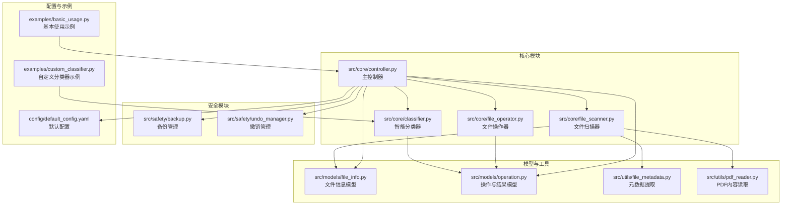
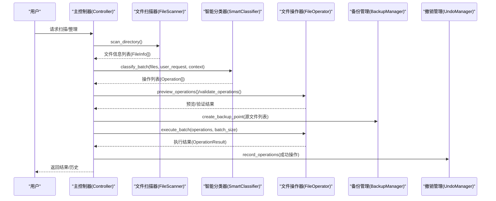
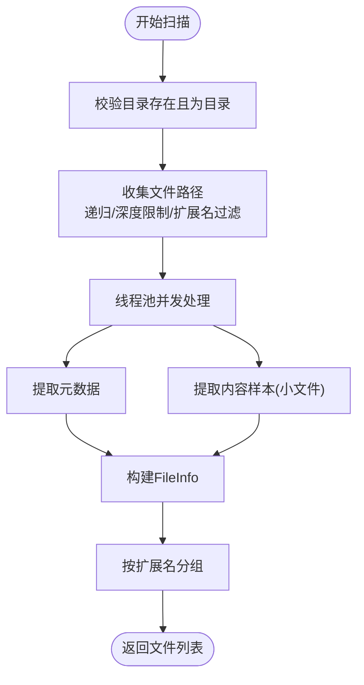
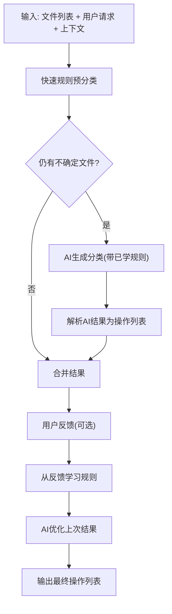
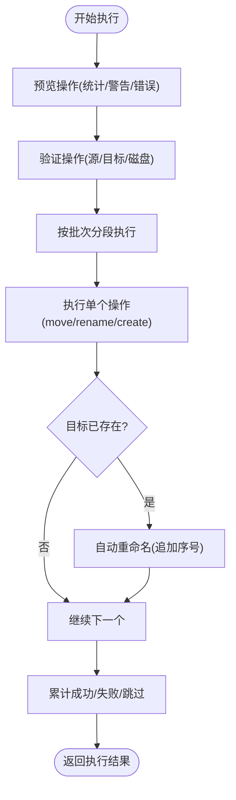
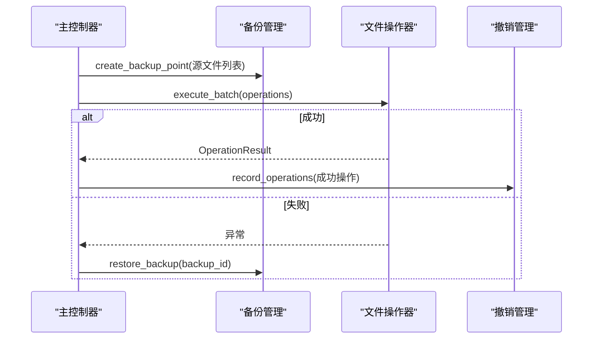
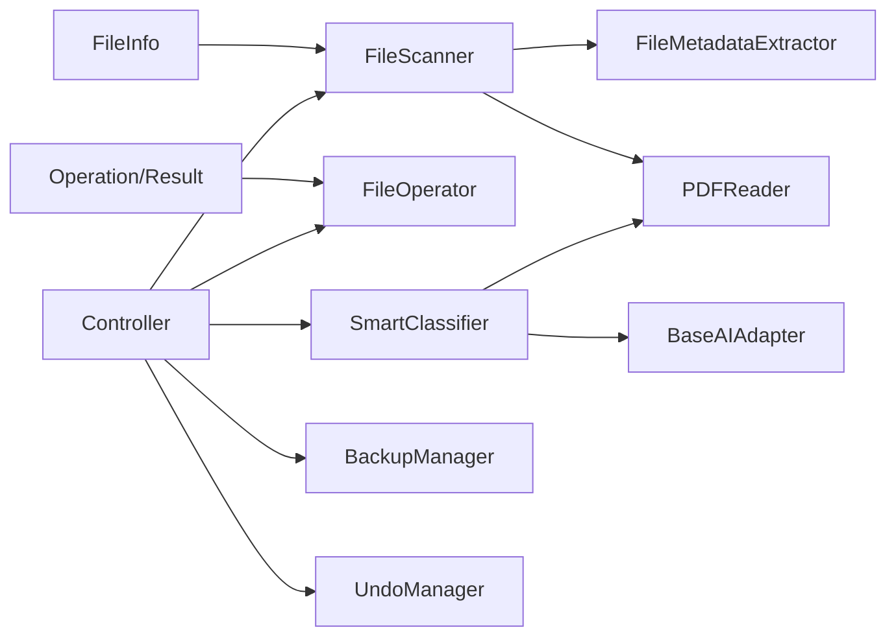
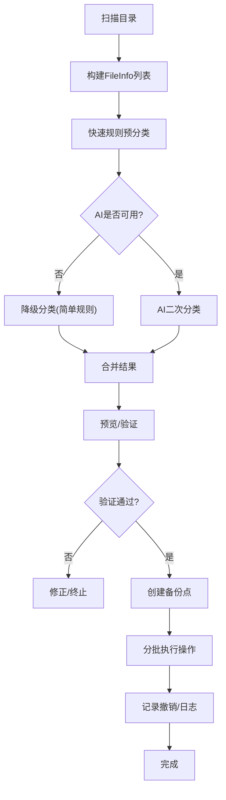

# 核心功能

<cite>
**本文引用的文件**
- [src/core/file_scanner.py](file://src/core/file_scanner.py)
- [src/core/classifier.py](file://src/core/classifier.py)
- [src/core/file_operator.py](file://src/core/file_operator.py)
- [src/core/controller.py](file://src/core/controller.py)
- [src/safety/backup.py](file://src/safety/backup.py)
- [src/safety/undo_manager.py](file://src/safety/undo_manager.py)
- [src/models/file_info.py](file://src/models/file_info.py)
- [src/models/operation.py](file://src/models/operation.py)
- [src/utils/file_metadata.py](file://src/utils/file_metadata.py)
- [src/utils/pdf_reader.py](file://src/utils/pdf_reader.py)
- [config/default_config.yaml](file://config/default_config.yaml)
- [examples/basic_usage.py](file://examples/basic_usage.py)
- [examples/custom_classifier.py](file://examples/custom_classifier.py)
- [tests/test_file_scanner.py](file://tests/test_file_scanner.py)
- [tests/test_classifier.py](file://tests/test_classifier.py)
- [tests/test_file_operator.py](file://tests/test_file_operator.py)
</cite>

## 目录
1. [简介](#简介)
2. [项目结构](#项目结构)
3. [核心组件](#核心组件)
4. [架构总览](#架构总览)
5. [详细组件分析](#详细组件分析)
6. [依赖关系分析](#依赖关系分析)
7. [性能考量](#性能考量)
8. [故障排查指南](#故障排查指南)
9. [结论](#结论)
10. [附录](#附录)

## 简介
本文件面向“智能文件整理助手”的核心功能模块，系统性阐述以下关键能力与实现细节：
- 文件扫描与元数据提取：递归扫描策略、并行处理、元数据与内容样本提取
- AI驱动的智能分类：快速规则预分类、AI二次分类、反馈优化与对话上下文
- 批量文件操作执行：预览与验证、分批执行、冲突处理与磁盘空间检查
- 安全保障机制：备份点创建与恢复、撤销管理、操作日志与错误回滚

同时给出模块间协作关系、数据流图、典型使用模式与配置项说明，帮助开发者与使用者高效上手并安全落地。

## 项目结构
核心模块位于 src/ 下，围绕“扫描—分类—执行—安全”主线组织：
- core：文件扫描、智能分类、文件操作、主控制器
- safety：备份管理、撤销管理、操作日志
- models：文件信息、操作与结果的数据模型
- utils：元数据提取、PDF内容读取等工具
- config：默认配置
- examples/tests：使用示例与单元测试

图表来源
- [src/core/file_scanner.py](file://src/core/file_scanner.py#L1-L196)
- [src/core/classifier.py](file://src/core/classifier.py#L1-L265)
- [src/core/file_operator.py](file://src/core/file_operator.py#L1-L246)
- [src/core/controller.py](file://src/core/controller.py#L1-L310)
- [src/safety/backup.py](file://src/safety/backup.py#L1-L152)
- [src/safety/undo_manager.py](file://src/safety/undo_manager.py#L1-L155)
- [src/models/file_info.py](file://src/models/file_info.py#L1-L48)
- [src/models/operation.py](file://src/models/operation.py#L1-L54)
- [src/utils/file_metadata.py](file://src/utils/file_metadata.py#L1-L82)
- [src/utils/pdf_reader.py](file://src/utils/pdf_reader.py#L1-L113)
- [config/default_config.yaml](file://config/default_config.yaml#L1-L79)
- [examples/basic_usage.py](file://examples/basic_usage.py#L1-L89)
- [examples/custom_classifier.py](file://examples/custom_classifier.py#L1-L84)

章节来源
- [src/core/file_scanner.py](file://src/core/file_scanner.py#L1-L196)
- [src/core/classifier.py](file://src/core/classifier.py#L1-L265)
- [src/core/file_operator.py](file://src/core/file_operator.py#L1-L246)
- [src/core/controller.py](file://src/core/controller.py#L1-L310)
- [src/safety/backup.py](file://src/safety/backup.py#L1-L152)
- [src/safety/undo_manager.py](file://src/safety/undo_manager.py#L1-L155)
- [src/models/file_info.py](file://src/models/file_info.py#L1-L48)
- [src/models/operation.py](file://src/models/operation.py#L1-L54)
- [src/utils/file_metadata.py](file://src/utils/file_metadata.py#L1-L82)
- [src/utils/pdf_reader.py](file://src/utils/pdf_reader.py#L1-L113)
- [config/default_config.yaml](file://config/default_config.yaml#L1-L79)
- [examples/basic_usage.py](file://examples/basic_usage.py#L1-L89)
- [examples/custom_classifier.py](file://examples/custom_classifier.py#L1-L84)

## 核心组件
- 文件扫描器：递归遍历目录、并行提取元数据与内容样本、按扩展名分组
- 智能分类器：快速规则预分类 + AI二次分类 + 反馈学习与优化
- 文件操作器：操作预览与验证、分批执行、冲突处理、磁盘空间检查
- 主控制器：编排扫描、分类、执行、备份与撤销，统一对外接口
- 安全模块：备份点管理、撤销栈、操作日志

章节来源
- [src/core/file_scanner.py](file://src/core/file_scanner.py#L13-L196)
- [src/core/classifier.py](file://src/core/classifier.py#L11-L265)
- [src/core/file_operator.py](file://src/core/file_operator.py#L12-L246)
- [src/core/controller.py](file://src/core/controller.py#L15-L310)
- [src/safety/backup.py](file://src/safety/backup.py#L10-L152)
- [src/safety/undo_manager.py](file://src/safety/undo_manager.py#L10-L155)

## 架构总览
整体工作流：扫描 → 分类 → 预览/验证 → 执行 → 记录日志/备份/撤销

图表来源
- [src/core/controller.py](file://src/core/controller.py#L83-L256)
- [src/core/file_scanner.py](file://src/core/file_scanner.py#L28-L84)
- [src/core/classifier.py](file://src/core/classifier.py#L24-L66)
- [src/core/file_operator.py](file://src/core/file_operator.py#L24-L100)
- [src/safety/backup.py](file://src/safety/backup.py#L23-L70)
- [src/safety/undo_manager.py](file://src/safety/undo_manager.py#L23-L49)

## 详细组件分析

### 文件扫描与元数据提取：FileScanner
- 递归扫描策略
  - 支持最大扫描深度限制，避免深层目录导致的性能问题
  - 可选扩展名过滤，跳过隐藏文件
  - 非递归仅扫描根目录，递归遍历子目录并按深度阈值剪枝
- 并行处理
  - 使用线程池并发处理每个文件，进度条可视化
  - 异常捕获与容错：单文件失败不影响整体扫描
- 元数据与内容样本
  - 元数据：MIME类型、PDF页数、作者、标题等；图片宽高、格式、EXIF等
  - 内容样本：PDF优先使用pdfplumber，其次PyPDF2；文本文件多编码尝试；二进制或异常返回提示
- 输出与分组
  - 返回 FileInfo 列表，提供按扩展名分组方法

图表来源
- [src/core/file_scanner.py](file://src/core/file_scanner.py#L28-L196)
- [src/utils/file_metadata.py](file://src/utils/file_metadata.py#L14-L31)
- [src/utils/pdf_reader.py](file://src/utils/pdf_reader.py#L14-L24)

章节来源
- [src/core/file_scanner.py](file://src/core/file_scanner.py#L16-L196)
- [src/utils/file_metadata.py](file://src/utils/file_metadata.py#L10-L82)
- [src/utils/pdf_reader.py](file://src/utils/pdf_reader.py#L10-L113)
- [tests/test_file_scanner.py](file://tests/test_file_scanner.py#L8-L68)

### AI驱动的智能分类：SmartClassifier
- 快速预分类 + AI二次分类
  - 基于规则与已知经验快速打标，剩余不确定项交由AI
  - AI不可用时降级为简单规则（如从用户请求提取目标文件夹名）
- 反馈学习与优化
  - 从用户反馈中抽取关键词规则，加入 learned_rules
  - 使用AI对上次结果+反馈进行优化，解析AI输出为标准操作列表
- 对话上下文
  - ConversationManager维护历史与上下文，便于多轮对话与个性化

图表来源
- [src/core/classifier.py](file://src/core/classifier.py#L24-L112)
- [src/core/classifier.py](file://src/core/classifier.py#L138-L208)
- [src/core/classifier.py](file://src/core/classifier.py#L232-L265)

章节来源
- [src/core/classifier.py](file://src/core/classifier.py#L11-L265)
- [examples/custom_classifier.py](file://examples/custom_classifier.py#L9-L84)
- [tests/test_classifier.py](file://tests/test_classifier.py#L8-L58)

### 批量文件操作执行：FileOperator
- 预览与验证
  - 统计操作类型、检查源文件存在性、目标存在性与目录创建需求
- 分批执行
  - 支持批次大小配置，默认每批若干个操作，统计成功/失败/跳过
- 冲突处理与安全
  - 目标存在时自动重命名（追加后缀），避免覆盖
  - 磁盘空间简单检查（可用空间与源文件大小）
  - dry-run模式仅模拟，不实际写入
- 操作类型
  - 移动、重命名、创建文件夹

图表来源
- [src/core/file_operator.py](file://src/core/file_operator.py#L24-L100)
- [src/core/file_operator.py](file://src/core/file_operator.py#L102-L246)

章节来源
- [src/core/file_operator.py](file://src/core/file_operator.py#L12-L246)
- [tests/test_file_operator.py](file://tests/test_file_operator.py#L9-L156)

### 安全保障机制：备份与撤销
- 备份管理
  - 创建备份点：记录文件清单、绝对路径、哈希、大小、修改时间等元信息
  - 列出/删除备份；恢复时检查文件是否被移动/修改
- 撤销管理
  - 记录最近一次操作批次的反向操作（移动→移回、重命名→改回、创建文件夹→删除空目录）
  - 支持撤销最后一批操作，失败计数统计
- 控制器集成
  - 执行前创建备份点，失败时尝试恢复；成功后记录撤销栈

图表来源
- [src/core/controller.py](file://src/core/controller.py#L203-L256)
- [src/safety/backup.py](file://src/safety/backup.py#L23-L70)
- [src/safety/undo_manager.py](file://src/safety/undo_manager.py#L23-L77)

章节来源
- [src/safety/backup.py](file://src/safety/backup.py#L10-L152)
- [src/safety/undo_manager.py](file://src/safety/undo_manager.py#L10-L155)
- [src/core/controller.py](file://src/core/controller.py#L203-L256)

### 主控制器：协调与编排
- 初始化阶段
  - 选择AI适配器或LangChain Agent模式，初始化扫描器、分类器、操作器、安全组件
  - 从配置读取扫描深度、最大文件大小、批大小等参数
- 工作流程
  - 扫描目录 → 生成方案 → 预览/验证 → 执行 → 记录日志/备份/撤销
  - 支持Agent模式下的文件分析、建议与聊天

章节来源
- [src/core/controller.py](file://src/core/controller.py#L15-L310)
- [config/default_config.yaml](file://config/default_config.yaml#L47-L79)

## 依赖关系分析
- 模型依赖
  - FileInfo/Operation/OperationResult 为跨模块通用数据契约
- 工具依赖
  - FileScanner 依赖 FileMetadataExtractor 与 PDFReader
  - Classifier 依赖 AI 适配器（BaseAIAdapter）与 PDFReader
  - FileOperator 依赖 Operation 类型
- 控制器耦合
  - Controller 统一编排各模块，并注入配置与安全组件

图表来源
- [src/models/file_info.py](file://src/models/file_info.py#L9-L48)
- [src/models/operation.py](file://src/models/operation.py#L18-L54)
- [src/core/file_scanner.py](file://src/core/file_scanner.py#L10-L11)
- [src/utils/file_metadata.py](file://src/utils/file_metadata.py#L10-L82)
- [src/utils/pdf_reader.py](file://src/utils/pdf_reader.py#L10-L113)
- [src/core/classifier.py](file://src/core/classifier.py#L6-L8)
- [src/core/controller.py](file://src/core/controller.py#L9-L12)

章节来源
- [src/models/file_info.py](file://src/models/file_info.py#L1-L48)
- [src/models/operation.py](file://src/models/operation.py#L1-L54)
- [src/core/file_scanner.py](file://src/core/file_scanner.py#L1-L11)
- [src/utils/file_metadata.py](file://src/utils/file_metadata.py#L1-L82)
- [src/utils/pdf_reader.py](file://src/utils/pdf_reader.py#L1-L113)
- [src/core/classifier.py](file://src/core/classifier.py#L1-L8)
- [src/core/controller.py](file://src/core/controller.py#L1-L12)

## 性能考量
- 扫描阶段
  - 并行线程池提升吞吐；深度限制与扩展名过滤降低IO压力
  - 大文件内容样本读取受 max_file_size_mb 限制，避免内存占用过高
- 分类阶段
  - 快速规则预分类减少AI调用次数；AI不可用时降级策略保证可用性
- 执行阶段
  - 分批执行降低内存峰值；冲突重命名避免阻塞
- I/O与磁盘
  - 磁盘空间检查为简单估算，实际执行仍需关注权限与挂载状态

[本节为通用指导，无需具体文件引用]

## 故障排查指南
- 扫描失败
  - 目录不存在或非目录：检查路径与权限
  - 单文件处理异常：查看日志输出，确认编码/格式支持
- 分类失败
  - AI不可用：检查网络/密钥/超时；观察降级行为
  - 结果解析失败：检查AI输出格式一致性
- 执行失败
  - 源文件不存在/目标非法：通过预览/验证提前发现
  - 磁盘空间不足：调整目标位置或清理空间
  - 冲突重命名：确认目标已存在且非预期覆盖
- 安全回滚
  - 备份恢复：若执行异常，尝试使用备份ID恢复
  - 撤销操作：确保撤销栈未清空，注意撤销失败计数

章节来源
- [src/core/file_scanner.py](file://src/core/file_scanner.py#L50-L54)
- [src/core/classifier.py](file://src/core/classifier.py#L58-L61)
- [src/core/file_operator.py](file://src/core/file_operator.py#L202-L246)
- [src/safety/backup.py](file://src/safety/backup.py#L72-L108)
- [src/safety/undo_manager.py](file://src/safety/undo_manager.py#L50-L76)

## 结论
该系统以“扫描—分类—执行—安全”为主线，通过并行化、规则预分类、AI降级、备份与撤销等机制，实现了稳定、可回滚、可优化的文件整理能力。配合配置中心与示例脚本，用户可在不同场景下灵活组合使用。

[本节为总结性内容，无需具体文件引用]

## 附录

### 配置选项与使用模式
- 默认配置要点
  - AI提供商与模型参数、LangChain Agent类型与工具参数、文件操作批大小与扫描深度、安全开关与日志级别
- 使用模式
  - 基本使用：扫描目录 → 生成方案 → 预览/验证 → 执行
  - 交互优化：提供反馈 → 分类器学习 → 重新生成方案
  - 撤销与恢复：执行前备份 → 失败时恢复 → 成功后记录撤销

章节来源
- [config/default_config.yaml](file://config/default_config.yaml#L1-L79)
- [examples/basic_usage.py](file://examples/basic_usage.py#L7-L89)
- [examples/custom_classifier.py](file://examples/custom_classifier.py#L49-L84)

### 关键流程图：从扫描到执行

图表来源
- [src/core/file_scanner.py](file://src/core/file_scanner.py#L28-L84)
- [src/core/classifier.py](file://src/core/classifier.py#L24-L66)
- [src/core/file_operator.py](file://src/core/file_operator.py#L24-L100)
- [src/core/controller.py](file://src/core/controller.py#L203-L256)