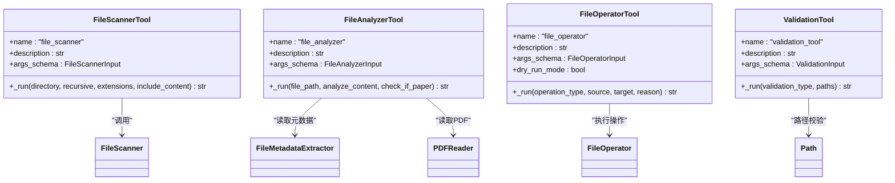

# LangChain Agent集成示例

<cite>
**本文引用的文件**
- [examples/langchain_example.py](file://examples/langchain_example.py)
- [src/langchain_integration/agent.py](file://src/langchain_integration/agent.py)
- [src/langchain_integration/prompts.py](file://src/langchain_integration/prompts.py)
- [src/langchain_integration/llm_factory.py](file://src/langchain_integration/llm_factory.py)
- [src/langchain_integration/tools/file_scanner_tool.py](file://src/langchain_integration/tools/file_scanner_tool.py)
- [src/langchain_integration/tools/file_analyzer_tool.py](file://src/langchain_integration/tools/file_analyzer_tool.py)
- [src/langchain_integration/tools/file_operator_tool.py](file://src/langchain_integration/tools/file_operator_tool.py)
- [src/langchain_integration/tools/validation_tool.py](file://src/langchain_integration/tools/validation_tool.py)
- [src/langchain_integration/content_analyzer.py](file://src/langchain_integration/content_analyzer.py)
- [src/langchain_integration/chains/classification_chain.py](file://src/langchain_integration/chains/classification_chain.py)
- [src/core/file_scanner.py](file://src/core/file_scanner.py)
- [src/core/file_operator.py](file://src/core/file_operator.py)
- [README.md](file://README.md)
</cite>

## 目录
1. [简介](#简介)
2. [项目结构](#项目结构)
3. [核心组件](#核心组件)
4. [架构总览](#架构总览)
5. [详细组件分析](#详细组件分析)
6. [依赖关系分析](#依赖关系分析)
7. [性能考量](#性能考量)
8. [故障排除指南](#故障排除指南)
9. [结论](#结论)
10. [附录](#附录)

## 简介
本指南围绕LangChain Agent在“智能文件整理助手”项目中的集成与应用展开，重点解释Agent模式的工作原理、ReAct推理机制、工具调用流程，并深入分析langchain_example.py中的Agent配置、工具集成、对话管理与决策过程。同时提供完整的Agent开发流程：环境搭建、工具开发、提示词工程、性能调优，以及复杂任务分解、多步推理、上下文记忆、错误恢复等高级功能的最佳实践与故障排除建议。

## 项目结构
该项目采用模块化分层架构，LangChain集成位于独立的langchain_integration包中，配合核心文件扫描与操作模块，形成“提示词模板 + LLM工厂 + 工具集合 + Agent编排”的完整链路。

图表来源
- [src/langchain_integration/agent.py](file://src/langchain_integration/agent.py#L21-L576)
- [src/langchain_integration/prompts.py](file://src/langchain_integration/prompts.py#L1-L232)
- [src/langchain_integration/llm_factory.py](file://src/langchain_integration/llm_factory.py#L1-L116)
- [src/langchain_integration/tools/file_scanner_tool.py](file://src/langchain_integration/tools/file_scanner_tool.py#L1-L115)
- [src/langchain_integration/tools/file_analyzer_tool.py](file://src/langchain_integration/tools/file_analyzer_tool.py#L1-L221)
- [src/langchain_integration/tools/file_operator_tool.py](file://src/langchain_integration/tools/file_operator_tool.py#L1-L148)
- [src/langchain_integration/tools/validation_tool.py](file://src/langchain_integration/tools/validation_tool.py#L1-L171)
- [src/langchain_integration/content_analyzer.py](file://src/langchain_integration/content_analyzer.py#L1-L403)
- [src/langchain_integration/chains/classification_chain.py](file://src/langchain_integration/chains/classification_chain.py#L1-L138)
- [src/core/file_scanner.py](file://src/core/file_scanner.py#L1-L196)
- [src/core/file_operator.py](file://src/core/file_operator.py#L1-L246)
- [examples/langchain_example.py](file://examples/langchain_example.py#L1-L279)

章节来源
- [README.md](file://README.md#L1-L290)

## 核心组件
- FileOrganizerAgent：核心智能决策引擎，负责任务编排、ReAct解析、工具调用与对话管理。
- LLMFactory：统一创建不同提供商（Claude、OpenAI、自定义、本地）的LLM实例。
- 工具集合：file_scanner、file_analyzer、file_operator、validation_tool，封装具体文件操作。
- ContentAnalyzer：基于LLM的内容分析器，提供分类、关键词抽取、摘要生成、论文识别等能力。
- ClassificationChain：面向文件列表的分类Chain，辅助Agent进行批量分类决策。
- 核心服务：FileScanner、FileOperator，提供底层文件扫描与安全操作能力。

章节来源
- [src/langchain_integration/agent.py](file://src/langchain_integration/agent.py#L21-L576)
- [src/langchain_integration/llm_factory.py](file://src/langchain_integration/llm_factory.py#L10-L116)
- [src/langchain_integration/tools/file_scanner_tool.py](file://src/langchain_integration/tools/file_scanner_tool.py#L31-L115)
- [src/langchain_integration/tools/file_analyzer_tool.py](file://src/langchain_integration/tools/file_analyzer_tool.py#L31-L221)
- [src/langchain_integration/tools/file_operator_tool.py](file://src/langchain_integration/tools/file_operator_tool.py#L32-L148)
- [src/langchain_integration/tools/validation_tool.py](file://src/langchain_integration/tools/validation_tool.py#L24-L171)
- [src/langchain_integration/content_analyzer.py](file://src/langchain_integration/content_analyzer.py#L14-L403)
- [src/langchain_integration/chains/classification_chain.py](file://src/langchain_integration/chains/classification_chain.py#L10-L138)
- [src/core/file_scanner.py](file://src/core/file_scanner.py#L13-L196)
- [src/core/file_operator.py](file://src/core/file_operator.py#L12-L246)

## 架构总览
Agent通过SYSTEM_PROMPT设定角色与工具边界，结合ReAct格式要求，引导LLM在“思考-行动-观察-反思”的循环中逐步完成复杂任务。Agent内部维护会话历史，支持对话交互与上下文记忆；工具层负责与文件系统交互，确保操作安全与可回滚。

图表来源
- [src/langchain_integration/agent.py](file://src/langchain_integration/agent.py#L300-L431)
- [src/langchain_integration/prompts.py](file://src/langchain_integration/prompts.py#L1-L133)
- [src/langchain_integration/tools/file_scanner_tool.py](file://src/langchain_integration/tools/file_scanner_tool.py#L48-L115)
- [src/langchain_integration/tools/file_analyzer_tool.py](file://src/langchain_integration/tools/file_analyzer_tool.py#L49-L221)
- [src/langchain_integration/tools/file_operator_tool.py](file://src/langchain_integration/tools/file_operator_tool.py#L60-L148)
- [src/langchain_integration/tools/validation_tool.py](file://src/langchain_integration/tools/validation_tool.py#L41-L171)

## 详细组件分析

### Agent核心：FileOrganizerAgent
- 角色与职责
  - 初始化LLM、内容分析器与工具集合，维护会话历史。
  - 根据用户请求判断是否为论文整理任务，构建任务提示。
  - 使用ReAct格式解析LLM输出，动态调用工具并推进任务。
  - 提供analyze_file、classify_files、suggest_organization、chat等高层接口。
- 关键流程
  - 任务判定：通过关键词规则判断是否默认论文整理。
  - 提示构建：根据任务类型拼接SYSTEM_PROMPT与任务指令。
  - ReAct执行：迭代调用LLM，解析Thought/Action/Action Input，执行工具，注入Observation。
  - 结果汇总：将最终答案或错误信息返回，并更新会话历史。
- 上下文与对话
  - chat接口维护最近N轮历史，支持连续对话与上下文延续。
  - clear_memory与get_chat_history便于调试与控制。

图表来源
- [src/langchain_integration/agent.py](file://src/langchain_integration/agent.py#L21-L576)

章节来源
- [src/langchain_integration/agent.py](file://src/langchain_integration/agent.py#L21-L576)

### LLM工厂：LLMFactory
- 支持提供商
  - claude：ChatAnthropic
  - openai：ChatOpenAI
  - custom：自定义OpenAI兼容API（需提供base_url、api_key、model）
  - local：Ollama本地模型
- 连接测试：提供test_connection方法，便于在部署前验证连通性。

图表来源
- [src/langchain_integration/llm_factory.py](file://src/langchain_integration/llm_factory.py#L10-L116)

章节来源
- [src/langchain_integration/llm_factory.py](file://src/langchain_integration/llm_factory.py#L10-L116)

### 工具层：file_scanner、file_analyzer、file_operator、validation_tool
- file_scanner_tool
  - 输入：directory、recursive、extensions、include_content
  - 输出：文件列表（含路径、名称、扩展名、大小、元数据、内容样本）
  - 限制：最多返回前100个文件，避免token过多
- file_analyzer_tool
  - 输入：file_path、analyze_content、check_if_paper
  - 输出：文件类型分析、元数据、内容样本、论文检测（基于规则+LLM）
- file_operator_tool
  - 输入：operation_type（move/rename/create_folder）、source、target、reason
  - 输出：操作结果（dry_run模式下返回模拟结果）
  - 安全：自动校验路径、避免覆盖、支持批量执行
- validation_tool
  - 输入：validation_type（file_exists/path_valid/disk_space）、paths
  - 输出：各路径存在性、有效性、磁盘空间使用情况

图表来源
- [src/langchain_integration/tools/file_scanner_tool.py](file://src/langchain_integration/tools/file_scanner_tool.py#L31-L115)
- [src/langchain_integration/tools/file_analyzer_tool.py](file://src/langchain_integration/tools/file_analyzer_tool.py#L31-L221)
- [src/langchain_integration/tools/file_operator_tool.py](file://src/langchain_integration/tools/file_operator_tool.py#L32-L148)
- [src/langchain_integration/tools/validation_tool.py](file://src/langchain_integration/tools/validation_tool.py#L24-L171)
- [src/core/file_scanner.py](file://src/core/file_scanner.py#L13-L196)
- [src/core/file_operator.py](file://src/core/file_operator.py#L12-L246)

章节来源
- [src/langchain_integration/tools/file_scanner_tool.py](file://src/langchain_integration/tools/file_scanner_tool.py#L31-L115)
- [src/langchain_integration/tools/file_analyzer_tool.py](file://src/langchain_integration/tools/file_analyzer_tool.py#L31-L221)
- [src/langchain_integration/tools/file_operator_tool.py](file://src/langchain_integration/tools/file_operator_tool.py#L32-L148)
- [src/langchain_integration/tools/validation_tool.py](file://src/langchain_integration/tools/validation_tool.py#L24-L171)
- [src/core/file_scanner.py](file://src/core/file_scanner.py#L13-L196)
- [src/core/file_operator.py](file://src/core/file_operator.py#L12-L246)

### 内容分析器：ContentAnalyzer
- 能力
  - analyze_file_content：提取元数据、读取内容、调用LLM进行内容分析
  - classify_content：将内容分类到指定类别
  - extract_keywords：提取关键词
  - summarize_content：生成摘要
  - identify_paper：识别PDF是否为学术论文并提取元信息
- 与Agent协作
  - Agent在需要深度分析时调用ContentAnalyzer，减少重复解析与LLM调用成本。

图表来源
- [src/langchain_integration/content_analyzer.py](file://src/langchain_integration/content_analyzer.py#L14-L403)

章节来源
- [src/langchain_integration/content_analyzer.py](file://src/langchain_integration/content_analyzer.py#L14-L403)

### 分类Chain：ClassificationChain
- 作用
  - 面向文件列表的分类决策，格式化文件信息，调用LLM生成分类建议
  - 提供suggest_categories：基于文件特征建议类别
- 与Agent协作
  - 当用户请求分类但未指定类别时，Agent可调用该Chain生成建议，再决定下一步操作。

图表来源
- [src/langchain_integration/chains/classification_chain.py](file://src/langchain_integration/chains/classification_chain.py#L10-L138)

章节来源
- [src/langchain_integration/chains/classification_chain.py](file://src/langchain_integration/chains/classification_chain.py#L10-L138)

### ReAct解析与错误恢复流程
- 解析逻辑
  - 从LLM输出中提取Thought、Action、Action Input，支持Final Answer结束
  - 对JSON解析失败进行容错（替换引号等），并提示重试
- 错误恢复
  - 工具不存在：提示正确工具名称
  - 工具执行失败：捕获异常并要求分析错误原因
  - 最大迭代次数：超时返回提示信息
  - 异常栈追踪：在verbose模式下打印详细堆栈

图表来源
- [src/langchain_integration/agent.py](file://src/langchain_integration/agent.py#L300-L431)

章节来源
- [src/langchain_integration/agent.py](file://src/langchain_integration/agent.py#L247-L431)

### 示例脚本：langchain_example.py
- 示例覆盖
  - 基本使用：Dry Run模式下的文件整理
  - 文件分析：单文件内容与论文特征分析
  - 整理建议：不执行操作的建议生成
  - 文件分类：指定类别的批量分类
  - 对话交互：多轮聊天与历史查看
  - 自定义API：DeepSeek等兼容API的Agent使用
  - 内容分析器：直接使用ContentAnalyzer进行分类、关键词提取、摘要生成
- 使用要点
  - 通过llm_provider与config选择LLM提供商
  - dry_run=True仅模拟，便于验证流程
  - verbose控制输出详细程度
  - chat接口支持上下文记忆，适合迭代优化

章节来源
- [examples/langchain_example.py](file://examples/langchain_example.py#L1-L279)

## 依赖关系分析
- 组件耦合
  - Agent依赖LLMFactory、Tools、ContentAnalyzer、Prompts
  - Tools依赖核心服务（FileScanner、FileOperator）与外部库（Pydantic、Path）
  - Chain与Agent相互补充：Chain专注静态文件列表的分类，Agent负责动态ReAct流程
- 外部依赖
  - LangChain（Core、Anthropic、OpenAI、Ollama）
  - Pydantic（参数校验）
  - PyPDF2/pdfplumber（PDF处理）
  - tqdm（进度显示）

图表来源
- [src/langchain_integration/agent.py](file://src/langchain_integration/agent.py#L1-L60)
- [src/langchain_integration/prompts.py](file://src/langchain_integration/prompts.py#L1-L232)
- [src/langchain_integration/llm_factory.py](file://src/langchain_integration/llm_factory.py#L1-L116)
- [src/langchain_integration/tools/file_scanner_tool.py](file://src/langchain_integration/tools/file_scanner_tool.py#L1-L115)
- [src/langchain_integration/tools/file_analyzer_tool.py](file://src/langchain_integration/tools/file_analyzer_tool.py#L1-L221)
- [src/langchain_integration/tools/file_operator_tool.py](file://src/langchain_integration/tools/file_operator_tool.py#L1-L148)
- [src/langchain_integration/tools/validation_tool.py](file://src/langchain_integration/tools/validation_tool.py#L1-L171)
- [src/langchain_integration/content_analyzer.py](file://src/langchain_integration/content_analyzer.py#L1-L403)
- [src/langchain_integration/chains/classification_chain.py](file://src/langchain_integration/chains/classification_chain.py#L1-L138)
- [src/core/file_scanner.py](file://src/core/file_scanner.py#L1-L196)
- [src/core/file_operator.py](file://src/core/file_operator.py#L1-L246)

## 性能考量
- 并行与批处理
  - FileScanner使用ThreadPoolExecutor并行处理文件信息提取，提升大规模目录扫描效率
  - FileOperator支持分批执行，避免一次性提交过多操作导致资源压力
- Token与输出控制
  - Tools对返回数量进行限制（如文件列表前100项），降低LLM输入长度
  - ContentAnalyzer对内容长度进行截断，避免LLM输入过大
- 连接与稳定性
  - LLMFactory提供test_connection，便于在部署阶段验证连通性
  - Agent对JSON解析失败进行容错，提高鲁棒性

章节来源
- [src/core/file_scanner.py](file://src/core/file_scanner.py#L61-L84)
- [src/core/file_operator.py](file://src/core/file_operator.py#L65-L100)
- [src/langchain_integration/tools/file_scanner_tool.py](file://src/langchain_integration/tools/file_scanner_tool.py#L93-L103)
- [src/langchain_integration/content_analyzer.py](file://src/langchain_integration/content_analyzer.py#L89-L117)
- [src/langchain_integration/llm_factory.py](file://src/langchain_integration/llm_factory.py#L99-L116)

## 故障排除指南
- 常见问题与定位
  - 工具调用失败：检查Action Input是否为合法JSON，确认工具名称是否正确
  - 文件不存在/路径无效：使用validation_tool进行预检，或启用dry_run模式验证
  - LLM连接失败：使用LLMFactory.test_connection验证API Key与网络
  - ReAct解析异常：开启verbose查看中间输出，检查Thought/Action格式
- 建议排查步骤
  - 启用verbose模式，观察每轮Thought与Observation
  - 使用dry_run模式先验证流程，再切换为真实执行
  - 对大目录使用file_scanner的extensions过滤，减少不必要的分析
  - 对长内容使用ContentAnalyzer的截断策略，避免LLM超限

章节来源
- [src/langchain_integration/agent.py](file://src/langchain_integration/agent.py#L386-L422)
- [src/langchain_integration/tools/validation_tool.py](file://src/langchain_integration/tools/validation_tool.py#L41-L171)
- [src/langchain_integration/llm_factory.py](file://src/langchain_integration/llm_factory.py#L99-L116)

## 结论
本项目通过LangChain Agent实现了“智能文件整理”的端到端解决方案：以SYSTEM_PROMPT定义Agent角色与工具边界，以ReAct机制驱动多步推理与工具调用，以工具层保障文件系统操作的安全与可回滚。配合内容分析器与分类Chain，Agent能够完成从论文识别、分类建议到批量整理的复杂任务。示例脚本提供了丰富的使用场景与最佳实践，便于开发者快速上手并扩展至更多业务场景。

## 附录

### Agent开发流程清单
- 环境搭建
  - 配置LLM提供商（Claude/OpenAI/自定义/本地），设置API Key与模型
  - 安装依赖并验证连接
- 工具开发
  - 基于BaseTool定义输入Schema与工具行为
  - 在dry_run模式下充分测试，确保安全与可回滚
- 提示词工程
  - 设计SYSTEM_PROMPT与任务专用Prompt，明确工具调用格式与终止条件
  - 为不同任务类型准备模板，支持动态拼接
- 性能调优
  - 控制输出长度与返回数量，合理分批执行
  - 使用并行与缓存策略，减少重复计算
- 高级功能
  - 复杂任务分解：将大任务拆分为若干子任务，逐步推进
  - 多步推理：在ReAct循环中注入上下文，提升决策质量
  - 上下文记忆：维护会话历史，支持连续对话与迭代优化
  - 错误恢复：对工具调用与JSON解析进行容错处理

章节来源
- [src/langchain_integration/prompts.py](file://src/langchain_integration/prompts.py#L1-L232)
- [src/langchain_integration/agent.py](file://src/langchain_integration/agent.py#L300-L431)
- [src/langchain_integration/llm_factory.py](file://src/langchain_integration/llm_factory.py#L10-L116)
- [examples/langchain_example.py](file://examples/langchain_example.py#L1-L279)