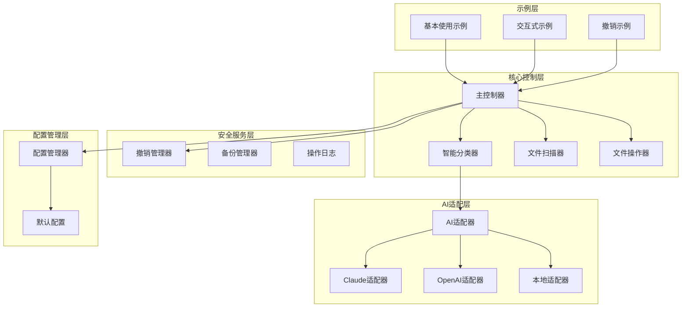
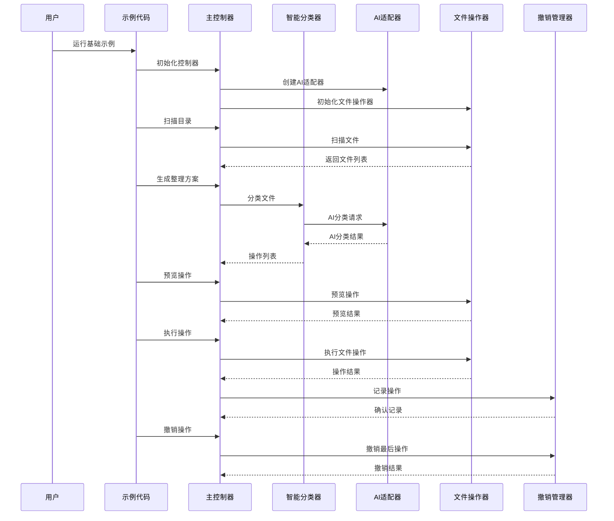
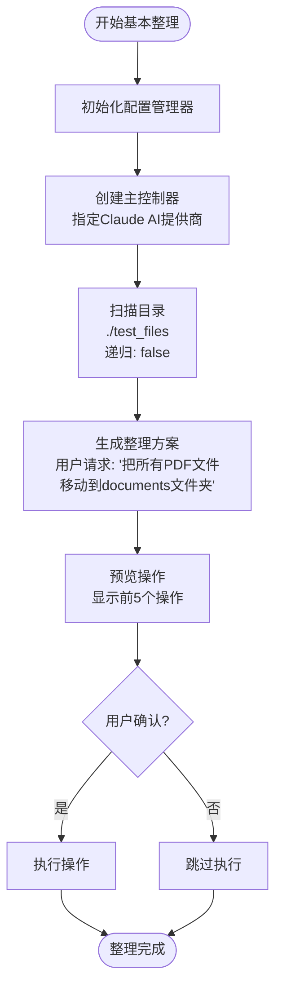
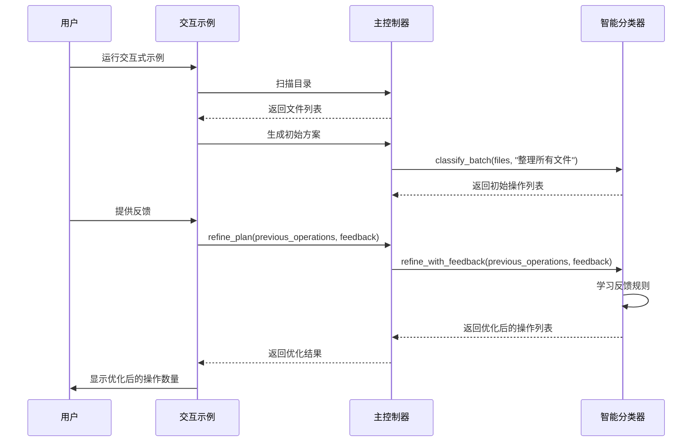
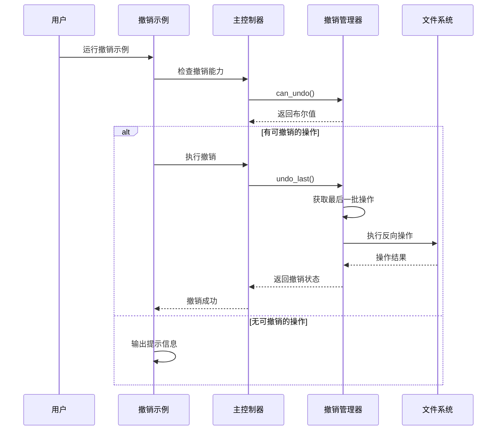
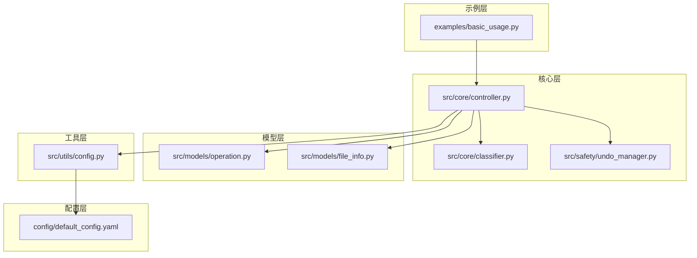

# 基础使用示例

<cite>
**本文引用的文件**
- [examples/basic_usage.py](file://examples/basic_usage.py)
- [src/core/controller.py](file://src/core/controller.py)
- [src/core/classifier.py](file://src/core/classifier.py)
- [src/safety/undo_manager.py](file://src/safety/undo_manager.py)
- [src/models/operation.py](file://src/models/operation.py)
- [src/utils/config.py](file://src/utils/config.py)
- [config/default_config.yaml](file://config/default_config.yaml)
- [README.md](file://README.md)
- [QUICKSTART.md](file://QUICKSTART.md)
</cite>

## 目录
1. [简介](#简介)
2. [项目结构](#项目结构)
3. [核心组件](#核心组件)
4. [架构概览](#架构概览)
5. [详细组件分析](#详细组件分析)
6. [依赖关系分析](#依赖关系分析)
7. [性能考虑](#性能考虑)
8. [故障排除指南](#故障排除指南)
9. [结论](#结论)
10. [附录](#附录)

## 简介

Smart File Tidy 是一个基于AI的智能文件分类和整理工具，支持自然语言交互和多种AI提供商。本文档专注于基础使用示例，深入解释基本整理流程、交互式整理、撤销操作等核心功能的实现。

该工具提供了三种主要的使用示例：
- 基本整理示例：展示标准的文件整理流程
- 交互式示例：演示多轮对话和反馈优化
- 撤销示例：说明操作撤销机制

## 项目结构

Smart File Tidy 采用模块化的架构设计，主要包含以下核心模块：



**图表来源**
- [examples/basic_usage.py](file://examples/basic_usage.py#L1-L89)
- [src/core/controller.py](file://src/core/controller.py#L1-L310)
- [src/core/classifier.py](file://src/core/classifier.py#L1-L265)
- [src/utils/config.py](file://src/utils/config.py#L1-L116)

**章节来源**
- [examples/basic_usage.py](file://examples/basic_usage.py#L1-L89)
- [src/core/controller.py](file://src/core/controller.py#L1-L310)
- [src/utils/config.py](file://src/utils/config.py#L1-L116)

## 核心组件

### 主控制器 (Controller)

主控制器是系统的核心协调器，负责管理各个组件之间的交互。它具备以下关键功能：

- **AI适配器管理**：支持Claude、OpenAI、本地模型等多种AI提供商
- **文件操作协调**：扫描、分类、执行文件操作
- **安全机制集成**：备份、日志、撤销管理
- **多模式支持**：传统模式和LangChain Agent模式

### 智能分类器 (SmartClassifier)

智能分类器使用AI技术对文件进行分类和整理决策：

- **批量分类**：同时处理多个文件的分类任务
- **反馈学习**：根据用户反馈优化分类结果
- **规则引擎**：结合AI和预定义规则进行分类
- **降级处理**：当AI不可用时提供简单分类方案

### 撤销管理器 (UndoManager)

撤销管理器提供安全的操作保护机制：

- **操作记录**：跟踪所有文件操作
- **反向操作**：为每种操作类型生成对应的撤销动作
- **历史管理**：维护操作历史记录
- **批量撤销**：支持撤销整个操作批次

**章节来源**
- [src/core/controller.py](file://src/core/controller.py#L15-L310)
- [src/core/classifier.py](file://src/core/classifier.py#L11-L265)
- [src/safety/undo_manager.py](file://src/safety/undo_manager.py#L10-L155)

## 架构概览

Smart File Tidy 采用分层架构设计，确保各层职责明确且松耦合：



**图表来源**
- [examples/basic_usage.py](file://examples/basic_usage.py#L7-L89)
- [src/core/controller.py](file://src/core/controller.py#L83-L310)
- [src/safety/undo_manager.py](file://src/safety/undo_manager.py#L50-L155)

## 详细组件分析

### 基本整理示例 (basic_organize_example)

基本整理示例展示了标准的文件整理流程，包含以下关键步骤：

#### 初始化阶段
1. **配置管理器初始化**：加载默认配置文件
2. **控制器创建**：指定AI提供商为Claude
3. **组件初始化**：自动创建AI适配器、文件扫描器、文件操作器

#### 目录扫描
使用 `scan_directory()` 方法扫描指定目录：
- 支持递归扫描和文件扩展名过滤
- 返回FileInfo对象列表
- 包含文件元数据和基本属性

#### 整理方案生成
通过 `generate_plan()` 方法生成操作计划：
- 解析用户需求描述
- 调用智能分类器进行文件分类
- 生成具体的文件操作列表

#### 操作预览
使用 `preview_operations()` 方法预览即将执行的操作：
- 显示操作类型和路径
- 提供操作摘要信息
- 支持批量预览和筛选

#### 执行流程图



**图表来源**
- [examples/basic_usage.py](file://examples/basic_usage.py#L7-L36)
- [src/core/controller.py](file://src/core/controller.py#L83-L140)

**章节来源**
- [examples/basic_usage.py](file://examples/basic_usage.py#L7-L36)
- [src/core/controller.py](file://src/core/controller.py#L83-L140)

### 交互式示例 (interactive_example)

交互式示例演示了多轮对话和反馈优化的完整流程：

#### 第一轮整理
1. **初始扫描**：获取当前目录下的所有文件
2. **生成方案**：基于"整理所有文件"的用户请求生成初步方案
3. **结果分析**：用户查看初步的分类结果

#### 反馈优化
用户提供的具体反馈："数字文件名的PDF不是论文，请单独分类"

#### 优化流程
1. **学习反馈**：智能分类器从反馈中提取规则
2. **重新分类**：基于新规则重新生成操作计划
3. **结果对比**：比较优化前后的分类差异

#### 交互流程图



**图表来源**
- [examples/basic_usage.py](file://examples/basic_usage.py#L38-L62)
- [src/core/classifier.py](file://src/core/classifier.py#L68-L112)

**章节来源**
- [examples/basic_usage.py](file://examples/basic_usage.py#L38-L62)
- [src/core/classifier.py](file://src/core/classifier.py#L68-L112)

### 撤销示例 (undo_example)

撤销示例展示了操作撤销的安全机制：

#### 撤销流程
1. **检查能力**：使用 `can_undo()` 方法检查是否有可撤销的操作
2. **执行撤销**：调用 `undo_last_operation()` 方法撤销最后一次操作
3. **结果确认**：验证撤销操作的成功状态

#### 撤销机制
撤销管理器为每种操作类型提供对应的反向操作：
- **移动操作**：将文件移回原始位置
- **重命名操作**：恢复文件的原始名称
- **文件夹创建**：删除空的文件夹

#### 撤销序列图



**图表来源**
- [examples/basic_usage.py](file://examples/basic_usage.py#L64-L77)
- [src/safety/undo_manager.py](file://src/safety/undo_manager.py#L50-L155)

**章节来源**
- [examples/basic_usage.py](file://examples/basic_usage.py#L64-L77)
- [src/safety/undo_manager.py](file://src/safety/undo_manager.py#L50-L155)

## 依赖关系分析

### 组件依赖图



**图表来源**
- [examples/basic_usage.py](file://examples/basic_usage.py#L1-L89)
- [src/core/controller.py](file://src/core/controller.py#L1-L310)
- [src/safety/undo_manager.py](file://src/safety/undo_manager.py#L1-L155)

### 关键配置参数

#### AI提供商配置
- **默认提供商**：claude
- **模型选择**：claude-3-5-sonnet-20241022
- **温度参数**：0.7
- **最大令牌数**：4096

#### 文件操作配置
- **批处理大小**：50
- **最大文件大小**：100MB
- **扫描最大深度**：5
- **支持的文件扩展名**：PDF、DOC、TXT、图片等

#### 安全配置
- **确认要求**：true
- **自动备份**：true
- **最大撤销历史**：10

**章节来源**
- [config/default_config.yaml](file://config/default_config.yaml#L1-L79)
- [src/utils/config.py](file://src/utils/config.py#L76-L116)

## 性能考虑

### 批处理优化
系统采用批处理机制来提高文件操作效率：
- **默认批大小**：50个操作
- **内存管理**：避免一次性加载过多文件
- **进度反馈**：提供操作进度和状态信息

### 缓存和预处理
- **文件元数据缓存**：减少重复的文件系统查询
- **AI响应缓存**：避免重复的AI计算
- **规则学习缓存**：保存用户反馈的学习结果

### 错误处理和恢复
- **操作验证**：在执行前验证操作的有效性
- **自动备份**：在执行前创建备份点
- **异常恢复**：发生错误时自动恢复到备份状态

## 故障排除指南

### 常见问题及解决方案

#### 1. AI提供商连接失败
**症状**：初始化控制器时报错
**解决方案**：
- 检查环境变量配置
- 验证API密钥有效性
- 确认网络连接正常

#### 2. 文件扫描失败
**症状**：扫描目录时抛出异常
**解决方案**：
- 检查目录权限
- 验证目录路径正确性
- 减少扫描深度或文件大小限制

#### 3. 撤销操作失败
**症状**：撤销时出现文件不存在错误
**解决方案**：
- 检查文件是否被外部程序修改
- 验证撤销历史记录
- 手动恢复文件到原始位置

#### 4. 操作预览不准确
**症状**：预览结果与预期不符
**解决方案**：
- 提供更详细的用户需求描述
- 使用交互式模式获取反馈
- 检查文件元数据和内容分析

### 调试技巧

#### 启用详细日志
```python
# 在配置中设置日志级别
config.set('logging.level', 'DEBUG')
```

#### 模拟执行模式
```python
# 使用dry_run模式预览操作而不实际执行
controller.execute_operations(operations, create_backup=False)
```

#### 操作历史追踪
```python
# 查看最近的操作历史
history = controller.get_operation_history(20)
for record in history:
    print(f"时间: {record['timestamp']}, 操作: {record['operation']['type']}")
```

**章节来源**
- [src/core/controller.py](file://src/core/controller.py#L203-L256)
- [src/safety/undo_manager.py](file://src/safety/undo_manager.py#L122-L155)

## 结论

Smart File Tidy 的基础使用示例展示了完整的文件整理工作流程，包括基本整理、交互式优化和安全撤销等核心功能。通过这些示例，用户可以：

1. **快速上手**：理解基本的文件整理流程
2. **迭代优化**：学会使用反馈改进整理结果
3. **安全保障**：掌握撤销机制的使用方法
4. **最佳实践**：遵循安全和效率的使用原则

建议初学者按照以下顺序学习：
1. 运行基本整理示例，理解标准流程
2. 尝试交互式示例，体验反馈优化
3. 学习撤销机制，确保操作安全
4. 结合实际需求调整配置参数

## 附录

### 实际运行截图

由于本文档为技术文档，不包含实际的运行截图。建议用户按照以下步骤获取示例输出：

#### 基本整理示例输出
```
扫描目录...
发现 4 个文件

生成整理方案...

将执行 2 个操作：
  move: report_2023.pdf -> documents/report_2023.pdf
  move: invoice_2024.pdf -> documents/invoice_2024.pdf
```

#### 交互式示例输出
```
优化后的方案包含 3 个操作
```

#### 撤销示例输出
```
撤销完成: 成功 2, 失败 0
```

### 最佳实践建议

1. **先预览后执行**：始终使用预览功能检查操作结果
2. **使用交互式模式**：通过多轮对话获得更精确的整理结果
3. **定期备份**：重要文件建议手动备份
4. **分批处理**：大量文件时分批次整理，避免系统过载
5. **监控日志**：关注操作日志，及时发现和解决问题

### 相关文档链接

- [快速开始指南](file://QUICKSTART.md)
- [使用指南](file://README.md)
- [配置说明](file://config/default_config.yaml)