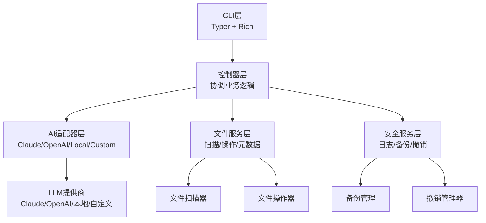
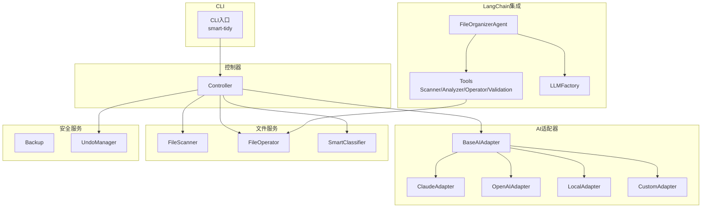
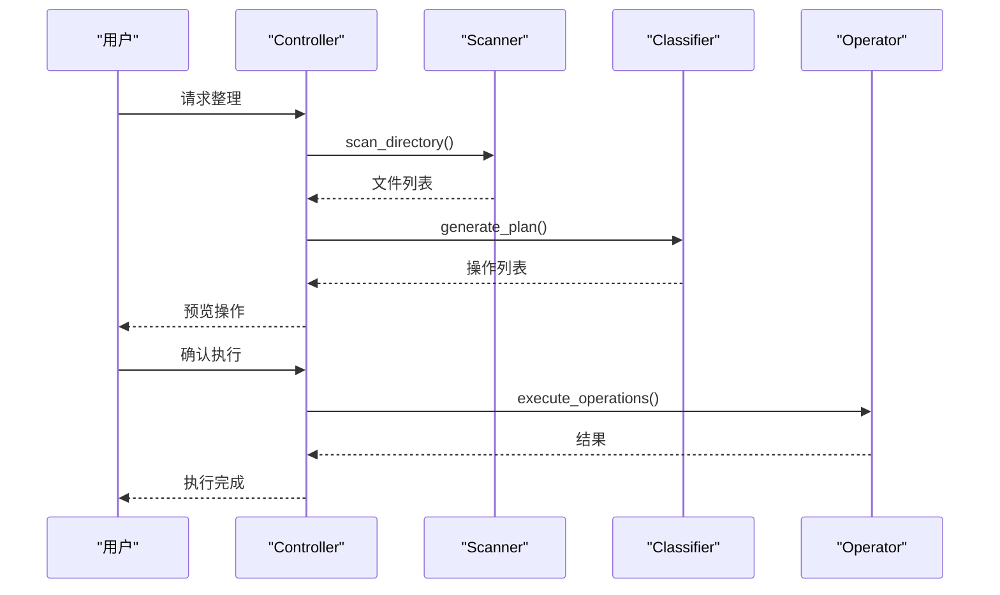
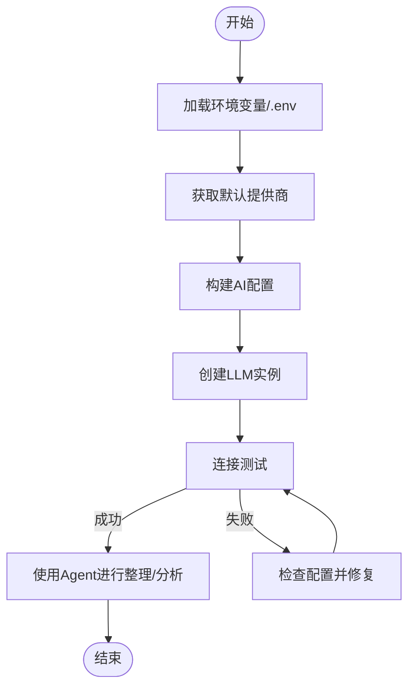
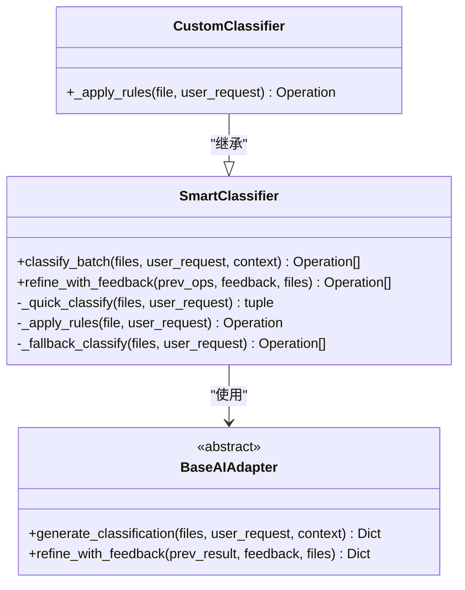
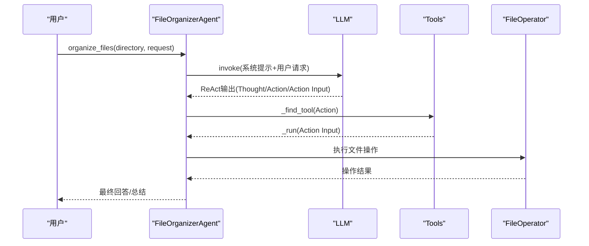

# 示例和最佳实践

<cite>
**本文引用的文件**
- [README.md](file://README.md)
- [examples/basic_usage.py](file://examples/basic_usage.py)
- [examples/custom_api_example.py](file://examples/custom_api_example.py)
- [examples/custom_classifier.py](file://examples/custom_classifier.py)
- [examples/langchain_example.py](file://examples/langchain_example.py)
- [examples/test_custom_api.py](file://examples/test_custom_api.py)
- [config/default_config.yaml](file://config/default_config.yaml)
- [docs/USAGE.md](file://docs/USAGE.md)
- [docs/CUSTOM_API.md](file://docs/CUSTOM_API.md)
- [docs/CUSTOM_API_LANGCHAIN.md](file://docs/CUSTOM_API_LANGCHAIN.md)
- [src/core/classifier.py](file://src/core/classifier.py)
- [src/langchain_integration/agent.py](file://src/langchain_integration/agent.py)
- [src/utils/config.py](file://src/utils/config.py)
- [src/ai/base_adapter.py](file://src/ai/base_adapter.py)
- [src/langchain_integration/tools/file_operator_tool.py](file://src/langchain_integration/tools/file_operator_tool.py)
- [src/models/file_info.py](file://src/models/file_info.py)
- [src/safety/undo_manager.py](file://src/safety/undo_manager.py)
</cite>

## 目录
1. [简介](#简介)
2. [项目结构](#项目结构)
3. [核心组件](#核心组件)
4. [架构总览](#架构总览)
5. [详细组件分析](#详细组件分析)
6. [依赖关系分析](#依赖关系分析)
7. [性能考虑](#性能考虑)
8. [故障排查指南](#故障排查指南)
9. [结论](#结论)
10. [附录](#附录)

## 简介
本指南面向希望系统掌握“智能文件整理助手”的开发者与使用者，提供从基础到高级的完整示例与最佳实践。内容涵盖：
- 基础使用示例：单次整理、交互式整理、撤销示例
- 自定义API集成示例：Azure OpenAI、通义千问、DeepSeek、自部署模型
- 自定义分类器开发示例：扩展规则、批量分类、反馈优化
- LangChain Agent集成示例：Agent基本使用、文件分析、建议生成、对话交互、内容分析器
- 性能优化建议、安全使用指南、错误处理最佳实践
- 实际应用场景案例、自动化脚本示例、CI/CD集成方案

## 项目结构
项目采用模块化分层设计，CLI层负责用户交互，控制器层协调业务逻辑，AI适配器层提供多提供商支持，文件服务层负责扫描与操作，安全服务层保障操作安全与可恢复。

图表来源
- [README.md](file://README.md#L220-L241)
- [src/utils/config.py](file://src/utils/config.py#L10-L116)
- [src/core/classifier.py](file://src/core/classifier.py#L11-L265)
- [src/safety/undo_manager.py](file://src/safety/undo_manager.py#L10-L155)

章节来源
- [README.md](file://README.md#L220-L241)
- [docs/USAGE.md](file://docs/USAGE.md#L57-L122)

## 核心组件
- 配置管理器：统一加载与合并环境变量与配置文件，支持多提供商参数注入
- 智能分类器：结合规则与AI生成分类方案，支持反馈优化
- LangChain Agent：ReAct执行流程，工具链式调用，支持论文整理默认模式
- 文件操作工具：封装移动、重命名、创建文件夹等操作，支持干运行与校验
- 撤销管理器：记录操作并生成反向操作，支持批量撤销

章节来源
- [src/utils/config.py](file://src/utils/config.py#L10-L116)
- [src/core/classifier.py](file://src/core/classifier.py#L11-L265)
- [src/langchain_integration/agent.py](file://src/langchain_integration/agent.py#L21-L576)
- [src/langchain_integration/tools/file_operator_tool.py](file://src/langchain_integration/tools/file_operator_tool.py#L32-L148)
- [src/safety/undo_manager.py](file://src/safety/undo_manager.py#L10-L155)

## 架构总览
下图展示了CLI、控制器、AI适配器、文件服务与安全服务之间的交互关系，以及LangChain Agent的工具链调用流程。

图表来源
- [README.md](file://README.md#L220-L241)
- [src/langchain_integration/agent.py](file://src/langchain_integration/agent.py#L21-L576)
- [src/langchain_integration/tools/file_operator_tool.py](file://src/langchain_integration/tools/file_operator_tool.py#L32-L148)
- [src/ai/base_adapter.py](file://src/ai/base_adapter.py#L9-L70)

## 详细组件分析

### 基础使用示例
- 单次整理：扫描目录、生成方案、预览操作
- 交互式整理：两轮迭代，根据反馈优化
- 撤销示例：检查可撤销状态并执行撤销

图表来源
- [examples/basic_usage.py](file://examples/basic_usage.py#L7-L36)
- [src/core/classifier.py](file://src/core/classifier.py#L24-L66)
- [src/safety/undo_manager.py](file://src/safety/undo_manager.py#L50-L76)

章节来源
- [examples/basic_usage.py](file://examples/basic_usage.py#L7-L77)
- [docs/USAGE.md](file://docs/USAGE.md#L57-L122)

### 自定义API集成示例
- Azure OpenAI、通义千问、DeepSeek、自部署模型的配置与使用
- 通过ConfigManager动态注入API Key、Base URL、Model
- 与LangChain Agent配合进行对话与文件分析

图表来源
- [examples/custom_api_example.py](file://examples/custom_api_example.py#L7-L81)
- [src/utils/config.py](file://src/utils/config.py#L76-L111)
- [examples/test_custom_api.py](file://examples/test_custom_api.py#L24-L86)

章节来源
- [examples/custom_api_example.py](file://examples/custom_api_example.py#L7-L81)
- [docs/CUSTOM_API.md](file://docs/CUSTOM_API.md#L101-L174)
- [docs/CUSTOM_API_LANGCHAIN.md](file://docs/CUSTOM_API_LANGCHAIN.md#L170-L213)

### 自定义分类器开发示例
- 继承SmartClassifier，实现规则匹配与批量分类
- 支持年份分类、大文件单独存放等业务规则
- 与AI适配器协作，无法匹配时回退到AI或简单规则

图表来源
- [src/core/classifier.py](file://src/core/classifier.py#L11-L265)
- [src/ai/base_adapter.py](file://src/ai/base_adapter.py#L9-L70)
- [examples/custom_classifier.py](file://examples/custom_classifier.py#L9-L47)

章节来源
- [examples/custom_classifier.py](file://examples/custom_classifier.py#L9-L76)
- [src/core/classifier.py](file://src/core/classifier.py#L11-L265)

### LangChain Agent集成示例
- Agent基本使用：ReAct执行流程，工具链调用
- 文件分析与建议生成：扫描、分析、分类、对话
- 内容分析器：关键词提取、摘要生成、内容分类

图表来源
- [examples/langchain_example.py](file://examples/langchain_example.py#L9-L38)
- [src/langchain_integration/agent.py](file://src/langchain_integration/agent.py#L100-L228)
- [src/langchain_integration/tools/file_operator_tool.py](file://src/langchain_integration/tools/file_operator_tool.py#L60-L134)

章节来源
- [examples/langchain_example.py](file://examples/langchain_example.py#L9-L279)
- [src/langchain_integration/agent.py](file://src/langchain_integration/agent.py#L21-L576)

## 依赖关系分析
- 配置管理器优先从环境变量加载敏感信息，再合并配置文件，确保灵活性与安全性
- 智能分类器依赖AI适配器生成分类方案，同时维护学习规则，支持反馈优化
- LangChain Agent依赖LLM工厂创建不同提供商的LLM，工具链封装文件系统操作
- 安全服务通过撤销管理器记录操作并生成反向操作，保障可恢复性

图表来源
- [src/utils/config.py](file://src/utils/config.py#L76-L111)
- [src/langchain_integration/agent.py](file://src/langchain_integration/agent.py#L45-L52)
- [src/langchain_integration/tools/file_operator_tool.py](file://src/langchain_integration/tools/file_operator_tool.py#L32-L53)
- [src/safety/undo_manager.py](file://src/safety/undo_manager.py#L23-L49)

章节来源
- [src/utils/config.py](file://src/utils/config.py#L10-L116)
- [src/langchain_integration/agent.py](file://src/langchain_integration/agent.py#L21-L60)

## 性能考虑
- 扫描深度与文件大小限制：减少内容读取与扫描范围
- 温度与Token上限：平衡准确性与速度
- 批处理大小：控制每次操作数量，避免超时
- 干运行模式：先模拟执行，再正式执行
- 工具链参数：限制扫描文件数与内容分析长度

章节来源
- [docs/USAGE.md](file://docs/USAGE.md#L203-L222)
- [config/default_config.yaml](file://config/default_config.yaml#L26-L79)
- [docs/CUSTOM_API_LANGCHAIN.md](file://docs/CUSTOM_API_LANGCHAIN.md#L270-L312)

## 故障排查指南
- 环境变量检查：确认DEFAULT_AI_PROVIDER、API地址、Key、模型名称
- 配置文件加载：确保default_config.yaml存在且可读
- LLM连接测试：通过简单消息验证连通性
- Agent工具链：确认工具可用、参数合法
- 错误处理：捕获ValueError与通用异常，区分配置错误与执行错误
- 撤销与日志：利用撤销管理器回滚，检查操作日志定位问题

章节来源
- [examples/test_custom_api.py](file://examples/test_custom_api.py#L24-L86)
- [examples/test_custom_api.py](file://examples/test_custom_api.py#L130-L159)
- [examples/test_custom_api.py](file://examples/test_custom_api.py#L197-L231)
- [src/safety/undo_manager.py](file://src/safety/undo_manager.py#L50-L76)

## 结论
本指南提供了从基础使用到高级集成的完整实践路径。通过合理配置与工具链组合，用户可以实现稳定、可扩展、可恢复的文件整理自动化。建议在生产环境中结合性能优化与安全策略，持续监控与迭代。

## 附录

### 常用命令与配置要点
- CLI命令参考与帮助
- 配置文件位置与关键字段
- 自定义API配置模板与测试脚本

章节来源
- [README.md](file://README.md#L149-L162)
- [docs/USAGE.md](file://docs/USAGE.md#L230-L245)
- [config/default_config.yaml](file://config/default_config.yaml#L1-L79)
- [docs/CUSTOM_API.md](file://docs/CUSTOM_API.md#L101-L174)

### 实际应用场景与自动化脚本
- 下载文件夹整理：交互式模式，逐步优化
- 按类型分类：单次整理，指定目标文件夹
- 清理旧文件：删除策略与预览
- 项目代码分类：依据项目文件结构自动归类

章节来源
- [README.md](file://README.md#L163-L196)
- [docs/USAGE.md](file://docs/USAGE.md#L150-L177)

### CI/CD集成方案
- 在流水线中执行测试脚本验证自定义API配置
- 使用干运行模式在PR阶段验证Agent行为
- 结合性能配置与日志输出，便于问题追踪

章节来源
- [examples/test_custom_api.py](file://examples/test_custom_api.py#L303-L348)
- [docs/CUSTOM_API_LANGCHAIN.md](file://docs/CUSTOM_API_LANGCHAIN.md#L313-L420)