# 自定义API集成示例

<cite>
**本文档引用的文件**
- [custom_api_example.py](file://examples/custom_api_example.py)
- [custom_adapter.py](file://src/ai/custom_adapter.py)
- [base_adapter.py](file://src/ai/base_adapter.py)
- [adapter_factory.py](file://src/ai/adapter_factory.py)
- [config.py](file://src/utils/config.py)
- [default_config.yaml](file://config/default_config.yaml)
- [CUSTOM_API.md](file://docs/CUSTOM_API.md)
- [test_custom_api.py](file://examples/test_custom_api.py)
- [agent.py](file://src/langchain_integration/agent.py)
- [file_info.py](file://src/models/file_info.py)
- [requirements.txt](file://requirements.txt)
- [README.md](file://README.md)
</cite>

## 目录
1. [简介](#简介)
2. [项目结构](#项目结构)
3. [核心组件](#核心组件)
4. [架构概览](#架构概览)
5. [详细组件分析](#详细组件分析)
6. [依赖关系分析](#依赖关系分析)
7. [性能考虑](#性能考虑)
8. [故障排除指南](#故障排除指南)
9. [结论](#结论)

## 简介

本文档提供了基于智能文件整理助手项目的自定义API集成综合指南。该项目是一个基于AI的智能文件分类和整理工具，支持多种AI提供商，包括Claude、OpenAI、本地模型以及任何兼容OpenAI API格式的第三方服务。

该工具的核心创新在于其灵活的适配器架构，允许开发者轻松扩展以支持新的AI服务提供商。本文档将深入分析CustomAPIAdapter的实现思路、接口规范、认证机制和错误处理策略，并提供完整的自定义适配器开发流程、测试方法和部署策略。

## 项目结构

智能文件整理助手采用模块化的架构设计，主要分为以下几个核心层次：

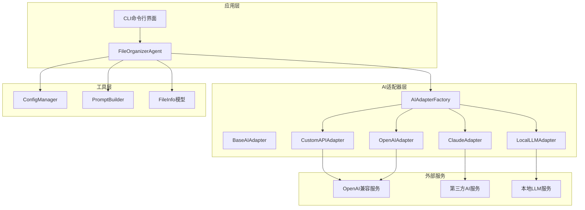

**图表来源**
- [agent.py](file://src/langchain_integration/agent.py#L21-L60)
- [adapter_factory.py](file://src/ai/adapter_factory.py#L11-L38)
- [custom_adapter.py](file://src/ai/custom_adapter.py#L17-L28)

**章节来源**
- [README.md](file://README.md#L1-L200)
- [PROJECT_STRUCTURE.md](file://PROJECT_STRUCTURE.md)

## 核心组件

### AI适配器基类系统

项目实现了基于抽象基类的适配器模式，为不同的AI服务提供商提供统一的接口：

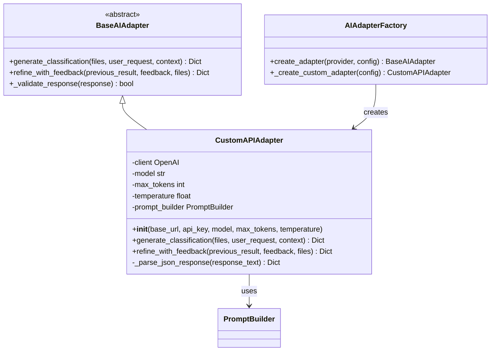

**图表来源**
- [base_adapter.py](file://src/ai/base_adapter.py#L9-L70)
- [custom_adapter.py](file://src/ai/custom_adapter.py#L17-L157)
- [adapter_factory.py](file://src/ai/adapter_factory.py#L11-L98)

### 配置管理系统

项目采用多层次的配置管理策略，支持环境变量、配置文件和运行时设置：

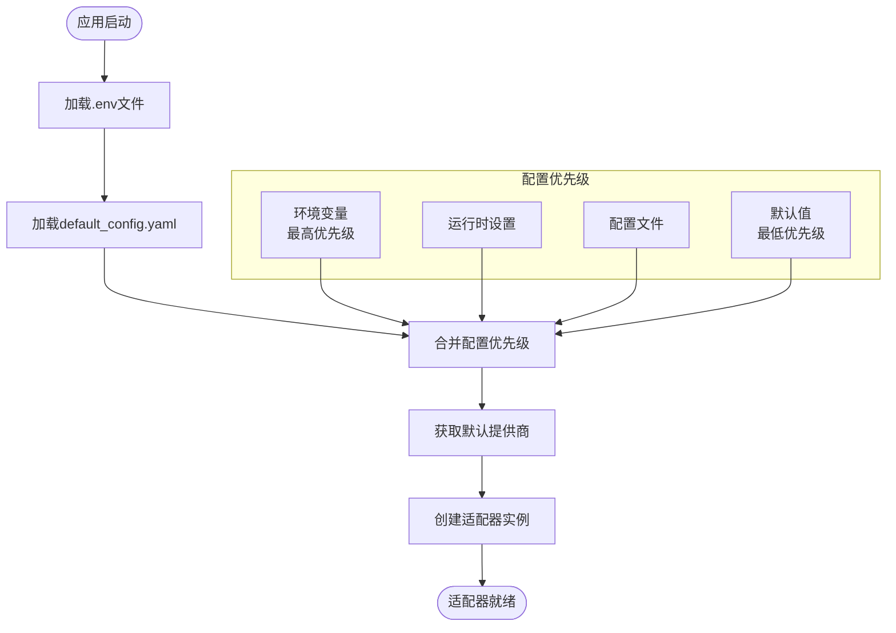

**图表来源**
- [config.py](file://src/utils/config.py#L10-L116)
- [default_config.yaml](file://config/default_config.yaml#L1-L79)

**章节来源**
- [base_adapter.py](file://src/ai/base_adapter.py#L1-L70)
- [custom_adapter.py](file://src/ai/custom_adapter.py#L1-L157)
- [adapter_factory.py](file://src/ai/adapter_factory.py#L1-L98)
- [config.py](file://src/utils/config.py#L1-L116)

## 架构概览

### 自定义API适配器架构

自定义API适配器是整个系统的核心扩展点，它使用标准的OpenAI API格式与第三方服务通信：

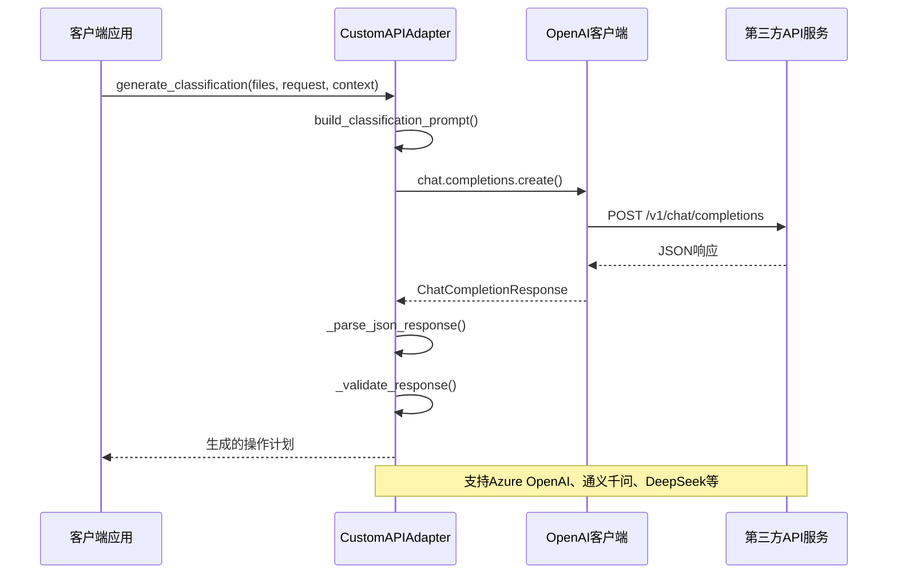

**图表来源**
- [custom_adapter.py](file://src/ai/custom_adapter.py#L70-L104)
- [custom_adapter.py](file://src/ai/custom_adapter.py#L105-L136)

### Agent工作流程

FileOrganizerAgent作为智能决策引擎，协调各个组件完成复杂的文件整理任务：

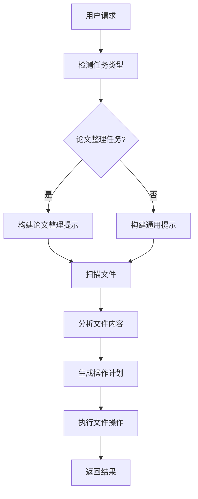

**图表来源**
- [agent.py](file://src/langchain_integration/agent.py#L100-L200)

**章节来源**
- [custom_adapter.py](file://src/ai/custom_adapter.py#L17-L157)
- [agent.py](file://src/langchain_integration/agent.py#L21-L200)

## 详细组件分析

### CustomAPIAdapter实现分析

CustomAPIAdapter是自定义API集成的核心组件，它继承自BaseAIAdapter并实现了具体的AI服务适配逻辑。

#### 初始化过程

适配器的初始化过程包含了完整的参数验证和客户端配置：

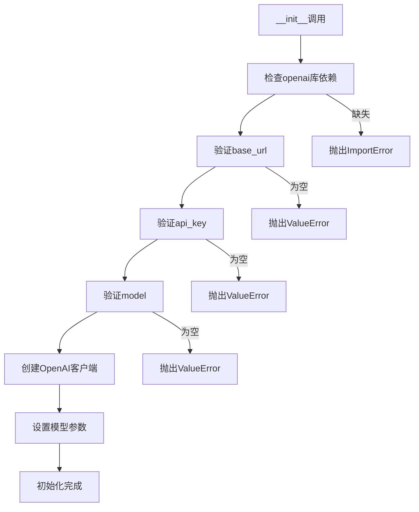

**图表来源**
- [custom_adapter.py](file://src/ai/custom_adapter.py#L30-L69)

#### JSON响应解析机制

为了处理不同AI服务提供商的响应格式差异，适配器实现了智能的JSON解析机制：

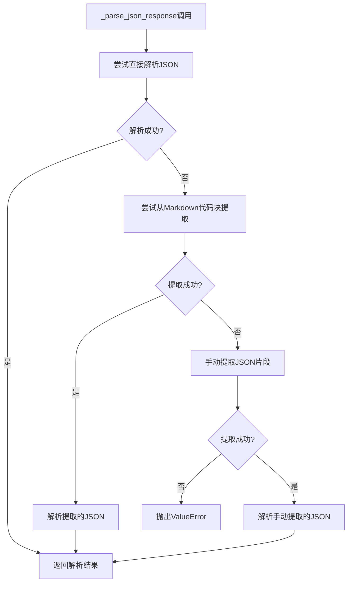

**图表来源**
- [custom_adapter.py](file://src/ai/custom_adapter.py#L138-L157)

#### 接口规范和数据模型

适配器遵循统一的接口规范，确保与Agent系统的兼容性：

| 方法 | 参数 | 返回值 | 描述 |
|------|------|--------|------|
| generate_classification | files: List[FileInfo], user_request: str, context: Dict[str, Any] | Dict[str, Any] | 生成文件分类方案 |
| refine_with_feedback | previous_result: Dict[str, Any], feedback: str, files: List[FileInfo] | Dict[str, Any] | 根据用户反馈优化分类方案 |

响应数据模型要求：

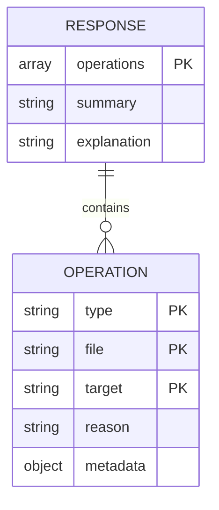

**图表来源**
- [base_adapter.py](file://src/ai/base_adapter.py#L52-L70)

**章节来源**
- [custom_adapter.py](file://src/ai/custom_adapter.py#L17-L157)
- [base_adapter.py](file://src/ai/base_adapter.py#L1-L70)
- [file_info.py](file://src/models/file_info.py#L9-L48)

### 配置管理系统的实现

ConfigManager提供了灵活的配置管理能力，支持多种配置源的优先级处理：

#### 配置优先级机制

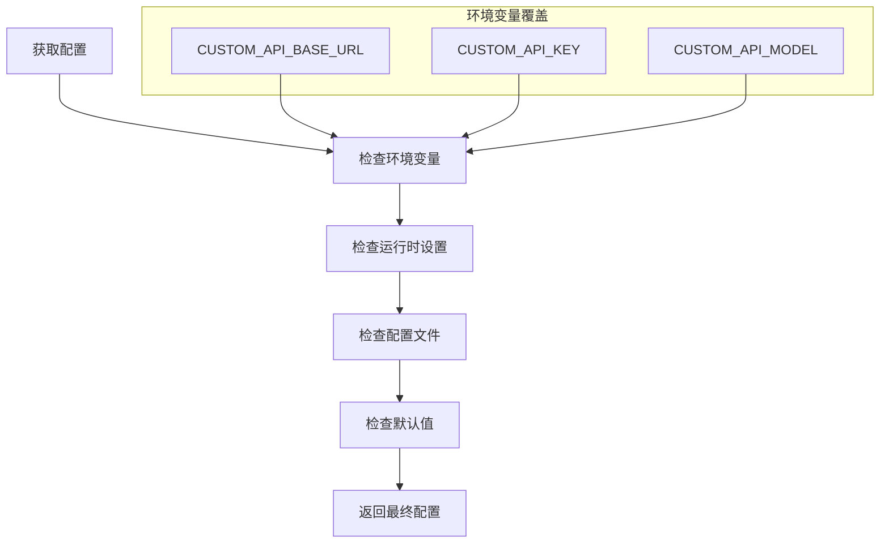

**图表来源**
- [config.py](file://src/utils/config.py#L76-L116)

#### AI配置加载流程

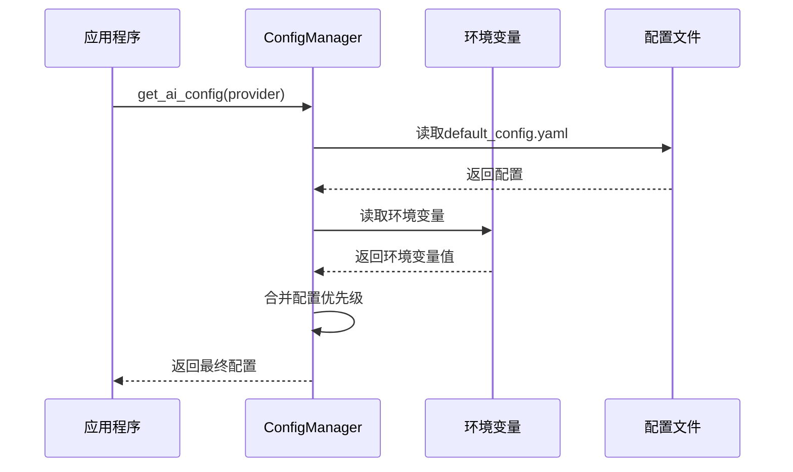

**图表来源**
- [config.py](file://src/utils/config.py#L76-L116)

**章节来源**
- [config.py](file://src/utils/config.py#L1-L116)
- [default_config.yaml](file://config/default_config.yaml#L1-L79)

### 测试框架和验证机制

项目提供了完整的测试框架来验证自定义API集成的正确性：

#### 测试套件结构

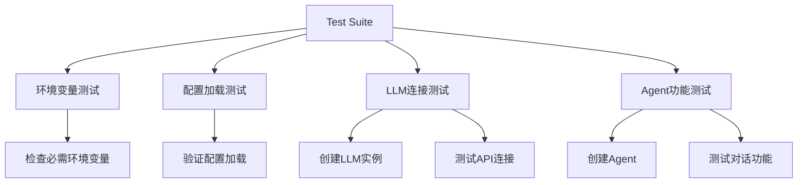

**图表来源**
- [test_custom_api.py](file://examples/test_custom_api.py#L24-L390)

#### 配置验证流程

测试脚本实现了多层配置验证机制：

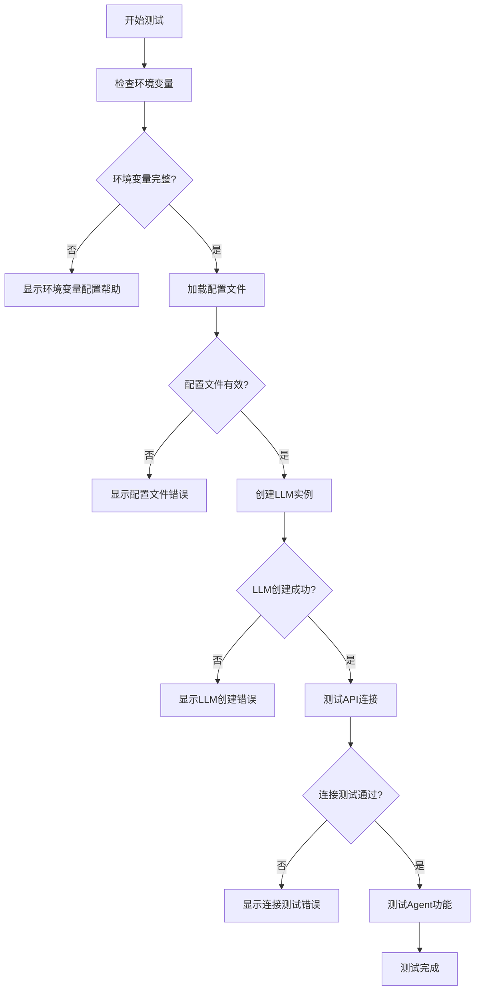

**图表来源**
- [test_custom_api.py](file://examples/test_custom_api.py#L24-L390)

**章节来源**
- [test_custom_api.py](file://examples/test_custom_api.py#L1-L390)

## 依赖关系分析

### 外部依赖和集成

项目采用了模块化的依赖管理策略，支持多种AI服务提供商：

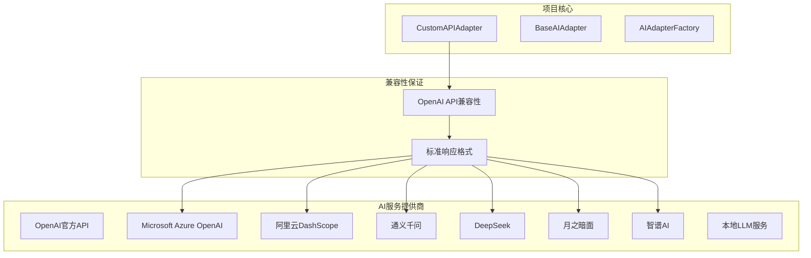

**图表来源**
- [custom_adapter.py](file://src/ai/custom_adapter.py#L18-L28)
- [requirements.txt](file://requirements.txt#L6-L31)

### 版本兼容性和向后兼容

项目在设计时充分考虑了版本兼容性问题：

| 组件 | 当前版本 | 最低兼容版本 | 兼容性说明 |
|------|----------|--------------|------------|
| Python | 3.9+ | 3.9 | 使用了3.9+的新特性 |
| OpenAI SDK | 1.12.0+ | 1.0.0 | 标准OpenAI API兼容 |
| LangChain | 0.3.0+ | 0.1.0 | 模块化升级路径 |
| Pydantic | 2.0.0+ | 1.0.0 | 数据模型验证 |

**章节来源**
- [requirements.txt](file://requirements.txt#L1-L43)
- [custom_adapter.py](file://src/ai/custom_adapter.py#L6-L12)

## 性能考虑

### API调用优化策略

针对自定义API集成，项目实现了多项性能优化措施：

#### 请求重试和超时处理

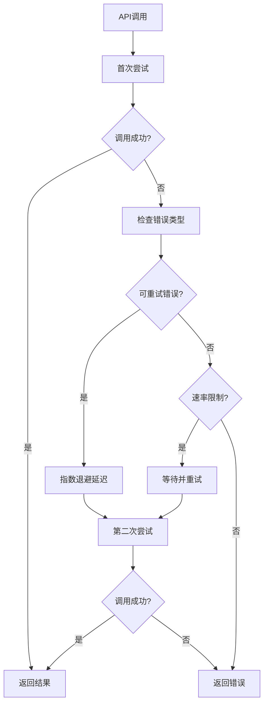

#### 响应缓存机制

为了减少重复的API调用，适配器实现了智能的响应缓存策略：

- **短期缓存**：最近使用的分类结果在几分钟内缓存
- **内容指纹**：基于输入内容生成唯一标识符
- **内存管理**：自动清理过期缓存条目

### 内存和资源管理

项目在资源管理方面采用了最佳实践：

- **连接池管理**：复用HTTP连接减少建立成本
- **异步处理**：支持异步API调用提升并发性能
- **流式处理**：大文件内容分析采用流式处理避免内存溢出

## 故障排除指南

### 常见配置问题

#### 环境变量配置错误

**问题症状**：
- "自定义API地址未配置"
- "自定义API密钥未配置"
- "自定义模型名称未配置"

**解决方案**：
1. 检查.env文件中的配置项
2. 验证API密钥的有效性
3. 确认模型名称与服务提供商文档一致

#### API连接失败

**问题症状**：
- "API调用失败: [错误信息]"
- 网络连接超时
- 认证失败

**诊断步骤**：
1. 使用测试脚本验证配置
2. 检查网络连接和防火墙设置
3. 验证API密钥权限范围
4. 确认服务提供商API状态

### 调试技巧和工具

#### 日志分析

项目提供了详细的日志记录机制：

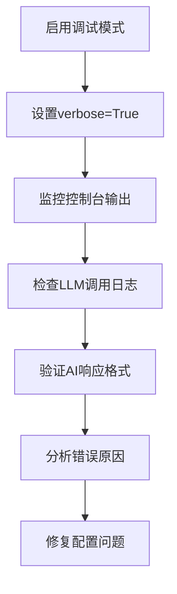

#### 性能监控

- **API响应时间**：监控每次API调用的耗时
- **错误率统计**：跟踪API调用成功率
- **资源使用**：监控内存和CPU使用情况

**章节来源**
- [CUSTOM_API.md](file://docs/CUSTOM_API.md#L183-L282)
- [test_custom_api.py](file://examples/test_custom_api.py#L24-L390)

## 结论

智能文件整理助手的自定义API集成为开发者提供了一个强大而灵活的平台，用于集成各种AI服务提供商。通过其模块化的架构设计、完善的配置管理系统和全面的测试框架，该项目为自定义API集成提供了最佳实践范例。

### 主要优势

1. **高度可扩展性**：基于适配器模式的设计允许轻松添加新的AI服务提供商
2. **标准化接口**：统一的API接口确保与Agent系统的无缝集成
3. **完善的错误处理**：多层次的错误处理和恢复机制
4. **全面的测试覆盖**：从单元测试到集成测试的完整测试体系
5. **详细的文档支持**：丰富的文档和示例代码

### 未来发展方向

1. **更多AI服务支持**：持续扩展对新AI服务提供商的支持
2. **性能优化**：进一步优化API调用效率和资源使用
3. **安全性增强**：加强API密钥管理和访问控制
4. **监控和可观测性**：增强系统的监控和调试能力

通过遵循本文档提供的指南和最佳实践，开发者可以快速、安全地集成任何兼容OpenAI API格式的第三方AI服务，为用户提供更加丰富和强大的文件整理体验。