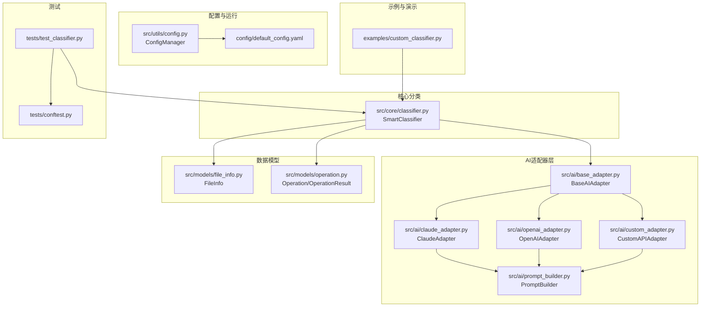
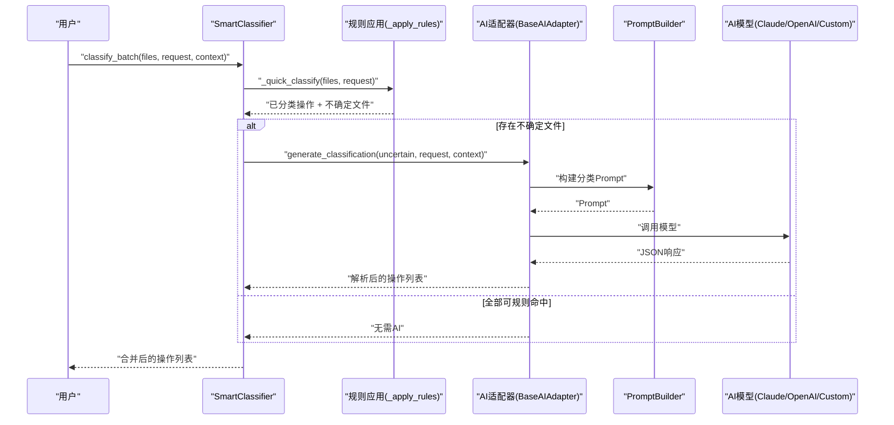
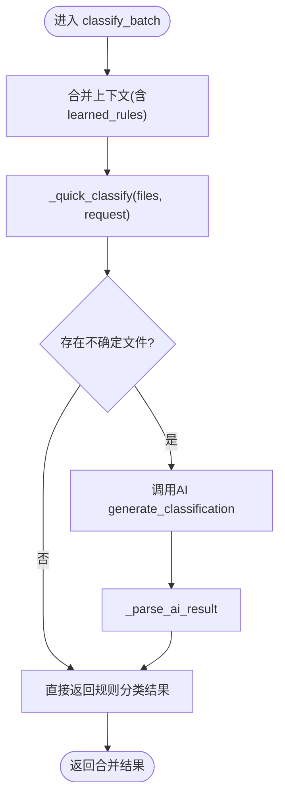
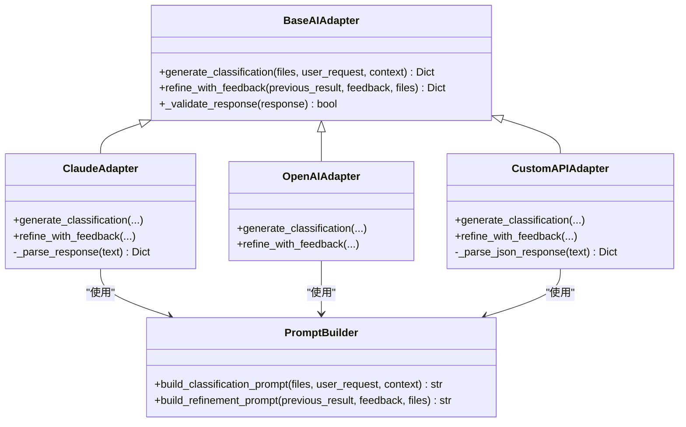
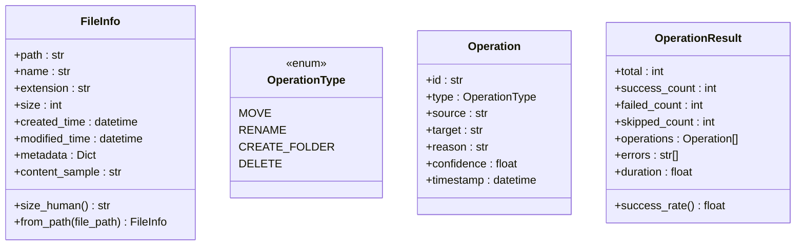
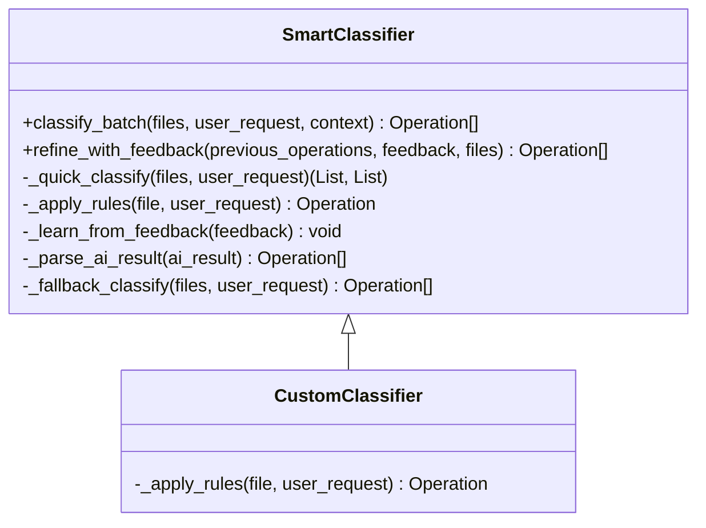
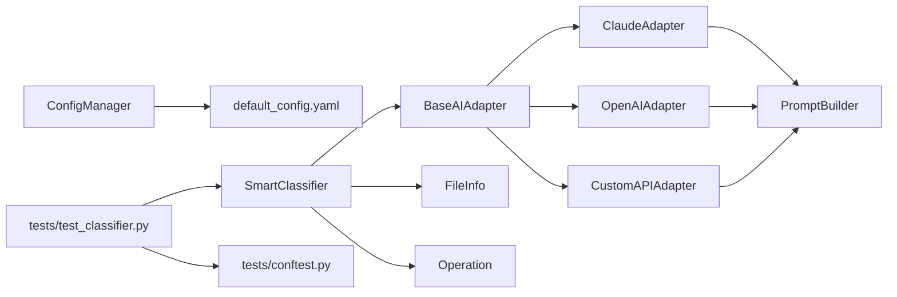

# 自定义分类器开发

<cite>
**本文引用的文件**
- [examples/custom_classifier.py](file://examples/custom_classifier.py)
- [src/core/classifier.py](file://src/core/classifier.py)
- [src/models/file_info.py](file://src/models/file_info.py)
- [src/models/operation.py](file://src/models/operation.py)
- [src/ai/base_adapter.py](file://src/ai/base_adapter.py)
- [src/ai/claude_adapter.py](file://src/ai/claude_adapter.py)
- [src/ai/openai_adapter.py](file://src/ai/openai_adapter.py)
- [src/ai/custom_adapter.py](file://src/ai/custom_adapter.py)
- [src/ai/prompt_builder.py](file://src/ai/prompt_builder.py)
- [src/utils/config.py](file://src/utils/config.py)
- [config/default_config.yaml](file://config/default_config.yaml)
- [tests/test_classifier.py](file://tests/test_classifier.py)
- [tests/conftest.py](file://tests/conftest.py)
- [README.md](file://README.md)
- [requirements.txt](file://requirements.txt)
</cite>

## 目录
1. [简介](#简介)
2. [项目结构](#项目结构)
3. [核心组件](#核心组件)
4. [架构总览](#架构总览)
5. [详细组件分析](#详细组件分析)
6. [依赖关系分析](#依赖关系分析)
7. [性能考虑](#性能考虑)
8. [故障排查指南](#故障排查指南)
9. [结论](#结论)
10. [附录](#附录)

## 简介
本教程面向希望在智能文件整理系统中开发与集成自定义分类逻辑的工程师与高级用户。我们将围绕自定义分类器的完整开发流程展开，包括需求分析、算法选择、训练数据准备、模型训练、测试验证、部署集成，并提供机器学习分类器、规则引擎、混合分类器等多种实现方案。同时，针对特征提取、分类算法、评估指标、性能优化、准确率提升与错误分析给出系统性建议。

## 项目结构
该系统采用模块化分层设计，核心分类能力由“智能分类器”与“AI适配器”协同完成；数据模型通过Pydantic定义；配置与环境变量通过ConfigManager集中管理；测试通过pytest与Mock适配器保障质量。

**图表来源**
- [examples/custom_classifier.py](file://examples/custom_classifier.py#L1-L84)
- [src/core/classifier.py](file://src/core/classifier.py#L1-L265)
- [src/ai/base_adapter.py](file://src/ai/base_adapter.py#L1-L70)
- [src/ai/claude_adapter.py](file://src/ai/claude_adapter.py#L1-L133)
- [src/ai/openai_adapter.py](file://src/ai/openai_adapter.py#L1-L110)
- [src/ai/custom_adapter.py](file://src/ai/custom_adapter.py#L1-L157)
- [src/ai/prompt_builder.py](file://src/ai/prompt_builder.py#L30-L71)
- [src/models/file_info.py](file://src/models/file_info.py#L1-L48)
- [src/models/operation.py](file://src/models/operation.py#L1-L54)
- [src/utils/config.py](file://src/utils/config.py#L1-L116)
- [config/default_config.yaml](file://config/default_config.yaml#L1-L79)
- [tests/test_classifier.py](file://tests/test_classifier.py#L1-L58)
- [tests/conftest.py](file://tests/conftest.py#L1-L76)

**章节来源**
- [README.md](file://README.md#L220-L241)
- [requirements.txt](file://requirements.txt#L1-L43)

## 核心组件
- 智能分类器（SmartClassifier）：负责批量分类、快速规则预分类、AI分类回退、反馈学习与上下文管理。
- AI适配器（BaseAIAdapter及其实现）：统一AI接口，封装Claude、OpenAI、本地模型与自定义API的调用细节。
- 数据模型（FileInfo、Operation）：标准化文件信息与操作结果，支撑分类与执行。
- 配置管理（ConfigManager）：集中管理AI提供商、批处理、日志等配置，支持环境变量注入。
- 示例（custom_classifier.py）：展示如何继承SmartClassifier并实现自定义规则。

**章节来源**
- [src/core/classifier.py](file://src/core/classifier.py#L11-L265)
- [src/ai/base_adapter.py](file://src/ai/base_adapter.py#L9-L70)
- [src/models/file_info.py](file://src/models/file_info.py#L9-L48)
- [src/models/operation.py](file://src/models/operation.py#L10-L54)
- [src/utils/config.py](file://src/utils/config.py#L10-L116)
- [examples/custom_classifier.py](file://examples/custom_classifier.py#L9-L84)

## 架构总览
系统采用“规则优先 + AI兜底”的混合分类策略：先用规则快速命中高置信度场景，再用AI处理不确定性问题；同时支持用户反馈驱动的持续学习与优化。

**图表来源**
- [src/core/classifier.py](file://src/core/classifier.py#L24-L66)
- [src/ai/base_adapter.py](file://src/ai/base_adapter.py#L12-L50)
- [src/ai/prompt_builder.py](file://src/ai/prompt_builder.py#L40-L71)
- [src/ai/claude_adapter.py](file://src/ai/claude_adapter.py#L43-L78)
- [src/ai/openai_adapter.py](file://src/ai/openai_adapter.py#L43-L76)
- [src/ai/custom_adapter.py](file://src/ai/custom_adapter.py#L70-L104)

## 详细组件分析

### 智能分类器（SmartClassifier）
- 批量分类流程：快速规则预分类 → AI分类（异常时降级）→ 合并结果。
- 反馈学习：从用户反馈中抽取规则，写入上下文，指导后续分类。
- 上下文管理：ConversationManager维护历史与上下文，便于多轮对话与优化。
- 错误处理：AI调用失败时自动回退至简单规则分类，保证可用性。

**图表来源**
- [src/core/classifier.py](file://src/core/classifier.py#L24-L66)
- [src/core/classifier.py](file://src/core/classifier.py#L113-L130)
- [src/core/classifier.py](file://src/core/classifier.py#L157-L178)

**章节来源**
- [src/core/classifier.py](file://src/core/classifier.py#L11-L265)

### AI适配器与提示工程
- BaseAIAdapter：定义统一接口，包含响应校验逻辑。
- ClaudeAdapter/OpenAIAdapter/CustomAPIAdapter：分别对接不同后端，统一Prompt构建与响应解析。
- PromptBuilder：构建分类与优化的Prompt，支持已知规则与历史反馈注入。

**图表来源**
- [src/ai/base_adapter.py](file://src/ai/base_adapter.py#L9-L70)
- [src/ai/claude_adapter.py](file://src/ai/claude_adapter.py#L17-L133)
- [src/ai/openai_adapter.py](file://src/ai/openai_adapter.py#L17-L110)
- [src/ai/custom_adapter.py](file://src/ai/custom_adapter.py#L17-L157)
- [src/ai/prompt_builder.py](file://src/ai/prompt_builder.py#L30-L71)

**章节来源**
- [src/ai/base_adapter.py](file://src/ai/base_adapter.py#L9-L70)
- [src/ai/claude_adapter.py](file://src/ai/claude_adapter.py#L17-L133)
- [src/ai/openai_adapter.py](file://src/ai/openai_adapter.py#L17-L110)
- [src/ai/custom_adapter.py](file://src/ai/custom_adapter.py#L17-L157)
- [src/ai/prompt_builder.py](file://src/ai/prompt_builder.py#L30-L71)

### 数据模型与操作结果
- FileInfo：标准化文件元信息（路径、名称、扩展名、大小、时间戳、采样内容等），支持从路径构造。
- Operation/OperationResult：标准化操作类型、置信度、原因与批量结果统计（成功率等）。

**图表来源**
- [src/models/file_info.py](file://src/models/file_info.py#L9-L48)
- [src/models/operation.py](file://src/models/operation.py#L10-L54)

**章节来源**
- [src/models/file_info.py](file://src/models/file_info.py#L9-L48)
- [src/models/operation.py](file://src/models/operation.py#L10-L54)

### 配置与运行
- ConfigManager：加载YAML配置，支持点号键访问与环境变量注入（如API Key、模型名、本地服务地址等）。
- default_config.yaml：默认AI提供商、批处理、扫描深度、备份策略、日志级别等。

**章节来源**
- [src/utils/config.py](file://src/utils/config.py#L10-L116)
- [config/default_config.yaml](file://config/default_config.yaml#L1-L79)

### 自定义分类器示例
- 继承SmartClassifier并重写规则应用方法，实现业务规则（如按年份分类PDF、大文件单独存放）。
- 通过ConfigManager与具体AI适配器（Claude/OpenAI/Custom）组合，完成端到端分类。

**图表来源**
- [src/core/classifier.py](file://src/core/classifier.py#L11-L265)
- [examples/custom_classifier.py](file://examples/custom_classifier.py#L9-L46)

**章节来源**
- [examples/custom_classifier.py](file://examples/custom_classifier.py#L9-L84)
- [src/core/classifier.py](file://src/core/classifier.py#L11-L265)

## 依赖关系分析
- 组件耦合：SmartClassifier依赖AI适配器接口与数据模型；AI适配器依赖PromptBuilder；ConfigManager贯穿配置注入。
- 外部依赖：Anthropic、OpenAI SDK、LangChain生态、Pydantic、PyPDF2/pdfplumber等。
- 测试依赖：pytest、Mock AI适配器、临时目录与样本文件。

**图表来源**
- [src/core/classifier.py](file://src/core/classifier.py#L11-L265)
- [src/ai/base_adapter.py](file://src/ai/base_adapter.py#L9-L70)
- [src/ai/claude_adapter.py](file://src/ai/claude_adapter.py#L17-L133)
- [src/ai/openai_adapter.py](file://src/ai/openai_adapter.py#L17-L110)
- [src/ai/custom_adapter.py](file://src/ai/custom_adapter.py#L17-L157)
- [src/ai/prompt_builder.py](file://src/ai/prompt_builder.py#L30-L71)
- [src/models/file_info.py](file://src/models/file_info.py#L9-L48)
- [src/models/operation.py](file://src/models/operation.py#L10-L54)
- [src/utils/config.py](file://src/utils/config.py#L10-L116)
- [config/default_config.yaml](file://config/default_config.yaml#L1-L79)
- [tests/test_classifier.py](file://tests/test_classifier.py#L1-L58)
- [tests/conftest.py](file://tests/conftest.py#L1-L76)

**章节来源**
- [requirements.txt](file://requirements.txt#L1-L43)

## 性能考虑
- 批处理与并发：合理设置批大小与扫描深度，避免一次性处理过多文件导致内存与IO压力。
- 规则优先策略：通过规则快速命中高置信场景，减少AI调用次数与成本。
- Prompt优化：将已知规则与历史反馈注入Prompt，提高AI一次命中率，降低迭代次数。
- 回退机制：AI失败时快速降级为简单规则分类，保证系统可用性。
- 资源限制：控制最大文件大小与内容采样长度，避免大文件影响性能。

[本节为通用性能建议，不直接分析具体文件，故无“章节来源”]

## 故障排查指南
- AI调用失败：检查API Key、网络连通性与模型可用性；确认PromptBuilder输出格式与AI响应一致性。
- 响应格式不正确：确认AI适配器的响应解析逻辑（如JSON提取、Markdown代码块解析）。
- 规则未生效：确认自定义分类器是否正确继承并覆盖规则应用方法。
- 配置加载失败：检查配置文件路径与YAML语法，确保环境变量已正确注入。
- 测试失败：使用Mock AI适配器与临时目录复现问题，定位规则或AI解析环节。

**章节来源**
- [src/ai/claude_adapter.py](file://src/ai/claude_adapter.py#L113-L133)
- [src/ai/openai_adapter.py](file://src/ai/openai_adapter.py#L100-L110)
- [src/ai/custom_adapter.py](file://src/ai/custom_adapter.py#L138-L157)
- [src/ai/base_adapter.py](file://src/ai/base_adapter.py#L52-L70)
- [src/utils/config.py](file://src/utils/config.py#L35-L42)
- [tests/conftest.py](file://tests/conftest.py#L38-L76)

## 结论
通过规则引擎与AI适配器的协同，系统实现了高鲁棒性的文件分类能力。自定义分类器开发的关键在于：明确业务规则边界、设计可解释的特征与置信度、建立反馈闭环以持续优化、并在性能与准确性之间取得平衡。建议优先从规则入手，逐步引入AI增强，最终形成“规则优先、AI兜底、持续学习”的混合分类体系。

[本节为总结性内容，不直接分析具体文件，故无“章节来源”]

## 附录

### 自定义分类器开发流程（实践指南）
- 需求分析：梳理高频文件类型与业务规则，定义规则边界与置信度阈值。
- 算法选择：优先规则引擎；对模糊场景引入AI；必要时结合两者（混合分类器）。
- 训练数据准备：收集标注样本，标注操作类型、目标路径、原因与置信度。
- 模型训练：可选（如需要复杂特征提取与分类）。若规则足够强，可直接使用规则引擎。
- 测试验证：编写单元测试与集成测试，覆盖规则命中、AI回退、反馈学习等场景。
- 部署集成：通过ConfigManager注入AI配置，将自定义分类器接入主流程。

[本节为流程性建议，不直接分析具体文件，故无“章节来源”]

### 特征提取与分类算法要点
- 特征提取：文件名模式（年份、关键字）、扩展名、大小、时间戳、内容采样（PDF/文本）。
- 分类算法：规则匹配（正则/关键词）、朴素贝叶斯/随机森林（可选）、LLM分类（推荐）。
- 置信度：规则命中通常高置信；AI分类需提供置信度评分，便于回退与优化。

[本节为方法论建议，不直接分析具体文件，故无“章节来源”]

### 评估指标与错误分析
- 指标：准确率、召回率、F1分数、成功率、平均置信度、人工修正率。
- 错误分析：区分规则误判、AI误判、边界案例；针对高频错误优化规则或Prompt。
- 反馈闭环：将错误案例纳入学习规则，持续迭代。

[本节为方法论建议，不直接分析具体文件，故无“章节来源”]

### 多实现方案概览
- 机器学习分类器：使用特征向量训练分类模型，适合大规模、高复杂度场景。
- 规则引擎：基于正则表达式与关键词的快速分类，适合规则明确、可解释性强的场景。
- 混合分类器：规则优先，AI兜底，结合反馈持续学习，兼顾效率与准确性。

[本节为方案综述，不直接分析具体文件，故无“章节来源”]