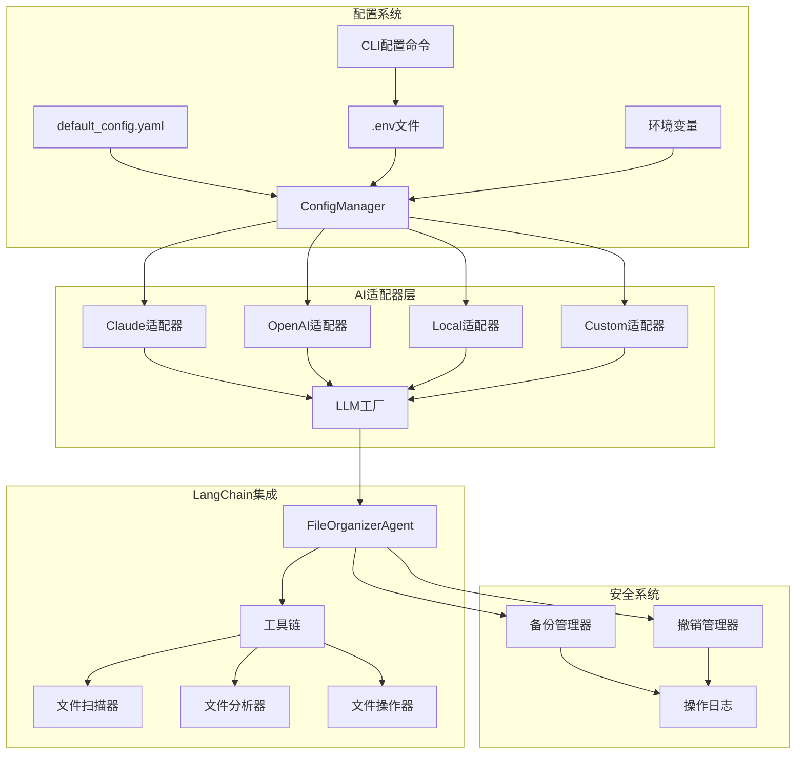

# YAML配置文件

<cite>
**本文引用的文件**
- [default_config.yaml](file://config/default_config.yaml)
- [CONFIGURATION.md](file://docs/CONFIGURATION.md)
- [config.py](file://src/utils/config.py)
- [config_commands.py](file://src/cli/config_commands.py)
- [adapter_factory.py](file://src/ai/adapter_factory.py)
- [agent.py](file://src/langchain_integration/agent.py)
- [backup.py](file://src/safety/backup.py)
- [operation_log.py](file://src/safety/operation_log.py)
- [file_operator.py](file://src/core/file_operator.py)
- [env.custom.example](file://env.custom.example)
</cite>

## 目录
1. [简介](#简介)
2. [项目结构](#项目结构)
3. [核心组件](#核心组件)
4. [架构概览](#架构概览)
5. [详细组件分析](#详细组件分析)
6. [依赖关系分析](#依赖关系分析)
7. [性能考虑](#性能考虑)
8. [故障排除指南](#故障排除指南)
9. [结论](#结论)
10. [附录](#附录)

## 简介
本文档详细解释了Smart File Tidy项目的YAML配置文件结构，特别是config/default_config.yaml的完整配置体系。该配置系统采用分层设计，涵盖AI提供商配置、LangChain Agent配置、文件操作配置、安全配置和日志配置五个主要部分。配置系统支持多层级优先级机制，包括环境变量、配置文件和默认值，并提供了灵活的安全管理和验证机制。

## 项目结构
Smart File Tidy项目采用模块化架构，配置系统位于config目录下的default_config.yaml文件中，同时配合.env环境变量文件实现动态配置管理。



**图表来源**
- [default_config.yaml](file://config/default_config.yaml#L1-L79)
- [config.py](file://src/utils/config.py#L10-L116)
- [adapter_factory.py](file://src/ai/adapter_factory.py#L11-L98)

**章节来源**
- [default_config.yaml](file://config/default_config.yaml#L1-L79)
- [CONFIGURATION.md](file://docs/CONFIGURATION.md#L1-L336)

## 核心组件
配置系统由五个核心组件构成，每个组件都有明确的功能边界和配置参数：

### AI提供商配置 (ai)
负责管理各种AI服务提供商的连接参数和模型设置。支持四种提供商类型：Claude、OpenAI、本地模型和自定义API。

### LangChain Agent配置 (langchain)
定义智能代理的行为参数，包括代理类型、工具配置和执行参数。

### 文件操作配置 (file_operations)
控制文件扫描、分析和操作的具体行为，包括批量处理、文件大小限制和扩展名支持。

### 安全配置 (safety)
管理系统的安全策略，包括确认要求、自动备份和撤销历史管理。

### 日志配置 (logging)
定义日志系统的输出格式、存储位置和保留策略。

**章节来源**
- [default_config.yaml](file://config/default_config.yaml#L2-L79)
- [config.py](file://src/utils/config.py#L76-L116)

## 架构概览
配置系统采用分层架构，实现了配置的动态加载、优先级处理和环境变量集成。


**图表来源**
- [config_commands.py](file://src/cli/config_commands.py#L50-L187)
- [config.py](file://src/utils/config.py#L35-L116)
- [adapter_factory.py](file://src/ai/adapter_factory.py#L14-L37)

## 详细组件分析

### AI提供商配置 (ai)
AI提供商配置是整个系统的核心，负责管理不同AI服务的连接参数。

#### 配置结构
```yaml
ai:
  default_provider: claude  # 默认提供商
  providers:
    claude:  # Claude配置
      model: claude-3-5-sonnet-20241022
      max_tokens: 4096
      temperature: 0.7
    openai:  # OpenAI配置
      model: gpt-4-turbo-preview
      max_tokens: 4096
      temperature: 0.7
    local:  # 本地模型配置
      base_url: http://localhost:11434
      model: llama3.1
      timeout: 120
    custom:  # 自定义API配置
      base_url: https://api.example.com/v1
      model: custom-model-name
      api_key: your-api-key
      max_tokens: 4096
      temperature: 0.7
```

#### 字段详细说明

**default_provider (字符串)**
- **含义**: 默认使用的AI提供商
- **默认值**: `claude`
- **可选值**: `claude`, `openai`, `local`, `custom`
- **使用场景**: 当未指定具体提供商时的默认选择
- **约束条件**: 必须是providers中已定义的提供商

**providers.claude**
- **model**: Claude模型名称，默认`claude-3-5-sonnet-20241022`
- **max_tokens**: 最大令牌数，默认4096
- **temperature**: 生成温度，默认0.7

**providers.openai**
- **model**: OpenAI模型名称，默认`gpt-4-turbo-preview`
- **max_tokens**: 最大令牌数，默认4096
- **temperature**: 生成温度，默认0.7

**providers.local**
- **base_url**: 本地服务地址，默认`http://localhost:11434`
- **model**: 本地模型名称，默认`llama3.1`
- **timeout**: 请求超时时间，默认120秒

**providers.custom**
- **base_url**: 自定义API基础URL
- **model**: 模型名称
- **api_key**: API密钥
- **max_tokens**: 最大令牌数，默认4096
- **temperature**: 生成温度，默认0.7

#### 环境变量集成
配置系统支持通过环境变量覆盖配置文件中的敏感信息：

| 环境变量 | 用途 | 优先级 |
|---------|------|--------|
| DEFAULT_AI_PROVIDER | 默认提供商选择 | 最高 |
| ANTHROPIC_API_KEY | Claude API密钥 | 最高 |
| OPENAI_API_KEY | OpenAI API密钥 | 最高 |
| LOCAL_LLM_BASE_URL | 本地模型地址 | 最高 |
| LOCAL_LLM_MODEL | 本地模型名称 | 最高 |
| CUSTOM_API_BASE_URL | 自定义API地址 | 最高 |
| CUSTOM_API_KEY | 自定义API密钥 | 最高 |
| CUSTOM_API_MODEL | 自定义模型名称 | 最高 |

**章节来源**
- [default_config.yaml](file://config/default_config.yaml#L1-L25)
- [config.py](file://src/utils/config.py#L83-L110)
- [CONFIGURATION.md](file://docs/CONFIGURATION.md#L159-L186)

### LangChain Agent配置 (langchain)
LangChain Agent配置定义了智能代理的行为参数和工具配置。

#### 配置结构
```yaml
langchain:
  agent:
    type: openai-tools  # Agent类型
    verbose: true       # 详细输出
    max_iterations: 15  # 最大迭代次数
    max_execution_time: 300  # 最大执行时间(秒)
  
  tools:
    file_scanner:
      max_files: 1000   # 最大扫描文件数
      recursive: true   # 是否递归扫描
    file_analyzer:
      content_analysis: true  # 是否进行内容分析
      max_content_size: 2000  # 最大内容大小(字符)
    file_operator:
      dry_run: false    # 是否仅模拟操作
      batch_size: 50    # 批处理大小
```

#### 字段详细说明

**agent.type (字符串)**
- **含义**: LangChain Agent的类型
- **默认值**: `openai-tools`
- **可选值**: `openai-tools`, `react`, `structured-chat`
- **使用场景**: 指定Agent的推理模式
- **约束条件**: 必须是支持的Agent类型之一

**agent.verbose (布尔值)**
- **含义**: 是否启用详细输出模式
- **默认值**: `true`
- **使用场景**: 调试和开发阶段的详细日志输出
- **约束条件**: 仅接受布尔值

**agent.max_iterations (整数)**
- **含义**: Agent的最大迭代次数
- **默认值**: 15
- **使用场景**: 防止无限循环和过度计算
- **约束条件**: 必须为正整数

**agent.max_execution_time (整数)**
- **含义**: Agent的最大执行时间
- **默认值**: 300秒
- **使用场景**: 控制任务执行时间上限
- **约束条件**: 必须为正整数

**tools.file_scanner.max_files (整数)**
- **含义**: 文件扫描的最大文件数量
- **默认值**: 1000
- **使用场景**: 控制扫描范围和性能
- **约束条件**: 必须为正整数

**tools.file_scanner.recursive (布尔值)**
- **含义**: 是否递归扫描子目录
- **默认值**: `true`
- **使用场景**: 控制扫描深度
- **约束条件**: 仅接受布尔值

**tools.file_analyzer.content_analysis (布尔值)**
- **含义**: 是否对文件内容进行分析
- **默认值**: `true`
- **使用场景**: 控制分析功能的启用
- **约束条件**: 仅接受布尔值

**tools.file_analyzer.max_content_size (整数)**
- **含义**: 内容分析的最大内容大小
- **默认值**: 2000字符
- **使用场景**: 控制分析性能和内存使用
- **约束条件**: 必须为正整数

**tools.file_operator.dry_run (布尔值)**
- **含义**: 是否启用模拟操作模式
- **默认值**: `false`
- **使用场景**: 测试和验证操作而不实际执行
- **约束条件**: 仅接受布尔值

**tools.file_operator.batch_size (整数)**
- **含义**: 文件操作的批处理大小
- **默认值**: 50
- **使用场景**: 控制批量操作的并发度
- **约束条件**: 必须为正整数

**章节来源**
- [default_config.yaml](file://config/default_config.yaml#L26-L46)
- [agent.py](file://src/langchain_integration/agent.py#L24-L60)

### 文件操作配置 (file_operations)
文件操作配置控制文件扫描、分析和操作的具体行为。

#### 配置结构
```yaml
file_operations:
  batch_size: 50              # 批处理大小
  max_file_size_mb: 100       # 最大文件大小(MB)
  scan_max_depth: 5           # 最大扫描深度
  backup_enabled: true        # 是否启用备份
  supported_extensions: [.pdf, .doc, .docx, .txt, .jpg, .jpeg, .png, .gif, .xlsx, .xls, .ppt, .pptx]
```

#### 字段详细说明

**batch_size (整数)**
- **含义**: 文件操作的批处理大小
- **默认值**: 50
- **使用场景**: 控制批量操作的并发度和内存使用
- **约束条件**: 必须为正整数
- **性能影响**: 较大的批处理可以提高效率但会增加内存占用

**max_file_size_mb (整数)**
- **含义**: 文件内容读取的最大文件大小
- **默认值**: 100MB
- **使用场景**: 防止读取过大的文件导致内存溢出
- **约束条件**: 必须为正整数
- **安全考虑**: 超过此大小的文件内容不会被读取

**scan_max_depth (整数)**
- **含义**: 文件扫描的最大深度
- **默认值**: 5
- **使用场景**: 控制扫描的递归深度
- **约束条件**: 必须为非负整数
- **性能影响**: 较深的扫描会增加时间和资源消耗

**backup_enabled (布尔值)**
- **含义**: 是否启用自动备份功能
- **默认值**: `true`
- **使用场景**: 控制备份功能的启用状态
- **约束条件**: 仅接受布尔值
- **安全影响**: 关闭备份会增加数据丢失风险

**supported_extensions (数组)**
- **含义**: 支持的文件扩展名列表
- **默认值**: 包含PDF、DOC、TXT、图片、Excel、PowerPoint等格式
- **使用场景**: 定义可处理的文件类型
- **约束条件**: 必须为字符串数组
- **扩展性**: 可以根据需要添加新的文件类型支持

**章节来源**
- [default_config.yaml](file://config/default_config.yaml#L47-L66)
- [file_operator.py](file://src/core/file_operator.py#L202-L245)

### 安全配置 (safety)
安全配置管理系统的安全策略和保护机制。

#### 配置结构
```yaml
safety:
  require_confirmation: true    # 是否需要确认
  auto_backup: true             # 是否自动备份
  max_undo_history: 10          # 最大撤销历史
```

#### 字段详细说明

**require_confirmation (布尔值)**
- **含义**: 是否需要用户确认才能执行危险操作
- **默认值**: `true`
- **使用场景**: 防止误操作造成的数据损失
- **约束条件**: 仅接受布尔值
- **安全级别**: 高，建议保持开启

**auto_backup (布尔值)**
- **含义**: 是否自动创建备份
- **默认值**: `true`
- **使用场景**: 自动保护数据安全
- **约束条件**: 仅接受布尔值
- **安全级别**: 高，建议保持开启

**max_undo_history (整数)**
- **含义**: 撤销操作的历史记录数量
- **默认值**: 10
- **使用场景**: 控制撤销历史的存储空间
- **约束条件**: 必须为正整数
- **存储影响**: 影响磁盘空间使用

**章节来源**
- [default_config.yaml](file://config/default_config.yaml#L67-L72)
- [backup.py](file://src/safety/backup.py#L10-L22)
- [operation_log.py](file://src/safety/operation_log.py#L11-L23)

### 日志配置 (logging)
日志配置定义日志系统的输出格式、存储位置和保留策略。

#### 配置结构
```yaml
logging:
  level: INFO                 # 日志级别
  log_dir: data/logs          # 日志目录
  retention_days: 30          # 保留天数
  format: "%(asctime)s - %(name)s - %(levelname)s - %(message)s"
```

#### 字段详细说明

**level (字符串)**
- **含义**: 日志记录的最低级别
- **默认值**: `INFO`
- **可选值**: `DEBUG`, `INFO`, `WARNING`, `ERROR`, `CRITICAL`
- **使用场景**: 控制日志的详细程度
- **性能影响**: 较低级别的日志会产生更多I/O操作

**log_dir (字符串)**
- **含义**: 日志文件的存储目录
- **默认值**: `data/logs`
- **使用场景**: 定义日志文件的位置
- **约束条件**: 必须为有效的目录路径
- **权限要求**: 应具有写入权限

**retention_days (整数)**
- **含义**: 日志文件的保留天数
- **默认值**: 30天
- **使用场景**: 控制日志文件的清理策略
- **约束条件**: 必须为正整数
- **存储管理**: 影响磁盘空间使用

**format (字符串)**
- **含义**: 日志消息的格式化模板
- **默认值**: `%(asctime)s - %(name)s - %(levelname)s - %(message)s`
- **使用场景**: 定义日志输出的格式
- **模板变量**: 包括时间、名称、级别、消息等
- **可定制性**: 可以根据需要调整格式

**章节来源**
- [default_config.yaml](file://config/default_config.yaml#L73-L79)
- [operation_log.py](file://src/safety/operation_log.py#L14-L22)

## 依赖关系分析

### 配置优先级机制
配置系统采用三层优先级机制，确保灵活性和安全性：


**图表来源**
- [CONFIGURATION.md](file://docs/CONFIGURATION.md#L5-L12)
- [config.py](file://src/utils/config.py#L83-L110)

### 配置验证规则
系统实现了多层次的配置验证机制：

1. **语法验证**: YAML文件格式检查
2. **类型验证**: 数据类型和范围检查
3. **依赖验证**: 相关配置项的依赖关系检查
4. **环境验证**: 环境变量的有效性检查

### 配置覆盖机制
配置系统支持动态覆盖和继承机制：

- **环境变量覆盖**: 最高优先级的配置覆盖
- **配置文件继承**: 从基础配置派生特定配置
- **默认值回退**: 当配置缺失时使用默认值

**章节来源**
- [CONFIGURATION.md](file://docs/CONFIGURATION.md#L5-L12)
- [config.py](file://src/utils/config.py#L43-L68)

## 性能考虑
配置系统在设计时充分考虑了性能影响：

### 内存使用优化
- 批处理大小配置影响内存使用量
- 文件大小限制防止内存溢出
- 日志轮转机制控制磁盘空间

### I/O性能优化
- 日志级别控制减少不必要的I/O操作
- 扫描深度限制避免深层遍历
- 工具配置优化执行效率

### 并发处理
- 批处理配置支持并发操作
- 超时机制防止长时间阻塞
- 资源清理机制释放系统资源

## 故障排除指南

### 常见配置问题

**问题1: API密钥未配置**
- **症状**: `Claude API Key未配置` 或 `OpenAI API Key未配置`
- **解决方案**: 检查.env文件中的相应环境变量
- **预防措施**: 使用CLI命令或.env模板文件

**问题2: 配置不生效**
- **症状**: 修改配置后仍然使用旧值
- **解决方案**: 检查配置优先级和缓存问题
- **预防措施**: 使用`smart-tidy config show`验证配置

**问题3: 自定义API连接失败**
- **症状**: 自定义API提供商无法连接
- **解决方案**: 检查base_url、api_key和model配置
- **预防措施**: 使用`smart-tidy config test`测试连接

### 配置验证工具
系统提供了多种验证工具：

- **配置显示**: `smart-tidy config show` 查看当前配置
- **连接测试**: `smart-tidy config test` 测试提供商连接
- **环境检查**: `python examples/test_custom_api.py` 检查环境变量

**章节来源**
- [CONFIGURATION.md](file://docs/CONFIGURATION.md#L284-L327)
- [config_commands.py](file://src/cli/config_commands.py#L13-L47)

## 结论
Smart File Tidy的配置系统设计精良，采用了分层架构和多优先级机制，既保证了灵活性又确保了安全性。通过环境变量集成、配置验证和动态加载机制，系统能够适应各种使用场景和环境需求。建议用户优先使用.env文件进行配置管理，这样既能保护敏感信息，又能实现多环境的灵活切换。

## 附录

### 配置最佳实践
1. **安全第一**: 始终使用.env文件存储敏感信息
2. **最小权限**: 为不同环境使用独立的配置文件
3. **版本控制**: 配置文件应纳入版本控制，但敏感信息不应提交
4. **定期审查**: 定期检查和更新配置参数
5. **文档维护**: 保持配置文档与实际配置同步

### 常用配置场景示例

**开发环境配置**
```yaml
# 开发环境专用配置
ai:
  default_provider: local
  providers:
    local:
      base_url: http://localhost:11434
      model: llama3.1
      timeout: 180

file_operations:
  batch_size: 10
  max_file_size_mb: 50
  scan_max_depth: 3

logging:
  level: DEBUG
  retention_days: 7
```

**生产环境配置**
```yaml
# 生产环境专用配置
ai:
  default_provider: claude
  providers:
    claude:
      model: claude-3-5-sonnet-20241022
      max_tokens: 4096
      temperature: 0.3

safety:
  require_confirmation: true
  auto_backup: true
  max_undo_history: 50

logging:
  level: INFO
  retention_days: 90
```

**自定义API配置示例**
```yaml
# 自定义API配置示例
ai:
  default_provider: custom
  providers:
    custom:
      base_url: https://api.example.com/v1
      model: custom-model-name
      max_tokens: 4096
      temperature: 0.7

# 对应的.env文件配置
DEFAULT_AI_PROVIDER=custom
CUSTOM_API_BASE_URL=https://api.example.com/v1
CUSTOM_API_KEY=sk-your-api-key
CUSTOM_API_MODEL=custom-model-name
```

**章节来源**
- [env.custom.example](file://env.custom.example#L1-L103)
- [CONFIGURATION.md](file://docs/CONFIGURATION.md#L196-L231)