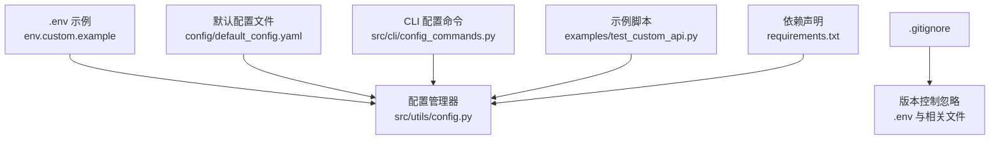
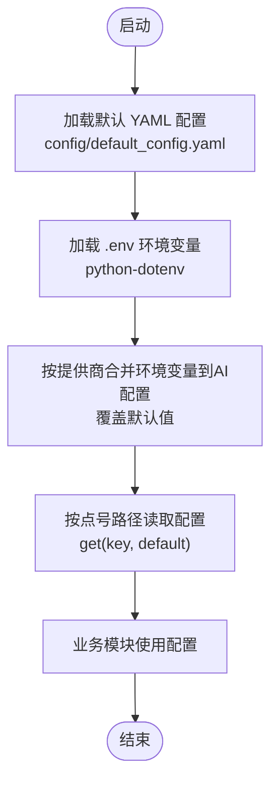
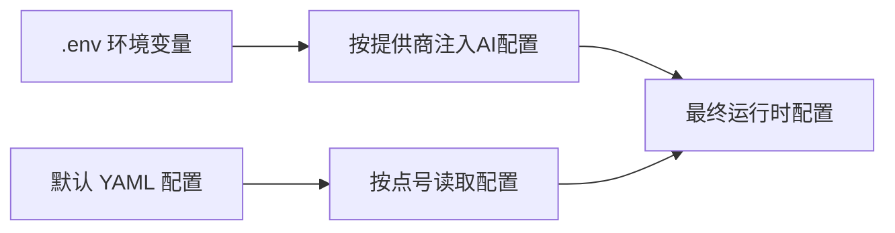
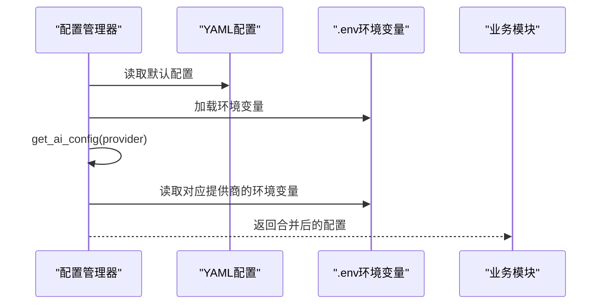
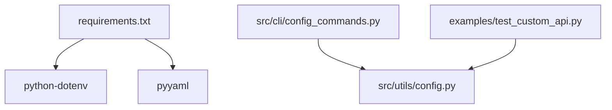

# 环境变量配置

<cite>
**本文引用的文件**
- [env.custom.example](file://env.custom.example)
- [src/utils/config.py](file://src/utils/config.py)
- [docs/CONFIGURATION.md](file://docs/CONFIGURATION.md)
- [config/default_config.yaml](file://config/default_config.yaml)
- [src/cli/config_commands.py](file://src/cli/config_commands.py)
- [examples/test_custom_api.py](file://examples/test_custom_api.py)
- [.gitignore](file://.gitignore)
- [requirements.txt](file://requirements.txt)
</cite>

## 目录
1. [简介](#简介)
2. [项目结构](#项目结构)
3. [核心组件](#核心组件)
4. [架构总览](#架构总览)
5. [详细组件分析](#详细组件分析)
6. [依赖关系分析](#依赖关系分析)
7. [性能考量](#性能考量)
8. [故障排查指南](#故障排查指南)
9. [结论](#结论)
10. [附录](#附录)

## 简介
本文件系统化阐述本项目的环境变量配置体系，包括 .env 文件的设置方法、字段定义、配置优先级、与 YAML 配置文件的合并规则与冲突解决机制、安全注意事项与最佳实践，以及不同部署环境下的配置示例与常见问题排查。目标是帮助开发者与运维人员以一致、安全、可维护的方式完成配置。

## 项目结构
围绕环境变量配置的关键文件与职责如下：
- .env 模板与示例：用于生成 .env 并提供各提供商的配置示例
- 配置管理器：负责加载 YAML 配置、读取 .env 环境变量，并在运行时合并
- CLI 配置命令：提供查看、设置、测试配置的能力
- 示例脚本：验证 .env 配置与自定义 API 连接
- 版本控制忽略：确保敏感文件不被提交

图表来源
- [env.custom.example](file://env.custom.example#L1-L103)
- [src/utils/config.py](file://src/utils/config.py#L1-L116)
- [config/default_config.yaml](file://config/default_config.yaml#L1-L79)
- [src/cli/config_commands.py](file://src/cli/config_commands.py#L1-L219)
- [examples/test_custom_api.py](file://examples/test_custom_api.py#L1-L390)
- [.gitignore](file://.gitignore#L1-L54)
- [requirements.txt](file://requirements.txt#L1-L43)

章节来源
- [env.custom.example](file://env.custom.example#L1-L103)
- [src/utils/config.py](file://src/utils/config.py#L1-L116)
- [config/default_config.yaml](file://config/default_config.yaml#L1-L79)
- [src/cli/config_commands.py](file://src/cli/config_commands.py#L1-L219)
- [examples/test_custom_api.py](file://examples/test_custom_api.py#L1-L390)
- [.gitignore](file://.gitignore#L1-L54)
- [requirements.txt](file://requirements.txt#L1-L43)

## 核心组件
- 配置管理器（ConfigManager）
  - 负责加载默认 YAML 配置、读取 .env 环境变量，并在运行时将环境变量注入到 AI 提供商配置中
  - 支持按点号路径读取/设置配置项
- CLI 配置命令
  - 提供查看当前配置、设置默认提供商、写入 .env、测试连接等功能
- 示例脚本
  - 验证 .env 中必要变量是否就绪、加载配置、创建 LLM 实例并进行连通性测试
- 版本控制忽略
  - 将 .env、config/user_config.yaml 等敏感或用户特定文件加入忽略列表

章节来源
- [src/utils/config.py](file://src/utils/config.py#L10-L116)
- [src/cli/config_commands.py](file://src/cli/config_commands.py#L13-L219)
- [examples/test_custom_api.py](file://examples/test_custom_api.py#L24-L127)
- [.gitignore](file://.gitignore#L40-L43)

## 架构总览
下图展示了“环境变量优先于配置文件”的整体配置加载与合并流程。

图表来源
- [src/utils/config.py](file://src/utils/config.py#L13-L18)
- [src/utils/config.py](file://src/utils/config.py#L76-L116)
- [config/default_config.yaml](file://config/default_config.yaml#L1-L79)

章节来源
- [src/utils/config.py](file://src/utils/config.py#L13-L18)
- [src/utils/config.py](file://src/utils/config.py#L76-L116)
- [config/default_config.yaml](file://config/default_config.yaml#L1-L79)

## 详细组件分析

### 配置优先级与合并规则
- 优先级（从高到低）
  1) 环境变量（.env）
  2) 配置文件（config/default_config.yaml）
  3) 默认值（代码中定义）
- 合并策略
  - 默认 YAML 配置作为基础
  - 环境变量仅覆盖同名键，不改变结构
  - 对 AI 提供商配置，环境变量会动态注入到对应提供商节点（如 api_key、base_url、model）

图表来源
- [src/utils/config.py](file://src/utils/config.py#L35-L68)
- [src/utils/config.py](file://src/utils/config.py#L76-L116)

章节来源
- [src/utils/config.py](file://src/utils/config.py#L35-L68)
- [src/utils/config.py](file://src/utils/config.py#L76-L116)
- [docs/CONFIGURATION.md](file://docs/CONFIGURATION.md#L5-L16)

### 环境变量字段定义与用途
- AI 提供商选择
  - DEFAULT_AI_PROVIDER：选择默认提供商（claude、openai、local、custom）
- Claude
  - ANTHROPIC_API_KEY：Claude API 密钥
- OpenAI
  - OPENAI_API_KEY：OpenAI API 密钥
- 本地模型
  - LOCAL_LLM_BASE_URL：本地 LLM 服务地址
  - LOCAL_LLM_MODEL：本地模型名称
- 自定义 API
  - CUSTOM_API_BASE_URL：自定义 OpenAI 兼容 API 基础地址
  - CUSTOM_API_KEY：自定义 API 密钥
  - CUSTOM_API_MODEL：自定义模型名称
- 高级配置（可选）
  - BATCH_SIZE：批处理大小
  - MAX_FILE_SIZE_MB：最大文件大小（MB）
  - SCAN_MAX_DEPTH：最大扫描深度

章节来源
- [docs/CONFIGURATION.md](file://docs/CONFIGURATION.md#L159-L193)
- [env.custom.example](file://env.custom.example#L15-L103)
- [src/utils/config.py](file://src/utils/config.py#L84-L109)

### .env 文件设置方法
- 复制模板为 .env
  - 将 env.custom.example 复制为 .env，并根据所选提供商取消注释并填写相应变量
- 使用 CLI 快速设置
  - 通过 smart-tidy config set-provider 命令写入 .env 并更新默认提供商
- 验证配置
  - 使用 smart-tidy config show 查看当前配置
  - 使用 smart-tidy config test 测试连接

章节来源
- [env.custom.example](file://env.custom.example#L5-L11)
- [src/cli/config_commands.py](file://src/cli/config_commands.py#L50-L187)
- [docs/CONFIGURATION.md](file://docs/CONFIGURATION.md#L234-L249)

### 与 YAML 配置文件的合并与冲突解决
- 结构保持不变：仅覆盖同名键，不删除 YAML 中的键
- 环境变量优先：当 .env 中存在同名键时，覆盖 YAML 中的值
- AI 提供商配置注入：get_ai_config 会根据 DEFAULT_AI_PROVIDER 读取对应提供商节点，并将环境变量注入其中

图表来源
- [src/utils/config.py](file://src/utils/config.py#L35-L41)
- [src/utils/config.py](file://src/utils/config.py#L76-L116)
- [src/utils/config.py](file://src/utils/config.py#L18)

章节来源
- [src/utils/config.py](file://src/utils/config.py#L35-L41)
- [src/utils/config.py](file://src/utils/config.py#L76-L116)

### 安全考虑与最佳实践
- 保护 .env 文件
  - 将 .env 与 .env.* 加入 .gitignore，且保留 .env.example
  - 在类 Unix 系统上限制 .env 文件权限（例如 600）
- 不提交敏感信息
  - 不要在配置文件中硬编码 API Key；使用 .env 管理
- 权限与最小暴露
  - 在输出中隐藏敏感信息（如 API Key 的中间部分）
- 多环境管理
  - 使用 .env.development 与 .env.production 等文件，按需复制为 .env

章节来源
- [.gitignore](file://.gitignore#L40-L43)
- [docs/CONFIGURATION.md](file://docs/CONFIGURATION.md#L253-L282)

### 不同部署环境下的配置示例
- 开发环境
  - 使用 .env.development，包含较低成本或测试用的 API 密钥
- 生产环境
  - 使用 .env.production，包含正式 API 密钥与生产级参数
- 多提供商共存
  - 在同一 .env 中配置多个提供商，通过 DEFAULT_AI_PROVIDER 切换

章节来源
- [docs/CONFIGURATION.md](file://docs/CONFIGURATION.md#L196-L230)

### 环境变量与 YAML 的合并规则与冲突解决机制
- 合并规则
  - 点号路径读取：get(key, default) 支持多级键访问
  - 环境变量覆盖：get_ai_config 中按提供商读取并注入环境变量
- 冲突解决
  - 环境变量优先于 YAML；若 YAML 中不存在该键，则保留环境变量
  - 若 YAML 中存在但 .env 中未设置，则保留 YAML 值

章节来源
- [src/utils/config.py](file://src/utils/config.py#L43-L68)
- [src/utils/config.py](file://src/utils/config.py#L76-L116)

## 依赖关系分析
- python-dotenv：用于加载 .env 文件中的键值对
- pyyaml：用于解析 YAML 配置文件
- CLI 与配置管理器耦合：CLI 命令通过 ConfigManager 读取与写入配置
- 示例脚本与配置管理器耦合：示例脚本通过 ConfigManager 验证配置

图表来源
- [requirements.txt](file://requirements.txt#L19-L21)
- [src/cli/config_commands.py](file://src/cli/config_commands.py#L7)
- [examples/test_custom_api.py](file://examples/test_custom_api.py#L8)
- [src/utils/config.py](file://src/utils/config.py#L3-L7)

章节来源
- [requirements.txt](file://requirements.txt#L19-L21)
- [src/cli/config_commands.py](file://src/cli/config_commands.py#L7)
- [examples/test_custom_api.py](file://examples/test_custom_api.py#L8)
- [src/utils/config.py](file://src/utils/config.py#L3-L7)

## 性能考量
- 环境变量加载成本极低，几乎无性能影响
- YAML 解析仅在初始化阶段执行，后续通过内存字典访问
- 建议避免在运行时频繁重载配置，可通过 CLI 命令一次性写入 .env 并重启进程

## 故障排查指南
- 找不到 API Key
  - 检查 .env 是否存在、变量名是否正确、是否有多余空格或引号
  - 使用 smart-tidy config show 与 smart-tidy config test 核验
- 配置不生效
  - 确认 .env 位于项目根目录
  - 检查 CLI 写入是否成功，必要时重新 set-provider
- 自定义 API 连接失败
  - 检查 CUSTOM_API_BASE_URL、CUSTOM_API_KEY、CUSTOM_API_MODEL 是否正确
  - 确认网络连通性与 API 服务可用性

章节来源
- [docs/CONFIGURATION.md](file://docs/CONFIGURATION.md#L285-L327)
- [src/cli/config_commands.py](file://src/cli/config_commands.py#L190-L219)

## 结论
本项目采用“环境变量优先”的统一配置策略，结合 .env 与 YAML 的分层设计，实现了简洁、安全、可维护的配置体系。通过 CLI 命令与示例脚本，用户可以快速完成配置并验证连通性。遵循安全最佳实践与多环境管理策略，可有效降低配置风险并提升可运维性。

## 附录
- 关键实现路径
  - 配置加载与合并：[src/utils/config.py](file://src/utils/config.py#L13-L116)
  - CLI 配置命令：[src/cli/config_commands.py](file://src/cli/config_commands.py#L13-L219)
  - 示例脚本验证：[examples/test_custom_api.py](file://examples/test_custom_api.py#L24-L127)
  - 默认配置文件：[config/default_config.yaml](file://config/default_config.yaml#L1-L79)
  - 环境变量模板：[env.custom.example](file://env.custom.example#L1-L103)
  - 版本控制忽略：[.gitignore](file://.gitignore#L40-L43)
  - 依赖声明：[requirements.txt](file://requirements.txt#L19-L21)