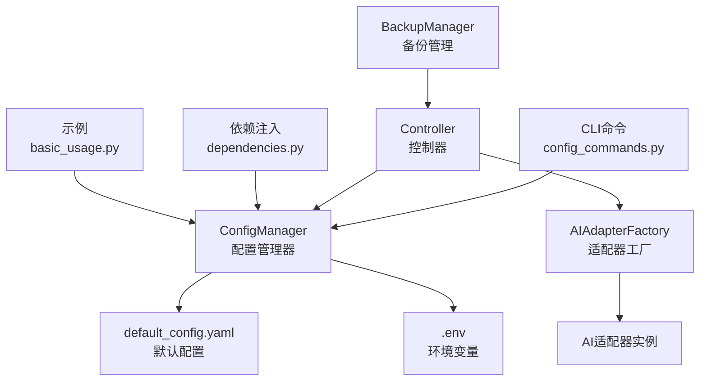
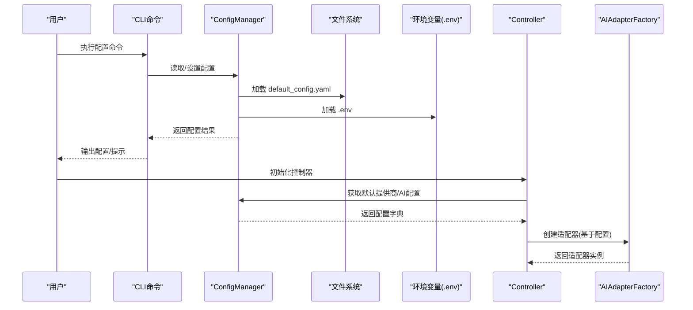
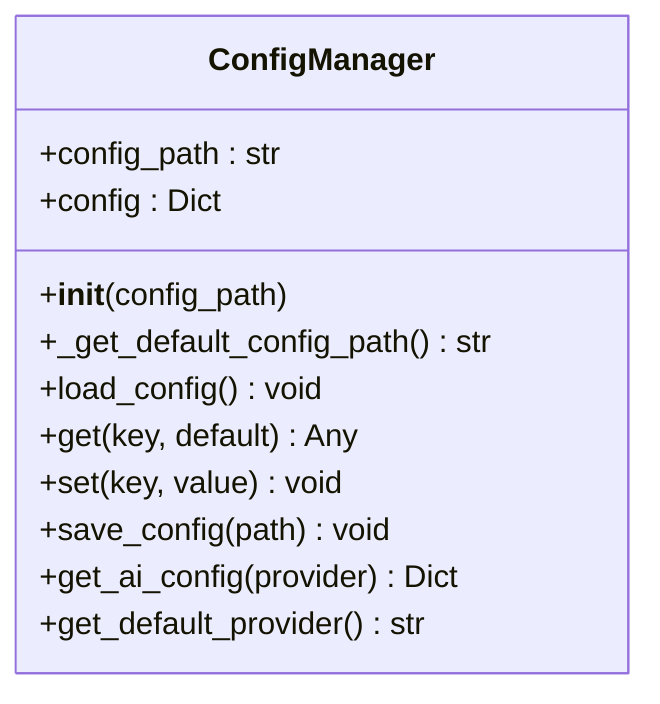
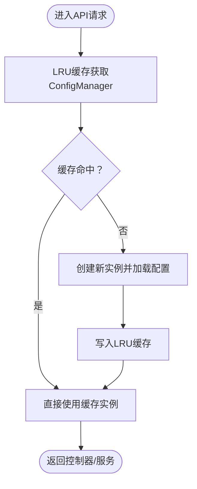
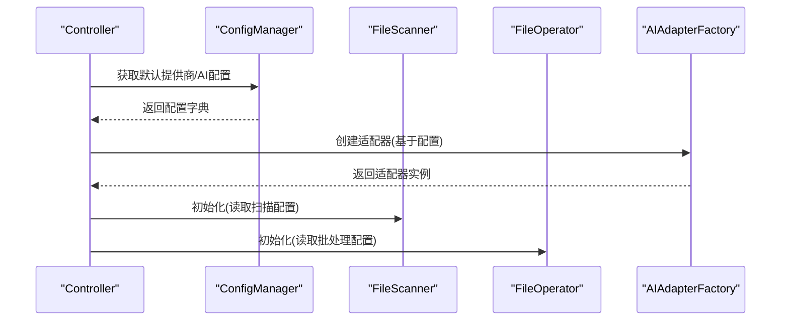
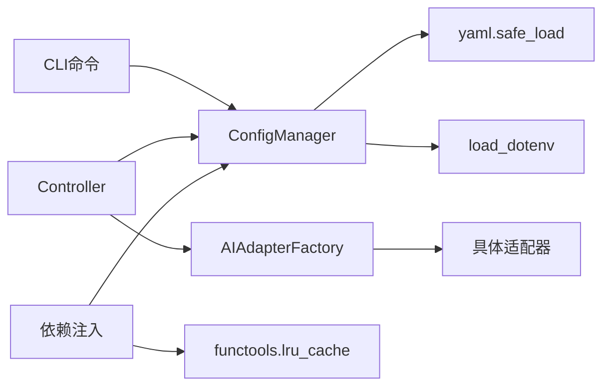

# 运行时配置管理

<cite>
**本文引用的文件**
- [src/utils/config.py](file://src/utils/config.py)
- [config/default_config.yaml](file://config/default_config.yaml)
- [docs/CONFIGURATION.md](file://docs/CONFIGURATION.md)
- [src/cli/config_commands.py](file://src/cli/config_commands.py)
- [src/core/controller.py](file://src/core/controller.py)
- [src/ai/adapter_factory.py](file://src/ai/adapter_factory.py)
- [src/api/dependencies.py](file://src/api/dependencies.py)
- [examples/basic_usage.py](file://examples/basic_usage.py)
- [src/safety/backup.py](file://src/safety/backup.py)
</cite>

## 目录
1. [简介](#简介)
2. [项目结构](#项目结构)
3. [核心组件](#核心组件)
4. [架构总览](#架构总览)
5. [详细组件分析](#详细组件分析)
6. [依赖关系分析](#依赖关系分析)
7. [性能考虑](#性能考虑)
8. [故障排除指南](#故障排除指南)
9. [结论](#结论)
10. [附录](#附录)

## 简介
本文件系统化阐述运行时配置管理的设计与实现，重点覆盖以下方面：
- config.py 模块的实现原理、配置加载流程与动态更新机制
- 配置验证、类型转换、默认值处理与错误处理逻辑
- 配置缓存、配置监听与热重载的实现细节
- 配置扩展点与自定义配置项的添加方法
- 配置在不同模块间的传递与共享机制
- 配置性能优化与内存管理的最佳实践

## 项目结构
运行时配置管理围绕 ConfigManager 核心类展开，配合 CLI 命令、控制器与 AI 适配器工厂，形成“配置加载—验证—应用—共享”的闭环。关键文件与职责如下：
- src/utils/config.py：配置管理器，负责配置文件加载、键值访问、AI提供商配置合并与环境变量注入
- config/default_config.yaml：默认配置文件，提供结构化的默认值
- docs/CONFIGURATION.md：配置优先级、环境变量与使用指南
- src/cli/config_commands.py：CLI 配置命令，提供查看、设置与测试连接能力
- src/core/controller.py：控制器，消费配置并协调各子系统
- src/ai/adapter_factory.py：AI 适配器工厂，基于配置创建具体适配器
- src/api/dependencies.py：API 层依赖注入，使用 LRU 缓存实现配置单例
- examples/basic_usage.py：示例，展示如何初始化配置与控制器
- src/safety/backup.py：备份管理，体现配置对执行行为的影响

图表来源
- [src/utils/config.py](file://src/utils/config.py#L10-L116)
- [config/default_config.yaml](file://config/default_config.yaml#L1-L79)
- [src/cli/config_commands.py](file://src/cli/config_commands.py#L1-L219)
- [src/core/controller.py](file://src/core/controller.py#L1-L310)
- [src/ai/adapter_factory.py](file://src/ai/adapter_factory.py#L1-L98)
- [src/api/dependencies.py](file://src/api/dependencies.py#L1-L64)
- [examples/basic_usage.py](file://examples/basic_usage.py#L1-L89)
- [src/safety/backup.py](file://src/safety/backup.py#L1-L152)

章节来源
- [src/utils/config.py](file://src/utils/config.py#L10-L116)
- [config/default_config.yaml](file://config/default_config.yaml#L1-L79)
- [docs/CONFIGURATION.md](file://docs/CONFIGURATION.md#L1-L336)
- [src/cli/config_commands.py](file://src/cli/config_commands.py#L1-L219)
- [src/core/controller.py](file://src/core/controller.py#L1-L310)
- [src/ai/adapter_factory.py](file://src/ai/adapter_factory.py#L1-L98)
- [src/api/dependencies.py](file://src/api/dependencies.py#L1-L64)
- [examples/basic_usage.py](file://examples/basic_usage.py#L1-L89)
- [src/safety/backup.py](file://src/safety/backup.py#L1-L152)

## 核心组件
- ConfigManager：提供配置加载、键访问、AI提供商配置合并、默认提供商解析与持久化能力
- CLI 配置命令：提供查看、设置与测试连接功能，实际写入 .env 并同步更新配置文件
- 控制器：从配置读取参数，驱动文件扫描、分类与执行流程
- AI 适配器工厂：依据配置创建具体适配器，并进行必要的参数校验
- 依赖注入：通过 LRU 缓存实现配置单例，避免重复加载

章节来源
- [src/utils/config.py](file://src/utils/config.py#L10-L116)
- [src/cli/config_commands.py](file://src/cli/config_commands.py#L13-L219)
- [src/core/controller.py](file://src/core/controller.py#L15-L82)
- [src/ai/adapter_factory.py](file://src/ai/adapter_factory.py#L11-L98)
- [src/api/dependencies.py](file://src/api/dependencies.py#L17-L20)

## 架构总览
配置管理采用“文件+环境变量+默认值”的三层优先级策略，通过 ConfigManager 统一抽象，向上层模块提供一致的配置接口。

图表来源
- [src/cli/config_commands.py](file://src/cli/config_commands.py#L13-L219)
- [src/utils/config.py](file://src/utils/config.py#L13-L116)
- [src/core/controller.py](file://src/core/controller.py#L18-L64)
- [src/ai/adapter_factory.py](file://src/ai/adapter_factory.py#L14-L37)

## 详细组件分析

### ConfigManager 实现原理与配置加载流程
- 初始化与路径解析
  - 通过内部方法解析默认配置文件路径，优先查找项目内 config/default_config.yaml，若不存在则抛出异常
  - 初始化时加载配置文件并调用 load_dotenv，使 .env 中的键值生效
- 配置加载
  - 使用 YAML 安全加载器读取配置，异常时抛出运行时错误
- 键访问与默认值
  - get 方法支持“点号”分隔的多级键访问；当某层级缺失或非字典类型时返回默认值
- 动态更新与持久化
  - set 方法支持“点号”分隔的多级键设置，自动创建中间字典
  - save_config 将当前内存中的配置写回配置文件
- AI 提供商配置合并
  - get_ai_config 根据默认提供商或显式 provider 读取对应配置，并从环境变量注入敏感字段（如 API Key、Base URL、Model）
  - get_default_provider 优先从环境变量读取 DEFAULT_AI_PROVIDER，否则回退到配置文件中的默认值
- 配置优先级
  - 环境变量(.env) > 配置文件(default_config.yaml) > 代码默认值

图表来源
- [src/utils/config.py](file://src/utils/config.py#L10-L116)

章节来源
- [src/utils/config.py](file://src/utils/config.py#L13-L116)
- [config/default_config.yaml](file://config/default_config.yaml#L1-L79)
- [docs/CONFIGURATION.md](file://docs/CONFIGURATION.md#L5-L16)

### 配置验证、类型转换、默认值处理与错误处理
- 配置验证
  - CLI 命令在设置提供商时进行参数校验（如 custom 提供商必须提供 base_url、api_key、model）
  - AI 适配器工厂在创建适配器时对必要参数进行校验（如 Claude/OpenAI 需要 API Key，Custom 需要 base_url、api_key、model）
- 类型转换
  - YAML 加载器返回 Python 原生类型；在控制器与工厂中通过 get 获取时可传入默认值，保证类型一致性
- 默认值处理
  - get 方法允许为任意键提供默认值；AI 适配器工厂在缺少配置时使用硬编码默认值
- 错误处理
  - 配置文件加载失败抛出运行时错误
  - 适配器创建失败抛出值错误，明确提示缺少的关键配置项
  - CLI 命令捕获异常并输出错误信息

章节来源
- [src/cli/config_commands.py](file://src/cli/config_commands.py#L74-L187)
- [src/ai/adapter_factory.py](file://src/ai/adapter_factory.py#L39-L98)
- [src/utils/config.py](file://src/utils/config.py#L35-L41)

### 配置缓存、配置监听与热重载
- 配置缓存
  - API 层依赖注入使用 LRU 缓存装饰器，确保 ConfigManager 单例，避免重复加载配置文件
- 配置监听与热重载
  - 当前实现未内置文件系统监控或自动重载机制；若需热重载，可在业务入口处增加文件变更检测与重新加载逻辑（例如基于文件时间戳或 watchdog）

图表来源
- [src/api/dependencies.py](file://src/api/dependencies.py#L17-L20)

章节来源
- [src/api/dependencies.py](file://src/api/dependencies.py#L17-L20)

### 配置扩展点与自定义配置项的添加方法
- 扩展步骤
  - 在 config/default_config.yaml 中添加新的键路径与默认值
  - 在需要的模块中通过 ConfigManager.get(key, default) 读取
  - 若涉及敏感信息，建议通过 .env 注入并在 ConfigManager.get_ai_config 中合并
- 示例
  - 新增文件操作参数：在 file_operations 下添加键值，控制器中通过 get 读取
  - 新增安全配置：在 safety 下添加键值，备份管理器与撤销管理器读取

章节来源
- [config/default_config.yaml](file://config/default_config.yaml#L47-L79)
- [src/core/controller.py](file://src/core/controller.py#L67-L70)
- [src/safety/backup.py](file://src/safety/backup.py#L13-L21)

### 配置在不同模块间的传递与共享机制
- 控制器共享
  - Controller 构造函数接收 ConfigManager 实例，随后在多个子系统中复用同一配置对象
- 适配器工厂共享
  - AIAdapterFactory.create_adapter 接收配置字典，避免重复读取
- API 层共享
  - 通过依赖注入函数统一获取 ConfigManager 单例，确保全局一致性

图表来源
- [src/core/controller.py](file://src/core/controller.py#L18-L82)
- [src/ai/adapter_factory.py](file://src/ai/adapter_factory.py#L14-L37)

章节来源
- [src/core/controller.py](file://src/core/controller.py#L18-L82)
- [src/ai/adapter_factory.py](file://src/ai/adapter_factory.py#L14-L37)
- [src/api/dependencies.py](file://src/api/dependencies.py#L54-L64)

## 依赖关系分析
- ConfigManager 依赖
  - YAML 解析器用于加载配置文件
  - python-dotenv 用于加载 .env 环境变量
- CLI 命令依赖
  - Rich 控制台输出表格与颜色
  - ConfigManager 读取/写入配置
- 控制器依赖
  - ConfigManager 提供文件操作、LangChain Agent 等配置
  - AIAdapterFactory 基于配置创建适配器
- 适配器工厂依赖
  - 各具体适配器类（Claude、OpenAI、Local、Custom）
- 依赖注入依赖
  - functools.lru_cache 提供单例缓存

图表来源
- [src/utils/config.py](file://src/utils/config.py#L3-L7)
- [src/cli/config_commands.py](file://src/cli/config_commands.py#L3-L10)
- [src/core/controller.py](file://src/core/controller.py#L6-L12)
- [src/ai/adapter_factory.py](file://src/ai/adapter_factory.py#L3-L8)
- [src/api/dependencies.py](file://src/api/dependencies.py#L5)

章节来源
- [src/utils/config.py](file://src/utils/config.py#L3-L7)
- [src/cli/config_commands.py](file://src/cli/config_commands.py#L3-L10)
- [src/core/controller.py](file://src/core/controller.py#L6-L12)
- [src/ai/adapter_factory.py](file://src/ai/adapter_factory.py#L3-L8)
- [src/api/dependencies.py](file://src/api/dependencies.py#L5)

## 性能考虑
- 配置加载
  - 使用 LRU 缓存 ConfigManager 单例，避免重复 IO 与解析
  - 配置文件体积较小，YAML 安全加载开销可忽略
- 键访问
  - get 方法为线性遍历，键层级较浅时性能良好
- 环境变量
  - load_dotenv 在初始化时一次性加载，后续通过 os.environ 访问，性能稳定
- 批处理与执行
  - 控制器读取 batch_size 等参数，避免在循环中重复查询配置

最佳实践
- 将频繁访问的配置项缓存到局部变量
- 对深层嵌套键使用分层读取，减少字符串拆分次数
- 在 CLI 或 API 入口处统一初始化 ConfigManager，避免多实例

章节来源
- [src/api/dependencies.py](file://src/api/dependencies.py#L17-L20)
- [src/core/controller.py](file://src/core/controller.py#L231-L232)

## 故障排除指南
- 找不到配置文件
  - 症状：初始化 ConfigManager 抛出文件未找到异常
  - 处理：确认 config/default_config.yaml 存在且路径正确
- 环境变量未生效
  - 症状：CLI 显示配置与预期不符
  - 处理：确认 .env 文件位于项目根目录，变量名拼写正确，无多余空格或引号
- API Key 未配置
  - 症状：创建适配器时报错，提示缺少 API Key
  - 处理：在 .env 中设置对应 PROVIDER_API_KEY 或通过 CLI 命令写入
- 自定义 API 配置不生效
  - 症状：custom 提供商连接失败
  - 处理：检查 CUSTOM_API_BASE_URL、CUSTOM_API_KEY、CUSTOM_API_MODEL 是否齐全且可访问
- 配置不生效或缓存问题
  - 症状：修改 .env 后仍使用旧值
  - 处理：重启进程以刷新 LRU 缓存；或在业务入口增加文件监控与重新加载逻辑

章节来源
- [src/utils/config.py](file://src/utils/config.py#L20-L33)
- [src/cli/config_commands.py](file://src/cli/config_commands.py#L190-L218)
- [src/ai/adapter_factory.py](file://src/ai/adapter_factory.py#L39-L98)
- [docs/CONFIGURATION.md](file://docs/CONFIGURATION.md#L285-L327)

## 结论
本运行时配置管理体系以 ConfigManager 为核心，结合 CLI 命令、控制器与适配器工厂，实现了清晰的配置优先级、一致的配置接口与良好的扩展性。通过 LRU 缓存实现配置单例，提升了性能与稳定性。未来可在文件监控与热重载方面进一步增强，以满足动态运维场景的需求。

## 附录
- 配置优先级与环境变量参考详见文档
- CLI 快速配置与测试连接命令
- 示例代码展示配置与控制器的典型用法

章节来源
- [docs/CONFIGURATION.md](file://docs/CONFIGURATION.md#L1-L336)
- [src/cli/config_commands.py](file://src/cli/config_commands.py#L13-L219)
- [examples/basic_usage.py](file://examples/basic_usage.py#L7-L11)