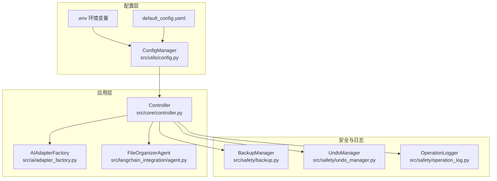
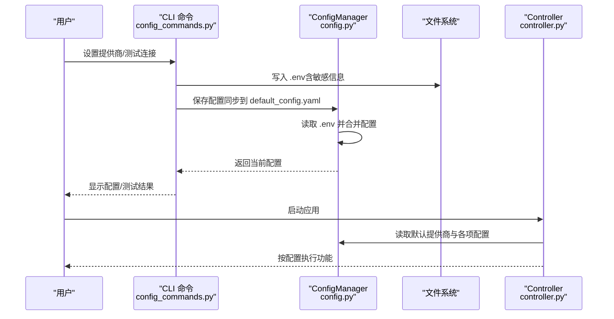
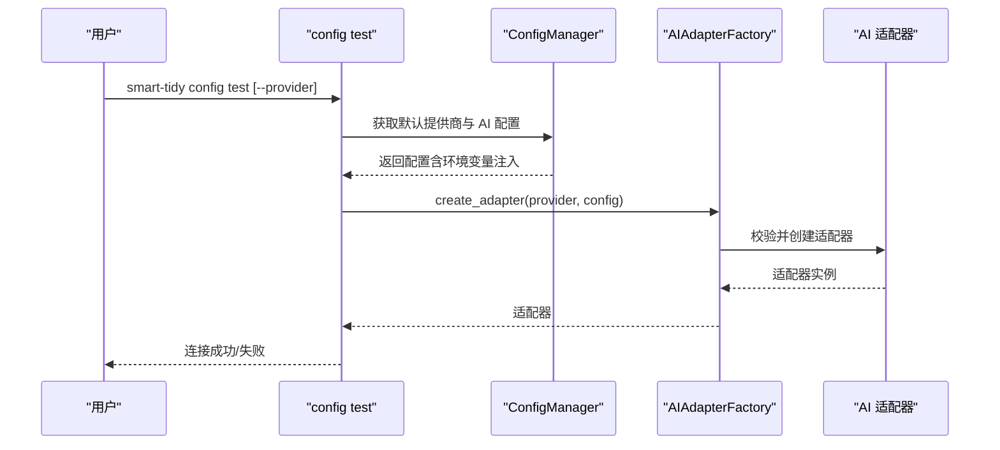
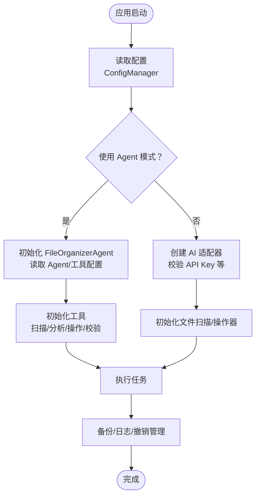
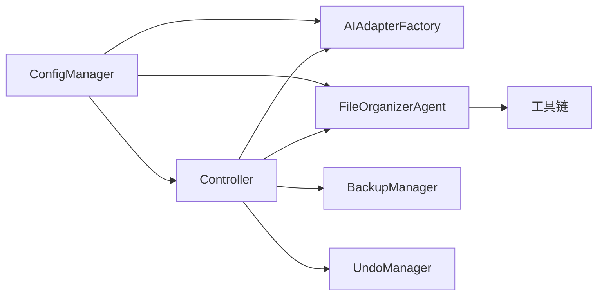

# 配置管理

<cite>
**本文引用的文件**
- [default_config.yaml](file://config/default_config.yaml)
- [config.py](file://src/utils/config.py)
- [CONFIGURATION.md](file://docs/CONFIGURATION.md)
- [env.custom.example](file://env.custom.example)
- [config_commands.py](file://src/cli/config_commands.py)
- [controller.py](file://src/core/controller.py)
- [adapter_factory.py](file://src/ai/adapter_factory.py)
- [agent.py](file://src/langchain_integration/agent.py)
- [backup.py](file://src/safety/backup.py)
- [undo_manager.py](file://src/safety/undo_manager.py)
- [file_info.py](file://src/models/file_info.py)
</cite>

## 目录
1. [简介](#简介)
2. [项目结构](#项目结构)
3. [核心组件](#核心组件)
4. [架构总览](#架构总览)
5. [详细组件分析](#详细组件分析)
6. [依赖关系分析](#依赖关系分析)
7. [性能考量](#性能考量)
8. [故障排除指南](#故障排除指南)
9. [结论](#结论)
10. [附录](#附录)

## 简介
本文件系统化梳理并解释本项目的配置管理体系，覆盖以下方面：
- default_config.yaml 的配置结构、字段含义、默认值与可选范围
- 环境变量配置（.env 文件）的设置方法、优先级规则与安全考虑
- AI 提供商配置、文件扫描设置、批量处理参数、安全策略、日志配置等各类配置项
- 配置验证、热更新、配置迁移的最佳实践
- 常见配置场景示例与故障排除指南

## 项目结构
配置相关的关键文件与职责如下：
- 配置文件：config/default_config.yaml
- 配置管理器：src/utils/config.py
- CLI 配置命令：src/cli/config_commands.py
- 配置使用入口：src/core/controller.py
- AI 适配器工厂：src/ai/adapter_factory.py
- LangChain Agent：src/langchain_integration/agent.py
- 安全与备份：src/safety/backup.py、src/safety/undo_manager.py
- 模型定义：src/models/file_info.py
- 配置文档：docs/CONFIGURATION.md
- 自定义 API 示例模板：env.custom.example

图表来源
- [default_config.yaml](file://config/default_config.yaml#L1-L79)
- [config.py](file://src/utils/config.py#L10-L116)
- [controller.py](file://src/core/controller.py#L15-L82)
- [adapter_factory.py](file://src/ai/adapter_factory.py#L11-L98)
- [agent.py](file://src/langchain_integration/agent.py#L21-L60)
- [backup.py](file://src/safety/backup.py#L10-L22)
- [undo_manager.py](file://src/safety/undo_manager.py#L10-L22)

章节来源
- [default_config.yaml](file://config/default_config.yaml#L1-L79)
- [config.py](file://src/utils/config.py#L10-L116)
- [controller.py](file://src/core/controller.py#L15-L82)

## 核心组件
- 配置管理器 ConfigManager
  - 负责加载 YAML 配置、读取/写入配置、合并环境变量优先级、提供层级键访问
  - 支持获取 AI 提供商配置并注入环境变量中的敏感信息
- CLI 配置命令
  - 提供查看、设置提供商、测试连接等能力，内部写入 .env 文件并同步配置文件
- 控制器 Controller
  - 依据配置初始化 AI 适配器或 LangChain Agent，读取文件扫描、批量处理、安全策略等参数
- AI 适配器工厂
  - 根据配置创建具体适配器，校验必要参数（如 API Key）
- LangChain Agent
  - 使用配置中的 Agent 与工具参数，执行 ReAct 工具调用流程
- 安全与备份
  - 备份管理器与撤销管理器基于配置决定是否创建备份、记录操作历史

章节来源
- [config.py](file://src/utils/config.py#L10-L116)
- [config_commands.py](file://src/cli/config_commands.py#L13-L219)
- [controller.py](file://src/core/controller.py#L15-L82)
- [adapter_factory.py](file://src/ai/adapter_factory.py#L11-L98)
- [agent.py](file://src/langchain_integration/agent.py#L21-L60)
- [backup.py](file://src/safety/backup.py#L10-L22)
- [undo_manager.py](file://src/safety/undo_manager.py#L10-L22)

## 架构总览
配置优先级（从高到低）：
1) 环境变量（.env 文件）
2) 配置文件（config/default_config.yaml）
3) 默认值（代码中）

该优先级确保敏感信息（如 API Key）不进入版本控制，同时允许通过 .env 灵活切换不同环境与提供商。

图表来源
- [config_commands.py](file://src/cli/config_commands.py#L50-L219)
- [config.py](file://src/utils/config.py#L10-L116)
- [controller.py](file://src/core/controller.py#L15-L82)

章节来源
- [CONFIGURATION.md](file://docs/CONFIGURATION.md#L5-L17)
- [config_commands.py](file://src/cli/config_commands.py#L50-L219)
- [config.py](file://src/utils/config.py#L10-L116)

## 详细组件分析

### default_config.yaml 配置结构与字段说明
- AI 提供商配置（ai）
  - default_provider：默认提供商（claude/openai/local/custom）
  - providers.claude/openai/local/custom：各提供商的模型、令牌上限、温度、超时、基础地址等
- LangChain Agent 配置（langchain）
  - agent.type：Agent 类型（openai-tools/react/structured-chat）
  - agent.verbose/max_iterations/max_execution_time：Agent 行为细节与超时
  - tools.file_scanner/max_files/recursive：扫描参数
  - tools.file_analyzer/content_analysis/max_content_size：内容分析参数
  - tools.file_operator/dry_run/batch_size：操作模拟与批处理
- 文件操作配置（file_operations）
  - batch_size：批量处理大小
  - max_file_size_mb：最大文件大小（MB）
  - scan_max_depth：最大扫描深度
  - backup_enabled：是否启用备份
  - supported_extensions：支持的文件扩展名列表
- 安全配置（safety）
  - require_confirmation/auto_backup/max_undo_history：确认、自动备份与撤销历史上限
- 日志配置（logging）
  - level/log_dir/retention_days/format：日志级别、目录、保留天数、格式

章节来源
- [default_config.yaml](file://config/default_config.yaml#L1-L79)

### 环境变量配置（.env 文件）
- 优先级：高于配置文件，低于代码默认值
- 推荐方式：使用 .env 文件集中管理，避免将敏感信息提交到版本控制
- 关键变量（部分）
  - DEFAULT_AI_PROVIDER：默认提供商（claude/openai/local/custom）
  - ANTHROPIC_API_KEY：Claude API Key
  - OPENAI_API_KEY：OpenAI API Key
  - LOCAL_LLM_BASE_URL/LOCAL_LLM_MODEL：本地模型地址与模型名
  - CUSTOM_API_BASE_URL/CUSTOM_API_KEY/CUSTOM_API_MODEL：自定义 OpenAI 兼容 API 的地址、密钥与模型
  - BATCH_SIZE/MAX_FILE_SIZE_MB/SCAN_MAX_DEPTH：高级配置（可选）

章节来源
- [CONFIGURATION.md](file://docs/CONFIGURATION.md#L157-L193)
- [config.py](file://src/utils/config.py#L76-L116)
- [env.custom.example](file://env.custom.example#L15-L102)

### 配置验证与测试
- CLI 提供“查看配置”“测试连接”命令
  - show：展示当前提供商与配置项（隐藏敏感信息）
  - test：尝试创建适配器并连接，校验必要参数
- 验证流程
  - 读取默认提供商与 AI 配置
  - 根据提供商检查 API Key/地址/模型等
  - 通过适配器工厂创建适配器并返回结果

图表来源
- [config_commands.py](file://src/cli/config_commands.py#L190-L219)
- [config.py](file://src/utils/config.py#L76-L116)
- [adapter_factory.py](file://src/ai/adapter_factory.py#L11-L98)

章节来源
- [config_commands.py](file://src/cli/config_commands.py#L13-L219)
- [adapter_factory.py](file://src/ai/adapter_factory.py#L11-L98)

### 配置使用与集成点
- 控制器读取配置
  - 读取默认提供商与 AI 配置
  - 初始化 LangChain Agent 或传统 AI 适配器
  - 读取文件扫描、批量处理、安全策略等参数
- Agent 使用配置
  - 读取 Agent 行为参数（verbose、max_iterations、max_execution_time）
  - 读取工具参数（扫描数量、内容分析长度、批处理大小）
- 安全与备份
  - 根据配置决定是否创建备份点、记录操作日志与撤销历史

图表来源
- [controller.py](file://src/core/controller.py#L15-L82)
- [agent.py](file://src/langchain_integration/agent.py#L21-L60)
- [backup.py](file://src/safety/backup.py#L10-L22)
- [undo_manager.py](file://src/safety/undo_manager.py#L10-L22)

章节来源
- [controller.py](file://src/core/controller.py#L15-L82)
- [agent.py](file://src/langchain_integration/agent.py#L21-L60)
- [backup.py](file://src/safety/backup.py#L10-L22)
- [undo_manager.py](file://src/safety/undo_manager.py#L10-L22)

### 配置迁移与最佳实践
- 迁移策略
  - 将敏感信息（API Key）迁移到 .env 文件，避免写入配置文件
  - 使用 DEFAULT_AI_PROVIDER 统一切换提供商，减少命令行参数
  - 通过 CLI 命令写入 .env 并同步配置文件，保证一致性
- 热更新
  - 当前实现未内置热重载机制；建议在外部进程管理器中重启应用以加载新配置
  - 对于非敏感参数（如日志级别、批处理大小），可在应用内设计增量刷新策略（需扩展）
- 验证与回滚
  - 使用“测试连接”命令验证配置
  - 利用备份与撤销管理器在执行前创建备份点，失败时可恢复

章节来源
- [CONFIGURATION.md](file://docs/CONFIGURATION.md#L234-L249)
- [config_commands.py](file://src/cli/config_commands.py#L50-L188)
- [backup.py](file://src/safety/backup.py#L10-L22)
- [undo_manager.py](file://src/safety/undo_manager.py#L10-L22)

## 依赖关系分析
- 配置管理器依赖
  - YAML 解析与 .env 加载（dotenv）
  - 层级键访问与默认值回退
- 控制器依赖
  - ConfigManager 提供的默认提供商与各项配置
  - AI 适配器工厂根据配置创建适配器
- Agent 依赖
  - LLMFactory（在 Agent 内部）根据配置创建 LLM
  - 工具链（扫描/分析/操作/校验）受配置影响
- 安全组件依赖
  - 备份与撤销管理器受配置控制（是否启用、历史上限）

图表来源
- [config.py](file://src/utils/config.py#L10-L116)
- [controller.py](file://src/core/controller.py#L15-L82)
- [adapter_factory.py](file://src/ai/adapter_factory.py#L11-L98)
- [agent.py](file://src/langchain_integration/agent.py#L21-L60)
- [backup.py](file://src/safety/backup.py#L10-L22)
- [undo_manager.py](file://src/safety/undo_manager.py#L10-L22)

章节来源
- [config.py](file://src/utils/config.py#L10-L116)
- [controller.py](file://src/core/controller.py#L15-L82)
- [adapter_factory.py](file://src/ai/adapter_factory.py#L11-L98)
- [agent.py](file://src/langchain_integration/agent.py#L21-L60)
- [backup.py](file://src/safety/backup.py#L10-L22)
- [undo_manager.py](file://src/safety/undo_manager.py#L10-L22)

## 性能考量
- 批量处理与扫描深度
  - 适当降低 batch_size 与 scan_max_depth 可减少内存占用与 I/O 压力
- 内容分析与文件大小
  - 控制 max_content_size 与 max_file_size_mb，避免对大文件进行昂贵的文本分析
- Agent 迭代与超时
  - 调整 max_iterations 与 max_execution_time，平衡准确度与响应时间
- 日志级别与保留
  - 在生产环境提高日志级别并设置合理保留天数，避免磁盘膨胀

## 故障排除指南
- 找不到 API Key
  - 检查 .env 文件是否存在、变量名是否正确、是否有多余空格或引号
  - 使用“查看配置”命令核对当前生效配置
- 配置不生效
  - 确认 .env 文件位于项目根目录
  - 使用“测试连接”命令验证提供商连通性
- 自定义 API 连接失败
  - 检查 CUSTOM_API_BASE_URL 格式、CUSTOM_API_KEY 有效性、CUSTOM_API_MODEL 名称
  - 确认网络可达与服务端口开放
- 切换提供商后仍使用旧配置
  - 修改 DEFAULT_AI_PROVIDER 后重新加载配置并测试连接

章节来源
- [CONFIGURATION.md](file://docs/CONFIGURATION.md#L285-L327)
- [config_commands.py](file://src/cli/config_commands.py#L13-L48)

## 结论
本项目的配置体系通过“环境变量优先”的设计实现了安全、灵活与一致的配置管理。配合 CLI 命令与文档指南，用户可以便捷地完成提供商切换、自定义 API 配置与多环境管理。建议在生产环境中坚持使用 .env 管理敏感信息，并结合备份与撤销机制保障操作安全。

## 附录
- 常见配置场景示例
  - 使用 Claude：设置 DEFAULT_AI_PROVIDER=claude 与 ANTHROPIC_API_KEY
  - 使用 OpenAI：设置 DEFAULT_AI_PROVIDER=openai 与 OPENAI_API_KEY
  - 使用本地模型：设置 DEFAULT_AI_PROVIDER=local 与 LOCAL_LLM_BASE_URL/LOCAL_LLM_MODEL
  - 使用自定义 API：设置 DEFAULT_AI_PROVIDER=custom 与 CUSTOM_API_BASE_URL/CUSTOM_API_KEY/CUSTOM_API_MODEL
- 安全建议
  - 将 .env 纳入 .gitignore
  - 定期轮换 API Key
  - 限制 .env 文件权限（Linux/macOS：chmod 600 .env）

章节来源
- [CONFIGURATION.md](file://docs/CONFIGURATION.md#L196-L231)
- [env.custom.example](file://env.custom.example#L15-L102)