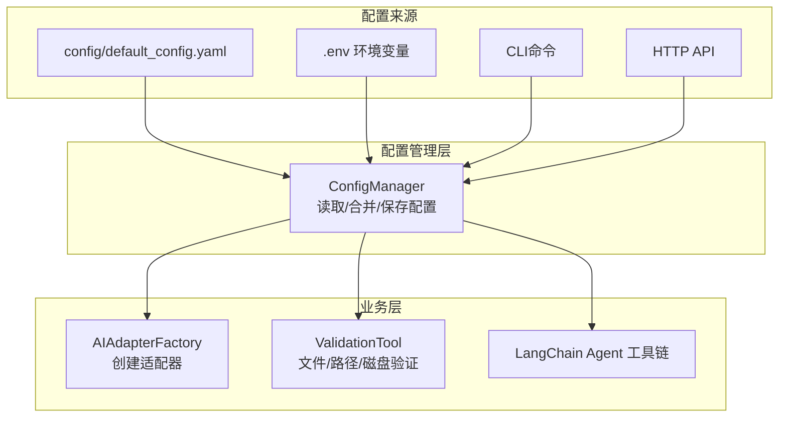
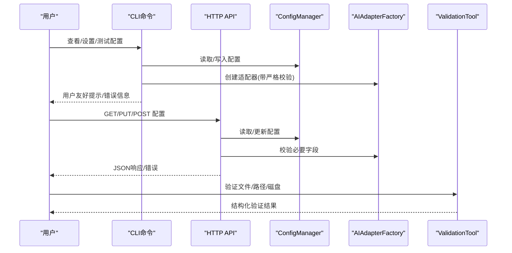
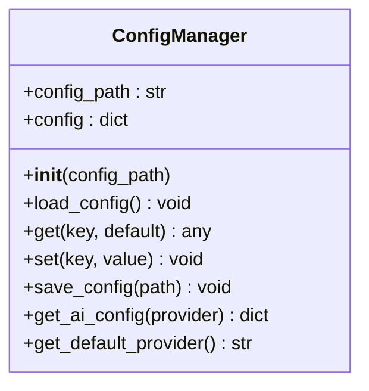
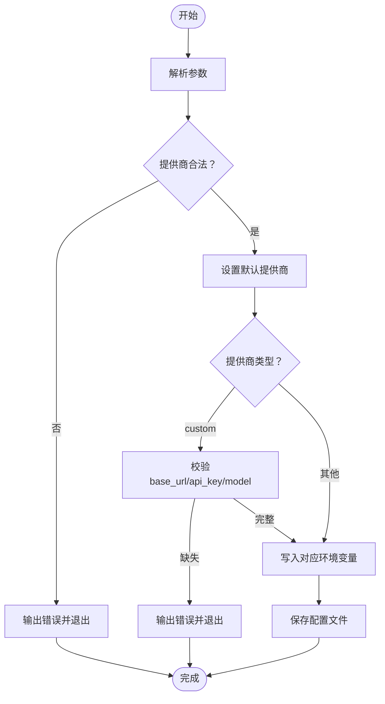
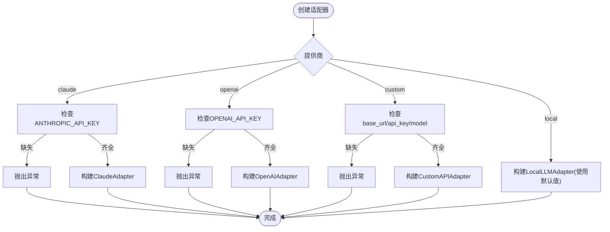
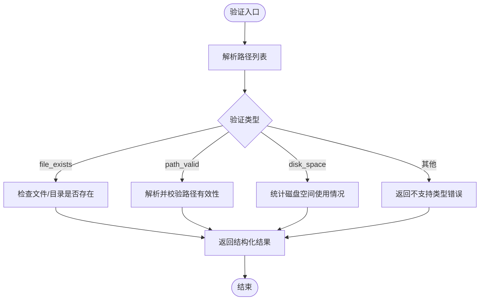
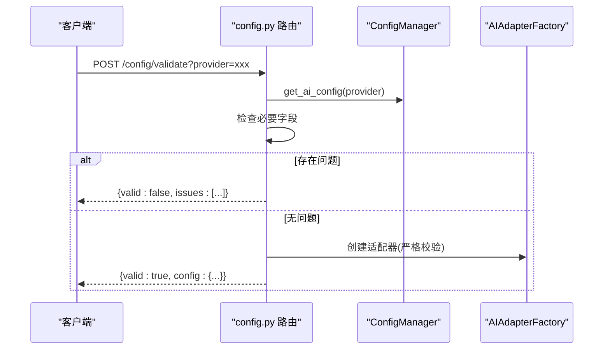
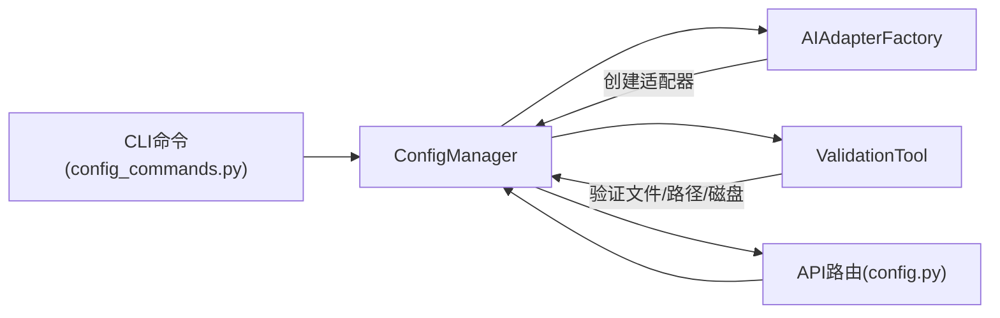

# 配置验证与错误处理

<cite>
**本文引用的文件**
- [config/default_config.yaml](file://config/default_config.yaml)
- [src/utils/config.py](file://src/utils/config.py)
- [src/cli/config_commands.py](file://src/cli/config_commands.py)
- [docs/CONFIGURATION.md](file://docs/CONFIGURATION.md)
- [src/ai/adapter_factory.py](file://src/ai/adapter_factory.py)
- [src/langchain_integration/tools/validation_tool.py](file://src/langchain_integration/tools/validation_tool.py)
- [src/api/routers/config.py](file://src/api/routers/config.py)
- [env.custom.example](file://env.custom.example)
- [examples/basic_usage.py](file://examples/basic_usage.py)
</cite>

## 目录
1. [简介](#简介)
2. [项目结构](#项目结构)
3. [核心组件](#核心组件)
4. [架构总览](#架构总览)
5. [详细组件分析](#详细组件分析)
6. [依赖关系分析](#依赖关系分析)
7. [性能考量](#性能考量)
8. [故障排除指南](#故障排除指南)
9. [结论](#结论)
10. [附录](#附录)

## 简介
本文件系统性阐述本项目的配置验证与错误处理机制，覆盖配置优先级、必填项检查、数据类型与范围验证、依赖关系验证、错误分类与消息格式、错误恢复策略、配置迁移与版本兼容性、调试工具与故障排除方法，以及异常捕获与用户友好提示机制。文档基于仓库中的配置文件、配置管理器、CLI命令、适配器工厂、LangChain验证工具与API路由等实现进行归纳总结。

## 项目结构
配置系统围绕“配置文件 + 环境变量 + CLI/HTTP接口”的三层配置来源构建，并通过配置管理器统一读取与合并，最终驱动AI适配器与LangChain工具链。

图表来源
- [config/default_config.yaml](file://config/default_config.yaml#L1-L79)
- [src/utils/config.py](file://src/utils/config.py#L10-L116)
- [src/ai/adapter_factory.py](file://src/ai/adapter_factory.py#L11-L98)
- [src/langchain_integration/tools/validation_tool.py](file://src/langchain_integration/tools/validation_tool.py#L24-L171)
- [src/api/routers/config.py](file://src/api/routers/config.py#L15-L206)

章节来源
- [config/default_config.yaml](file://config/default_config.yaml#L1-L79)
- [src/utils/config.py](file://src/utils/config.py#L10-L116)
- [docs/CONFIGURATION.md](file://docs/CONFIGURATION.md#L1-L336)

## 核心组件
- 配置管理器：负责加载、合并、查询、保存配置；优先级为环境变量 > 配置文件 > 默认值。
- CLI配置命令：提供查看、设置提供商、测试连接等能力，内部调用配置管理器并进行基础校验。
- 适配器工厂：依据配置创建具体AI适配器，执行更严格的必填项与依赖关系校验。
- LangChain验证工具：对文件存在性、路径有效性、磁盘空间进行验证，返回结构化结果。
- API路由：提供HTTP接口获取/更新/验证配置，统一错误处理与响应格式。

章节来源
- [src/utils/config.py](file://src/utils/config.py#L10-L116)
- [src/cli/config_commands.py](file://src/cli/config_commands.py#L13-L219)
- [src/ai/adapter_factory.py](file://src/ai/adapter_factory.py#L11-L98)
- [src/langchain_integration/tools/validation_tool.py](file://src/langchain_integration/tools/validation_tool.py#L24-L171)
- [src/api/routers/config.py](file://src/api/routers/config.py#L15-L206)

## 架构总览
配置验证与错误处理贯穿从配置读取到业务执行的全流程，形成“读取-校验-执行-回滚”的闭环。

图表来源
- [src/cli/config_commands.py](file://src/cli/config_commands.py#L13-L219)
- [src/api/routers/config.py](file://src/api/routers/config.py#L15-L206)
- [src/utils/config.py](file://src/utils/config.py#L35-L116)
- [src/ai/adapter_factory.py](file://src/ai/adapter_factory.py#L14-L98)
- [src/langchain_integration/tools/validation_tool.py](file://src/langchain_integration/tools/validation_tool.py#L41-L171)

## 详细组件分析

### 配置管理器与优先级
- 优先级：环境变量(.env) > 配置文件(config/default_config.yaml) > 代码默认值。
- 关键能力：
  - 加载配置文件并处理异常。
  - 支持点号键路径查询与递归设置。
  - 从环境变量注入API Key与模型参数。
  - 保存配置到文件。

图表来源
- [src/utils/config.py](file://src/utils/config.py#L10-L116)

章节来源
- [src/utils/config.py](file://src/utils/config.py#L10-L116)
- [docs/CONFIGURATION.md](file://docs/CONFIGURATION.md#L5-L17)

### CLI配置命令与基础校验
- show：展示当前配置，隐藏敏感信息（如API Key），并输出文件操作相关参数。
- set-provider：设置默认提供商与相关参数，进行基础合法性校验（如提供商枚举、custom必须提供base_url/api_key/model）。
- test：测试AI提供商连接，检查必要配置并尝试创建适配器。

图表来源
- [src/cli/config_commands.py](file://src/cli/config_commands.py#L50-L188)

章节来源
- [src/cli/config_commands.py](file://src/cli/config_commands.py#L13-L219)

### 适配器工厂与严格校验
- create_adapter：根据提供商创建适配器，执行严格必填项校验：
  - claude/openai：要求API Key存在。
  - custom：要求base_url、api_key、model均存在。
  - local：无强制必填项，但会使用默认值。
- 未满足条件时抛出明确异常，便于上层捕获与提示。

图表来源
- [src/ai/adapter_factory.py](file://src/ai/adapter_factory.py#L14-L98)

章节来源
- [src/ai/adapter_factory.py](file://src/ai/adapter_factory.py#L14-L98)

### LangChain验证工具与范围/依赖校验
- 支持三种验证类型：文件存在、路径有效、磁盘空间。
- 对每个路径执行独立校验，返回结构化JSON结果，包含success、error、warnings等字段。
- 异常被捕获并以JSON形式返回，保证工具链稳定性。

图表来源
- [src/langchain_integration/tools/validation_tool.py](file://src/langchain_integration/tools/validation_tool.py#L41-L171)

章节来源
- [src/langchain_integration/tools/validation_tool.py](file://src/langchain_integration/tools/validation_tool.py#L24-L171)

### HTTP API配置路由与统一错误处理
- GET /config：返回当前配置，标注各提供商是否已配置。
- PUT /config/ai：更新AI配置（模型、max_tokens、temperature、base_url），API Key建议通过环境变量设置。
- POST /config/validate：验证指定提供商配置是否可用，返回valid及issues列表。
- POST /config/set-default：设置默认提供商，进行合法性校验。

图表来源
- [src/api/routers/config.py](file://src/api/routers/config.py#L128-L176)
- [src/utils/config.py](file://src/utils/config.py#L76-L116)
- [src/ai/adapter_factory.py](file://src/ai/adapter_factory.py#L14-L98)

章节来源
- [src/api/routers/config.py](file://src/api/routers/config.py#L15-L206)

### 配置验证规则与流程
- 必填项检查
  - claude/openai：必须设置对应API Key环境变量。
  - custom：必须设置base_url、api_key、model。
  - local：无强制必填项，但建议设置base_url与model。
- 数据类型与范围验证
  - 配置文件中数值字段（如batch_size、max_tokens、temperature、timeout）在适配器构造时使用默认值或传入值，未见显式的范围约束逻辑；可在上层调用处补充范围校验。
- 依赖关系验证
  - set-provider命令对custom提供商进行依赖关系校验（base_url/api_key/model三者缺一不可）。
  - API路由对必要环境变量进行依赖检查。
- 错误消息格式
  - CLI命令使用控制台彩色输出，错误信息简洁明确。
  - API路由返回JSON结构，包含valid、provider、issues等字段。
  - LangChain验证工具返回JSON，包含success、error、results等字段。
- 错误恢复机制
  - CLI命令提供重试与重新设置的步骤建议。
  - API路由在异常时返回HTTP 500与错误详情，便于前端处理。
  - 配置管理器在加载失败时抛出RuntimeError，便于上层捕获。

章节来源
- [src/cli/config_commands.py](file://src/cli/config_commands.py#L74-L188)
- [src/api/routers/config.py](file://src/api/routers/config.py#L133-L176)
- [src/ai/adapter_factory.py](file://src/ai/adapter_factory.py#L42-L91)
- [src/langchain_integration/tools/validation_tool.py](file://src/langchain_integration/tools/validation_tool.py#L58-L68)

### 配置迁移、版本兼容性与向后兼容
- 当前实现未发现显式的配置迁移脚本或版本号字段。
- 建议策略（概念性说明）：
  - 版本字段：在配置文件中增加version字段，用于标识配置格式版本。
  - 迁移流程：启动时检测version，若低于当前版本则执行迁移函数，更新配置并写回。
  - 兼容性：新增字段采用默认值，删除字段保留兼容读取逻辑。
  - 回滚：迁移失败时保留原配置副本，允许用户手动回滚。
- 实施要点：迁移逻辑应幂等、可回滚、具备详细日志与错误处理。

[本节为概念性指导，不直接分析具体文件]

### 配置调试工具与故障排除
- 配置查看与测试
  - CLI：smart-tidy config show、smart-tidy config test。
  - API：GET /config、POST /config/validate。
- 常见问题与排查清单
  - API Key未配置：检查环境变量名与值，确认未有多余空格或引号。
  - 配置不生效：确认.env文件位于项目根目录，重新加载配置。
  - 自定义API连接失败：检查base_url格式、model名称、网络连通性。
- 安全建议
  - .env文件加入.gitignore，Linux/macOS设置文件权限为600。
  - 不在配置文件中硬编码API Key，使用环境变量。

章节来源
- [docs/CONFIGURATION.md](file://docs/CONFIGURATION.md#L234-L336)
- [src/cli/config_commands.py](file://src/cli/config_commands.py#L190-L219)
- [src/api/routers/config.py](file://src/api/routers/config.py#L15-L83)

### 异常捕获、处理与用户友好提示
- 异常捕获
  - 配置文件加载失败：抛出RuntimeError，提示具体错误。
  - 适配器创建失败：抛出ValueError，明确缺少的关键配置。
  - 工具链异常：验证工具捕获异常并返回JSON错误。
  - API异常：统一包装为HTTPException，返回500与错误详情。
- 用户友好提示
  - CLI命令使用彩色输出与清晰的错误信息。
  - API返回结构化JSON，包含valid、issues、error等字段。
  - 验证工具返回结构化结果，便于前端渲染。

章节来源
- [src/utils/config.py](file://src/utils/config.py#L40-L41)
- [src/ai/adapter_factory.py](file://src/ai/adapter_factory.py#L43-L44)
- [src/langchain_integration/tools/validation_tool.py](file://src/langchain_integration/tools/validation_tool.py#L64-L68)
- [src/api/routers/config.py](file://src/api/routers/config.py#L175-L176)

## 依赖关系分析

图表来源
- [src/utils/config.py](file://src/utils/config.py#L10-L116)
- [src/ai/adapter_factory.py](file://src/ai/adapter_factory.py#L11-L98)
- [src/langchain_integration/tools/validation_tool.py](file://src/langchain_integration/tools/validation_tool.py#L24-L171)
- [src/api/routers/config.py](file://src/api/routers/config.py#L15-L206)
- [src/cli/config_commands.py](file://src/cli/config_commands.py#L13-L219)

章节来源
- [src/utils/config.py](file://src/utils/config.py#L10-L116)
- [src/ai/adapter_factory.py](file://src/ai/adapter_factory.py#L11-L98)
- [src/langchain_integration/tools/validation_tool.py](file://src/langchain_integration/tools/validation_tool.py#L24-L171)
- [src/api/routers/config.py](file://src/api/routers/config.py#L15-L206)
- [src/cli/config_commands.py](file://src/cli/config_commands.py#L13-L219)

## 性能考量
- 配置读取：ConfigManager使用内存字典缓存配置，查询复杂度O(k)，k为键层级数。
- 验证工具：对每个路径独立校验，时间复杂度O(n)，n为路径数量；磁盘空间统计使用系统调用，开销与路径数量线性相关。
- 适配器创建：工厂方法为O(1)查找与构造，成本主要在外部API调用（不在本仓库范围内）。
- 建议：批量路径验证时避免重复解析同一路径；对大量文件的磁盘空间检查可考虑并发优化。

[本节提供一般性指导，不直接分析具体文件]

## 故障排除指南
- 配置文件加载失败
  - 症状：启动时报错“找不到配置文件”或“加载配置文件失败”。
  - 处理：确认config/default_config.yaml存在且可读，检查路径解析逻辑。
- API Key未配置
  - 症状：适配器创建抛出异常，提示未配置API Key。
  - 处理：设置对应环境变量（ANTHROPIC_API_KEY、OPENAI_API_KEY等），或通过CLI命令写入.env。
- 自定义API配置不生效
  - 症状：POST /config/validate返回issues。
  - 处理：检查CUSTOM_API_BASE_URL、CUSTOM_API_KEY、CUSTOM_API_MODEL是否正确设置。
- 验证工具异常
  - 症状：验证返回error字段。
  - 处理：检查路径格式与权限，确认系统磁盘统计可用。

章节来源
- [src/utils/config.py](file://src/utils/config.py#L35-L41)
- [src/ai/adapter_factory.py](file://src/ai/adapter_factory.py#L42-L91)
- [src/api/routers/config.py](file://src/api/routers/config.py#L133-L176)
- [src/langchain_integration/tools/validation_tool.py](file://src/langchain_integration/tools/validation_tool.py#L64-L68)

## 结论
本项目通过“配置文件 + 环境变量 + CLI/HTTP接口”的多源配置体系，结合ConfigManager统一读取与合并，实现了清晰的配置优先级与可维护性。CLI与API提供了基础的配置查看、设置与验证能力，适配器工厂与LangChain验证工具分别承担了严格必填项校验与范围/依赖校验。建议在未来引入显式的配置版本与迁移机制，进一步增强向后兼容性与自动化修复能力。

[本节为总结性内容，不直接分析具体文件]

## 附录
- 环境变量参考与示例
  - DEFAULT_AI_PROVIDER、ANTHROPIC_API_KEY、OPENAI_API_KEY、LOCAL_LLM_BASE_URL、LOCAL_LLM_MODEL、CUSTOM_API_BASE_URL、CUSTOM_API_KEY、CUSTOM_API_MODEL等。
- 配置示例
  - env.custom.example展示了自定义API的配置模板与使用说明。

章节来源
- [docs/CONFIGURATION.md](file://docs/CONFIGURATION.md#L157-L186)
- [env.custom.example](file://env.custom.example#L15-L103)