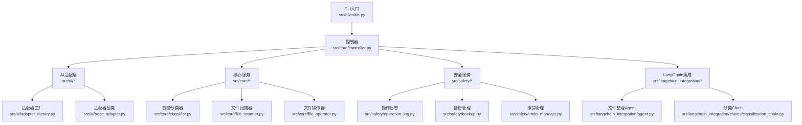
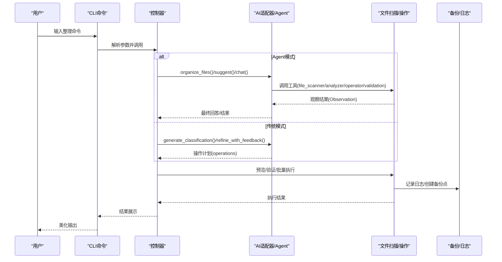
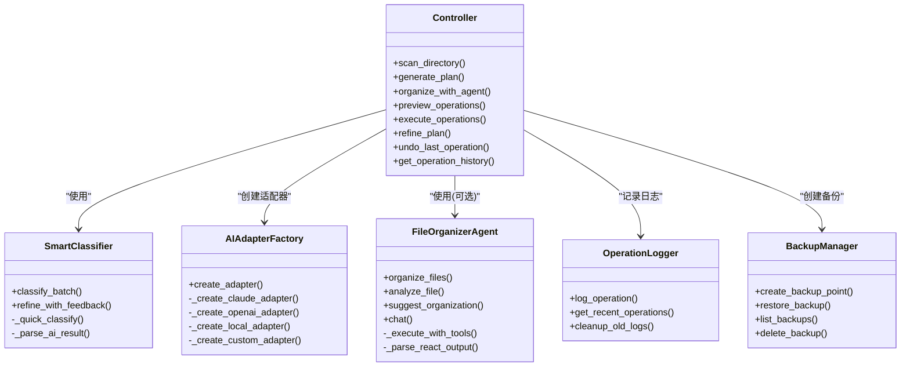

# 功能特性总览

<cite>
**本文引用的文件**
- [README.md](file://README.md)
- [src/__init__.py](file://src/__init__.py)
- [src/ai/__init__.py](file://src/ai/__init__.py)
- [src/ai/base_adapter.py](file://src/ai/base_adapter.py)
- [src/ai/adapter_factory.py](file://src/ai/adapter_factory.py)
- [src/core/__init__.py](file://src/core/__init__.py)
- [src/core/classifier.py](file://src/core/classifier.py)
- [src/core/controller.py](file://src/core/controller.py)
- [src/langchain_integration/__init__.py](file://src/langchain_integration/__init__.py)
- [src/langchain_integration/agent.py](file://src/langchain_integration/agent.py)
- [src/langchain_integration/chains/classification_chain.py](file://src/langchain_integration/chains/classification_chain.py)
- [src/safety/__init__.py](file://src/safety/__init__.py)
- [src/safety/operation_log.py](file://src/safety/operation_log.py)
- [src/safety/backup.py](file://src/safety/backup.py)
- [src/models/file_info.py](file://src/models/file_info.py)
- [src/models/operation.py](file://src/models/operation.py)
- [src/cli/main.py](file://src/cli/main.py)
- [config/default_config.yaml](file://config/default_config.yaml)
</cite>

## 目录
1. [简介](#简介)
2. [项目结构](#项目结构)
3. [核心组件](#核心组件)
4. [架构总览](#架构总览)
5. [详细组件分析](#详细组件分析)
6. [依赖关系分析](#依赖关系分析)
7. [性能考量](#性能考量)
8. [故障排查指南](#故障排查指南)
9. [结论](#结论)
10. [附录](#附录)

## 简介
本项目是一个基于AI的智能文件分类与整理工具，支持自然语言交互、多提供商AI适配、LangChain Agent智能决策、批量处理、安全可靠的备份与撤销、操作日志审计、以及友好的CLI界面。其核心特性包括：AI Agent驱动、深度理解、工具化设计、智能分类、对话交互、安全可靠、批量处理、友好界面、操作日志、高度可扩展、广泛兼容。

## 项目结构
项目采用模块化分层架构，围绕“CLI层 → 控制器层 → 服务层（AI/文件/安全）”展开，配合配置中心与模型层，形成清晰的职责边界与扩展点。

图表来源
- [src/cli/main.py](file://src/cli/main.py#L1-L138)
- [src/core/controller.py](file://src/core/controller.py#L1-L310)
- [src/ai/adapter_factory.py](file://src/ai/adapter_factory.py#L1-L98)
- [src/ai/base_adapter.py](file://src/ai/base_adapter.py#L1-L70)
- [src/core/classifier.py](file://src/core/classifier.py#L1-L265)
- [src/safety/operation_log.py](file://src/safety/operation_log.py#L1-L133)
- [src/safety/backup.py](file://src/safety/backup.py#L1-L152)
- [src/langchain_integration/agent.py](file://src/langchain_integration/agent.py#L1-L576)
- [src/langchain_integration/chains/classification_chain.py](file://src/langchain_integration/chains/classification_chain.py#L1-L138)

章节来源
- [README.md](file://README.md#L220-L240)
- [src/cli/main.py](file://src/cli/main.py#L1-L138)
- [src/core/controller.py](file://src/core/controller.py#L1-L310)

## 核心组件
- CLI层：基于Typer + Rich，提供命令式交互与美化输出，涵盖整理、交互、撤销、历史、Agent模式、建议、分析、聊天、版本等命令。
- 控制器层：协调AI适配器/Agent、文件扫描、文件操作、安全日志与备份、撤销管理、对话上下文。
- AI适配层：统一适配Claude、OpenAI、本地模型、自定义API，工厂化创建与配置注入。
- 核心服务层：文件扫描、智能分类（规则+AI）、文件操作（移动/重命名/创建文件夹/删除）、对话上下文管理。
- LangChain集成：Agent（ReAct工具链）+ Chain（分类链），支持论文整理默认模式与通用整理模式。
- 安全服务层：操作日志（JSONL）、备份清单（manifest）、撤销栈。
- 模型层：文件信息、操作类型与结果、操作结果统计。

章节来源
- [src/cli/main.py](file://src/cli/main.py#L1-L138)
- [src/core/controller.py](file://src/core/controller.py#L1-L310)
- [src/ai/adapter_factory.py](file://src/ai/adapter_factory.py#L1-L98)
- [src/core/classifier.py](file://src/core/classifier.py#L1-L265)
- [src/langchain_integration/agent.py](file://src/langchain_integration/agent.py#L1-L576)
- [src/safety/operation_log.py](file://src/safety/operation_log.py#L1-L133)
- [src/safety/backup.py](file://src/safety/backup.py#L1-L152)
- [src/models/file_info.py](file://src/models/file_info.py#L1-L48)
- [src/models/operation.py](file://src/models/operation.py#L1-L54)

## 架构总览
系统通过CLI触发，控制器根据配置选择Agent模式或传统AI适配器模式；Agent模式使用LangChain工具链（扫描、分析、操作、校验）完成ReAct式决策；传统模式由智能分类器结合规则与AI生成操作计划；执行阶段统一走文件操作器，配合备份与日志，支持撤销与历史查询。

图表来源
- [src/cli/main.py](file://src/cli/main.py#L35-L127)
- [src/core/controller.py](file://src/core/controller.py#L109-L256)
- [src/langchain_integration/agent.py](file://src/langchain_integration/agent.py#L100-L228)
- [src/safety/operation_log.py](file://src/safety/operation_log.py#L24-L53)
- [src/safety/backup.py](file://src/safety/backup.py#L23-L71)

## 详细组件分析

### AI Agent驱动（LangChain）
- 技术实现原理
  - Agent封装LLM与工具集合，采用ReAct范式解析工具调用，避免函数调用绑定的不确定性。
  - 支持论文整理默认模式与通用整理模式，自动判断任务类型并构造提示词。
  - 工具包括：文件扫描、内容分析、文件操作、校验。
- 使用场景与价值
  - 适合复杂、多步、需要自主决策的整理任务；可与用户对话迭代优化。
- 优势
  - 强大的工具组合能力与可扩展性；无需用户逐条指令，Agent自动推进。
- 代码片段路径
  - [Agent初始化与工具创建](file://src/langchain_integration/agent.py#L21-L68)
  - [ReAct执行循环与输出解析](file://src/langchain_integration/agent.py#L300-L431)
  - [论文任务判定与默认流程](file://src/langchain_integration/agent.py#L70-L99)

章节来源
- [src/langchain_integration/agent.py](file://src/langchain_integration/agent.py#L1-L576)

### 深度理解（语义级内容分析）
- 技术实现原理
  - 通过内容分析器对PDF等文件进行内容抽取与语义特征提取，辅助论文识别与分类。
  - 在Agent模式中，Analyzer工具用于识别论文属性（如是否为论文）。
- 使用场景与价值
  - 高精度区分论文与其他文档，减少误判；支持多轮对话反馈优化。
- 代码片段路径
  - [内容分析器调用](file://src/langchain_integration/agent.py#L432-L442)
  - [分类链格式化文件信息与建议类别](file://src/langchain_integration/chains/classification_chain.py#L68-L137)

章节来源
- [src/langchain_integration/agent.py](file://src/langchain_integration/agent.py#L432-L442)
- [src/langchain_integration/chains/classification_chain.py](file://src/langchain_integration/chains/classification_chain.py#L1-L138)

### 工具化设计（标准化LangChain Tools）
- 技术实现原理
  - 将扫描、分析、操作、校验抽象为独立工具，Agent通过ReAct格式调用，便于扩展与替换。
- 使用场景与价值
  - 快速接入新工具，提升系统可维护性与可扩展性。
- 代码片段路径
  - [工具注册与调用](file://src/langchain_integration/agent.py#L61-L68)
  - [工具查找与执行](file://src/langchain_integration/agent.py#L229-L246)

章节来源
- [src/langchain_integration/agent.py](file://src/langchain_integration/agent.py#L61-L68)
- [src/langchain_integration/agent.py](file://src/langchain_integration/agent.py#L229-L246)

### 智能分类（规则+AI融合）
- 技术实现原理
  - 先用规则快速分类（扩展名、已知规则），对不确定文件使用AI生成操作计划；支持从用户反馈中学习新规则。
  - 传统模式下，分类器负责解析AI结果并生成标准操作；Agent模式下由Agent内部工具链完成。
- 使用场景与价值
  - 高效处理大量文件，兼顾准确性与速度；可随使用经验持续优化。
- 代码片段路径
  - [批量分类与降级策略](file://src/core/classifier.py#L24-L66)
  - [反馈学习与规则提取](file://src/core/classifier.py#L138-L156)
  - [AI结果解析与回退分类](file://src/core/classifier.py#L157-L208)

章节来源
- [src/core/classifier.py](file://src/core/classifier.py#L1-L265)

### 对话交互（多轮上下文与建议）
- 技术实现原理
  - 控制器维护对话上下文，记录历史与反馈；Agent支持聊天与建议生成。
- 使用场景与价值
  - 通过多轮对话逐步细化整理方案，降低一次性理解偏差。
- 代码片段路径
  - [对话管理器与上下文](file://src/core/classifier.py#L232-L265)
  - [Agent聊天与建议](file://src/langchain_integration/agent.py#L527-L567)
  - [控制器生成计划与记录交互](file://src/core/controller.py#L109-L140)

章节来源
- [src/core/classifier.py](file://src/core/classifier.py#L232-L265)
- [src/langchain_integration/agent.py](file://src/langchain_integration/agent.py#L527-L567)
- [src/core/controller.py](file://src/core/controller.py#L109-L140)

### 安全可靠（备份、撤销、日志）
- 技术实现原理
  - 执行前创建备份清单（manifest），记录文件哈希与元信息；异常时可审计但不自动恢复；记录操作日志（JSONL）；撤销管理记录可逆操作。
- 使用场景与价值
  - 高风险操作前的安全保障；可审计、可追溯、可回滚。
- 代码片段路径
  - [备份清单创建与校验](file://src/safety/backup.py#L23-L108)
  - [操作日志写入与查询](file://src/safety/operation_log.py#L24-L83)
  - [控制器执行与日志/备份/撤销集成](file://src/core/controller.py#L203-L256)

章节来源
- [src/safety/backup.py](file://src/safety/backup.py#L1-L152)
- [src/safety/operation_log.py](file://src/safety/operation_log.py#L1-L133)
- [src/core/controller.py](file://src/core/controller.py#L203-L256)

### 批量处理（智能分批与并发控制）
- 技术实现原理
  - 控制器根据配置设定批次大小，文件操作器按批次执行；扫描器支持最大深度与文件大小限制，避免资源耗尽。
- 使用场景与价值
  - 大规模文件整理的稳定性与可控性；避免内存与IO压力。
- 代码片段路径
  - [批量执行与批次大小](file://src/core/controller.py#L231-L232)
  - [扫描器配置与限制](file://src/core/controller.py#L67-L69)
  - [配置项：批处理大小与扫描深度](file://config/default_config.yaml#L48-L52)

章节来源
- [src/core/controller.py](file://src/core/controller.py#L231-L232)
- [src/core/controller.py](file://src/core/controller.py#L67-L69)
- [config/default_config.yaml](file://config/default_config.yaml#L48-L52)

### 友好界面（CLI + Rich）
- 技术实现原理
  - CLI基于Typer声明命令与参数，Rich负责终端渲染与美化输出；控制器在关键节点输出进度与预览。
- 使用场景与价值
  - 低门槛使用，清晰反馈；适合命令行环境下的高效操作。
- 代码片段路径
  - [主CLI应用与命令注册](file://src/cli/main.py#L22-L127)
  - [版本命令与美化输出](file://src/cli/main.py#L129-L133)

章节来源
- [src/cli/main.py](file://src/cli/main.py#L1-L138)

### 操作日志（审计与追踪）
- 技术实现原理
  - 每个操作写入JSONL日志文件，按日期切分；支持近期查询与按日期检索；可清理过期日志。
- 使用场景与价值
  - 审计合规、问题定位、历史追踪。
- 代码片段路径
  - [日志写入与查询](file://src/safety/operation_log.py#L24-L83)
  - [过期清理](file://src/safety/operation_log.py#L111-L133)

章节来源
- [src/safety/operation_log.py](file://src/safety/operation_log.py#L1-L133)

### 高度可扩展（模块化与插件化）
- 技术实现原理
  - 适配器工厂统一创建不同提供商适配器；LangChain工具链可新增工具；分类器可扩展规则与学习机制。
- 使用场景与价值
  - 快速适配新AI提供商或新工具，满足定制化需求。
- 代码片段路径
  - [适配器工厂与提供商映射](file://src/ai/adapter_factory.py#L14-L37)
  - [工具注册与Agent调用](file://src/langchain_integration/agent.py#L61-L68)

章节来源
- [src/ai/adapter_factory.py](file://src/ai/adapter_factory.py#L1-L98)
- [src/langchain_integration/agent.py](file://src/langchain_integration/agent.py#L61-L68)

### 广泛兼容（多提供商与自定义API）
- 技术实现原理
  - 支持Claude、OpenAI、本地模型、自定义OpenAI兼容API；通过配置中心集中管理提供商参数。
- 使用场景与价值
  - 适配不同部署环境与预算；支持企业私有化与多云策略。
- 代码片段路径
  - [适配器工厂创建各提供商适配器](file://src/ai/adapter_factory.py#L39-L98)
  - [默认配置与提供商参数](file://config/default_config.yaml#L2-L24)

章节来源
- [src/ai/adapter_factory.py](file://src/ai/adapter_factory.py#L1-L98)
- [config/default_config.yaml](file://config/default_config.yaml#L1-L79)

## 依赖关系分析

图表来源
- [src/core/controller.py](file://src/core/controller.py#L15-L310)
- [src/core/classifier.py](file://src/core/classifier.py#L11-L265)
- [src/ai/adapter_factory.py](file://src/ai/adapter_factory.py#L11-L98)
- [src/langchain_integration/agent.py](file://src/langchain_integration/agent.py#L21-L576)
- [src/safety/operation_log.py](file://src/safety/operation_log.py#L11-L133)
- [src/safety/backup.py](file://src/safety/backup.py#L10-L152)

章节来源
- [src/core/controller.py](file://src/core/controller.py#L1-L310)
- [src/core/classifier.py](file://src/core/classifier.py#L1-L265)
- [src/ai/adapter_factory.py](file://src/ai/adapter_factory.py#L1-L98)
- [src/langchain_integration/agent.py](file://src/langchain_integration/agent.py#L1-L576)
- [src/safety/operation_log.py](file://src/safety/operation_log.py#L1-L133)
- [src/safety/backup.py](file://src/safety/backup.py#L1-L152)

## 性能考量
- 批处理与资源限制
  - 通过配置控制批次大小、扫描深度与最大文件大小，避免内存与IO瓶颈。
- AI调用成本控制
  - 先用规则快速分类，减少不必要的AI调用；在Agent模式下通过工具链减少重复分析。
- I/O与日志
  - 日志采用JSONL按日切分，定期清理过期日志，降低磁盘占用。
- 备份策略
  - 备份仅记录清单与哈希，不复制大文件，节省存储空间。

章节来源
- [config/default_config.yaml](file://config/default_config.yaml#L48-L79)
- [src/safety/operation_log.py](file://src/safety/operation_log.py#L111-L133)
- [src/safety/backup.py](file://src/safety/backup.py#L23-L71)

## 故障排查指南
- Agent导入失败回退
  - 若LangChain不可用，控制器会回退到传统模式，确保基本功能可用。
- AI响应格式校验
  - 适配器基类提供统一响应校验，若格式不符自动降级。
- 执行异常与备份恢复
  - 执行失败时记录失败日志并尝试恢复备份（若备份存在）。
- 日志与历史
  - 使用历史命令查看最近操作；必要时清理过期日志释放空间。
- 配置检查
  - 确认默认提供商与API密钥配置正确；自定义API需检查URL与模型名称。

章节来源
- [src/core/controller.py](file://src/core/controller.py#L42-L59)
- [src/ai/base_adapter.py](file://src/ai/base_adapter.py#L52-L70)
- [src/core/controller.py](file://src/core/controller.py#L243-L255)
- [src/safety/operation_log.py](file://src/safety/operation_log.py#L85-L109)
- [config/default_config.yaml](file://config/default_config.yaml#L1-L79)

## 结论
本项目以“AI Agent驱动 + 工具化设计”为核心，结合“智能分类 + 深度理解”，在保证安全可靠的前提下，实现了高效、可扩展、易用的文件整理解决方案。其模块化架构与多提供商兼容性，使其既能满足个人用户的日常整理需求，也能适应团队与企业级的定制化场景。

## 附录
- 版本信息：可通过版本命令查看。
- CLI命令总览：整理、交互、撤销、历史、Agent模式、建议、分析、聊天、版本。

章节来源
- [src/cli/main.py](file://src/cli/main.py#L129-L133)