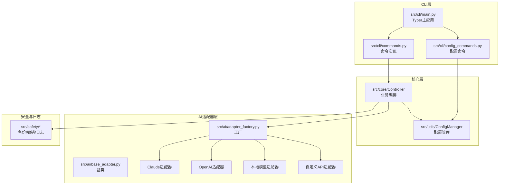
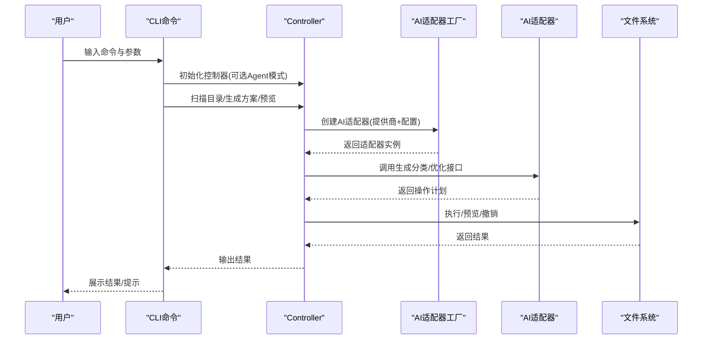
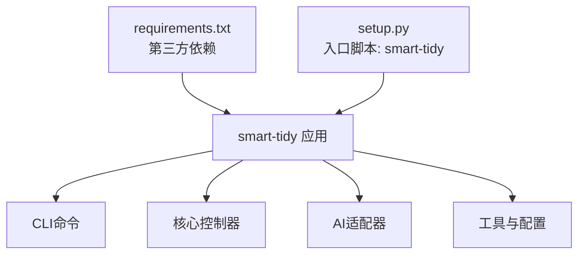

# 安装与快速开始

<cite>
**本文引用的文件**
- [README.md](file://README.md)
- [QUICKSTART.md](file://QUICKSTART.md)
- [requirements.txt](file://requirements.txt)
- [setup.py](file://setup.py)
- [config/default_config.yaml](file://config/default_config.yaml)
- [env.custom.example](file://env.custom.example)
- [src/cli/main.py](file://src/cli/main.py)
- [src/cli/commands.py](file://src/cli/commands.py)
- [src/cli/config_commands.py](file://src/cli/config_commands.py)
- [src/utils/config.py](file://src/utils/config.py)
- [src/ai/adapter_factory.py](file://src/ai/adapter_factory.py)
- [src/ai/base_adapter.py](file://src/ai/base_adapter.py)
- [examples/test_custom_api.py](file://examples/test_custom_api.py)
- [examples/basic_usage.py](file://examples/basic_usage.py)
- [examples/custom_api_example.py](file://examples/custom_api_example.py)
</cite>

## 目录
1. [简介](#简介)
2. [项目结构](#项目结构)
3. [核心组件](#核心组件)
4. [架构总览](#架构总览)
5. [详细组件分析](#详细组件分析)
6. [依赖关系分析](#依赖关系分析)
7. [性能考虑](#性能考虑)
8. [故障排除指南](#故障排除指南)
9. [结论](#结论)
10. [附录](#附录)

## 简介
本指南面向首次使用者，提供从零开始的完整安装与快速上手流程。内容涵盖系统要求、依赖安装、项目克隆与配置、四种AI提供商配置方案（Claude、OpenAI、本地模型、自定义API）、命令行使用示例（Agent模式与传统模式），以及常见问题排查与解决方案。

## 项目结构
该项目采用模块化设计，CLI层负责用户交互，控制器层协调业务逻辑，AI适配器层抽象不同提供商的调用方式，安全与日志模块保障操作安全与可追溯性。

**图表来源**
- [src/cli/main.py](file://src/cli/main.py#L1-L138)
- [src/cli/commands.py](file://src/cli/commands.py#L1-L556)
- [src/cli/config_commands.py](file://src/cli/config_commands.py#L1-L219)
- [src/utils/config.py](file://src/utils/config.py#L1-L116)
- [src/ai/adapter_factory.py](file://src/ai/adapter_factory.py#L1-L98)
- [src/ai/base_adapter.py](file://src/ai/base_adapter.py#L1-L70)

**章节来源**
- [README.md](file://README.md#L220-L241)
- [src/cli/main.py](file://src/cli/main.py#L1-L138)
- [src/cli/commands.py](file://src/cli/commands.py#L1-L556)
- [src/utils/config.py](file://src/utils/config.py#L1-L116)
- [src/ai/adapter_factory.py](file://src/ai/adapter_factory.py#L1-L98)

## 核心组件
- CLI主程序与命令实现：提供 organize、interactive、agent、suggest、analyze、chat、undo、history、config 等命令。
- 配置管理器：加载 YAML 配置与 .env 环境变量，支持动态读取各提供商配置。
- AI适配器工厂：根据提供商类型创建相应适配器，统一对外接口。
- 控制器：协调扫描、生成方案、预览、执行与撤销等流程。

**章节来源**
- [src/cli/main.py](file://src/cli/main.py#L1-L138)
- [src/cli/commands.py](file://src/cli/commands.py#L1-L556)
- [src/cli/config_commands.py](file://src/cli/config_commands.py#L1-L219)
- [src/utils/config.py](file://src/utils/config.py#L1-L116)
- [src/ai/adapter_factory.py](file://src/ai/adapter_factory.py#L1-L98)
- [src/ai/base_adapter.py](file://src/ai/base_adapter.py#L1-L70)

## 架构总览
下图展示从命令行到AI适配器与文件操作的整体流程。

**图表来源**
- [src/cli/commands.py](file://src/cli/commands.py#L18-L556)
- [src/ai/adapter_factory.py](file://src/ai/adapter_factory.py#L14-L98)
- [src/utils/config.py](file://src/utils/config.py#L76-L116)

## 详细组件分析

### 系统要求与安装步骤
- Python 版本：3.9及以上
- 安装依赖与工具：
  - 克隆仓库后，先安装依赖，再安装可执行工具
- 安装命令参考：
  - 克隆与安装：见 [README.md](file://README.md#L25-L35)
  - 快速安装：见 [QUICKSTART.md](file://QUICKSTART.md#L7-L17)

**章节来源**
- [README.md](file://README.md#L23-L35)
- [QUICKSTART.md](file://QUICKSTART.md#L5-L17)
- [requirements.txt](file://requirements.txt#L1-L43)
- [setup.py](file://setup.py#L20-L26)

### 四种AI提供商配置方案

#### 方案A：Claude（推荐）
- 在 .env 中设置默认提供商与API Key
- 配置要点：
  - DEFAULT_AI_PROVIDER=claude
  - ANTHROPIC_API_KEY=sk-ant-...
- 验证连接：使用配置命令测试
- 参考路径：
  - [README.md](file://README.md#L52-L57)
  - [QUICKSTART.md](file://QUICKSTART.md#L32-L38)
  - [src/cli/config_commands.py](file://src/cli/config_commands.py#L190-L219)

**章节来源**
- [README.md](file://README.md#L52-L57)
- [QUICKSTART.md](file://QUICKSTART.md#L32-L38)
- [src/cli/config_commands.py](file://src/cli/config_commands.py#L190-L219)

#### 方案B：OpenAI
- 在 .env 中设置默认提供商与API Key
- 配置要点：
  - DEFAULT_AI_PROVIDER=openai
  - OPENAI_API_KEY=sk-...
- 参考路径：
  - [README.md](file://README.md#L59-L64)
  - [QUICKSTART.md](file://QUICKSTART.md#L42-L48)

**章节来源**
- [README.md](file://README.md#L59-L64)
- [QUICKSTART.md](file://QUICKSTART.md#L42-L48)

#### 方案C：本地模型（免费）
- 先启动本地推理服务（例如 Ollama），再在 .env 中配置基础URL与模型
- 配置要点：
  - DEFAULT_AI_PROVIDER=local
  - LOCAL_LLM_BASE_URL=http://localhost:11434
  - LOCAL_LLM_MODEL=llama3.1
- 参考路径：
  - [README.md](file://README.md#L66-L73)
  - [QUICKSTART.md](file://QUICKSTART.md#L52-L63)

**章节来源**
- [README.md](file://README.md#L66-L73)
- [QUICKSTART.md](file://QUICKSTART.md#L52-L63)

#### 方案D：自定义API（通义千问/DeepSeek等）
- 使用 env.custom.example 作为模板复制为 .env，并填写自定义API配置
- 配置要点：
  - DEFAULT_AI_PROVIDER=custom
  - CUSTOM_API_BASE_URL=https://api.example.com/v1
  - CUSTOM_API_KEY=sk-...
  - CUSTOM_API_MODEL=your-model-name
- 参考路径：
  - [README.md](file://README.md#L75-L88)
  - [env.custom.example](file://env.custom.example#L15-L24)
  - [examples/test_custom_api.py](file://examples/test_custom_api.py#L64-L78)

**章节来源**
- [README.md](file://README.md#L75-L88)
- [env.custom.example](file://env.custom.example#L15-L24)
- [examples/test_custom_api.py](file://examples/test_custom_api.py#L64-L78)

### 配置文件与环境变量加载机制
- 配置文件：config/default_config.yaml
- 环境变量：.env（由 python-dotenv 加载）
- 配置优先级：环境变量覆盖默认配置
- 关键配置项：
  - ai.default_provider
  - ai.providers.claude/openai/local/custom
  - langchain.* 与 file_operations.* 等
- 参考路径：
  - [config/default_config.yaml](file://config/default_config.yaml#L1-L79)
  - [src/utils/config.py](file://src/utils/config.py#L13-L116)

**章节来源**
- [config/default_config.yaml](file://config/default_config.yaml#L1-L79)
- [src/utils/config.py](file://src/utils/config.py#L13-L116)

### 命令行使用示例

#### Agent模式（推荐）
- 智能整理：smart-tidy agent 目标目录 --request "按文件类型智能分类"
- 获取建议：smart-tidy suggest 目标目录
- 分析单个文件：smart-tidy analyze 文件路径
- 与Agent对话：smart-tidy chat
- 参考路径：
  - [README.md](file://README.md#L105-L119)
  - [src/cli/main.py](file://src/cli/main.py#L87-L127)

**章节来源**
- [README.md](file://README.md#L105-L119)
- [src/cli/main.py](file://src/cli/main.py#L87-L127)

#### 传统模式
- 交互式模式：smart-tidy interactive 目标目录
- 单次整理：smart-tidy organize 目标目录 --request "把所有PDF论文整理到论文文件夹"
- 预览模式：smart-tidy organize 目标目录 --request "整理图片" --dry-run
- 参考路径：
  - [README.md](file://README.md#L121-L132)
  - [src/cli/main.py](file://src/cli/main.py#L35-L100)

**章节来源**
- [README.md](file://README.md#L121-L132)
- [src/cli/main.py](file://src/cli/main.py#L35-L100)

#### 其他常用命令
- 查看历史：smart-tidy history --limit 20
- 撤销操作：smart-tidy undo
- 查看配置：smart-tidy config show
- 查看帮助：smart-tidy --help
- 参考路径：
  - [README.md](file://README.md#L134-L148)
  - [src/cli/main.py](file://src/cli/main.py#L79-L134)

**章节来源**
- [README.md](file://README.md#L134-L148)
- [src/cli/main.py](file://src/cli/main.py#L79-L134)

### 测试与验证方法
- 完整测试（自定义API与LangChain集成）：python examples/test_custom_api.py
- 快速测试（聊天模式）：smart-tidy chat
- 配置测试：smart-tidy config test
- 参考路径：
  - [README.md](file://README.md#L94-L101)
  - [examples/test_custom_api.py](file://examples/test_custom_api.py#L303-L390)
  - [src/cli/config_commands.py](file://src/cli/config_commands.py#L190-L219)

**章节来源**
- [README.md](file://README.md#L94-L101)
- [examples/test_custom_api.py](file://examples/test_custom_api.py#L303-L390)
- [src/cli/config_commands.py](file://src/cli/config_commands.py#L190-L219)

### AI适配器与工厂
- 工厂根据 PROVIDER 创建对应适配器，校验必要配置（如API Key、Base URL、Model）
- 适配器需实现统一接口：generate_classification 与 refine_with_feedback
- 参考路径：
  - [src/ai/adapter_factory.py](file://src/ai/adapter_factory.py#L14-L98)
  - [src/ai/base_adapter.py](file://src/ai/base_adapter.py#L12-L70)

**章节来源**
- [src/ai/adapter_factory.py](file://src/ai/adapter_factory.py#L14-L98)
- [src/ai/base_adapter.py](file://src/ai/base_adapter.py#L12-L70)

## 依赖关系分析
- Python版本要求：>=3.9
- 关键依赖：Typer、Rich、Anthropic、OpenAI、Requests、Pydantic、PyYAML、python-dotenv、LangChain系列、PDF处理库、图像库等
- 安装顺序：先安装 requirements.txt，再 pip install -e .

**图表来源**
- [requirements.txt](file://requirements.txt#L1-L43)
- [setup.py](file://setup.py#L20-L46)
- [src/cli/main.py](file://src/cli/main.py#L41-L44)

**章节来源**
- [requirements.txt](file://requirements.txt#L1-L43)
- [setup.py](file://setup.py#L20-L46)
- [src/cli/main.py](file://src/cli/main.py#L41-L44)

## 性能考虑
- 批处理大小：可通过命令行参数或配置调整，默认值见配置文件
- 扫描深度与文件大小限制：避免对超大目录造成性能压力
- 并发与重试：LangChain相关组件包含重试机制，有助于网络波动下的稳定性
- 建议：
  - 大量文件分批整理
  - 使用预览模式先观察结果
  - 交互式模式便于迭代优化

[本节为通用指导，无需具体文件分析]

## 故障排除指南

### 常见问题与解决
- 无法连接AI服务
  - 检查API Key是否正确设置
  - 使用配置测试命令验证连接
  - 参考：[src/cli/config_commands.py](file://src/cli/config_commands.py#L190-L219)
- 文件没有移动
  - 检查是否误用了 --dry-run
  - 查看操作历史与权限
  - 参考：[src/cli/commands.py](file://src/cli/commands.py#L18-L123)
- 分类不准确
  - 提供更详细的描述
  - 使用交互式模式并给出反馈
  - 考虑更换模型
  - 参考：[src/cli/commands.py](file://src/cli/commands.py#L125-L238)

### 自定义API集成问题
- 环境变量未设置或不完整
  - 使用测试脚本检查并打印示例配置
  - 参考：[examples/test_custom_api.py](file://examples/test_custom_api.py#L24-L86)
- LLM创建或连接失败
  - 检查BASE_URL、API_KEY、MODEL是否正确
  - 参考：[examples/test_custom_api.py](file://examples/test_custom_api.py#L130-L195)
- Agent创建或对话异常
  - 确认LangChain依赖已安装
  - 参考：[examples/test_custom_api.py](file://examples/test_custom_api.py#L197-L260)

**章节来源**
- [src/cli/config_commands.py](file://src/cli/config_commands.py#L190-L219)
- [src/cli/commands.py](file://src/cli/commands.py#L18-L123)
- [examples/test_custom_api.py](file://examples/test_custom_api.py#L24-L86)
- [examples/test_custom_api.py](file://examples/test_custom_api.py#L130-L195)
- [examples/test_custom_api.py](file://examples/test_custom_api.py#L197-L260)

## 结论
按照本指南完成安装与配置后，您可以：
- 选择任一AI提供商（Claude、OpenAI、本地模型、自定义API）
- 使用Agent模式或传统模式进行文件整理
- 通过测试脚本与配置命令验证连通性
- 利用交互式模式与反馈持续优化整理效果

## 附录

### 快速开始清单
- 克隆与安装：见 [README.md](file://README.md#L25-L35)、[QUICKSTART.md](file://QUICKSTART.md#L7-L17)
- 配置提供商：见 [README.md](file://README.md#L41-L88)、[QUICKSTART.md](file://QUICKSTART.md#L19-L106)
- 首次使用：见 [QUICKSTART.md](file://QUICKSTART.md#L108-L148)
- 常用命令速查：见 [QUICKSTART.md](file://QUICKSTART.md#L149-L175)

### 示例代码参考
- 基本使用示例：见 [examples/basic_usage.py](file://examples/basic_usage.py#L1-L89)
- 自定义API示例：见 [examples/custom_api_example.py](file://examples/custom_api_example.py#L1-L99)
- 自定义API集成测试：见 [examples/test_custom_api.py](file://examples/test_custom_api.py#L1-L390)

**章节来源**
- [README.md](file://README.md#L25-L148)
- [QUICKSTART.md](file://QUICKSTART.md#L5-L175)
- [examples/basic_usage.py](file://examples/basic_usage.py#L1-L89)
- [examples/custom_api_example.py](file://examples/custom_api_example.py#L1-L99)
- [examples/test_custom_api.py](file://examples/test_custom_api.py#L1-L390)