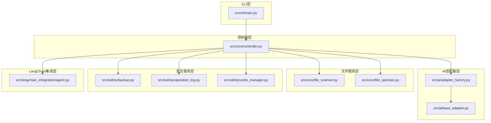
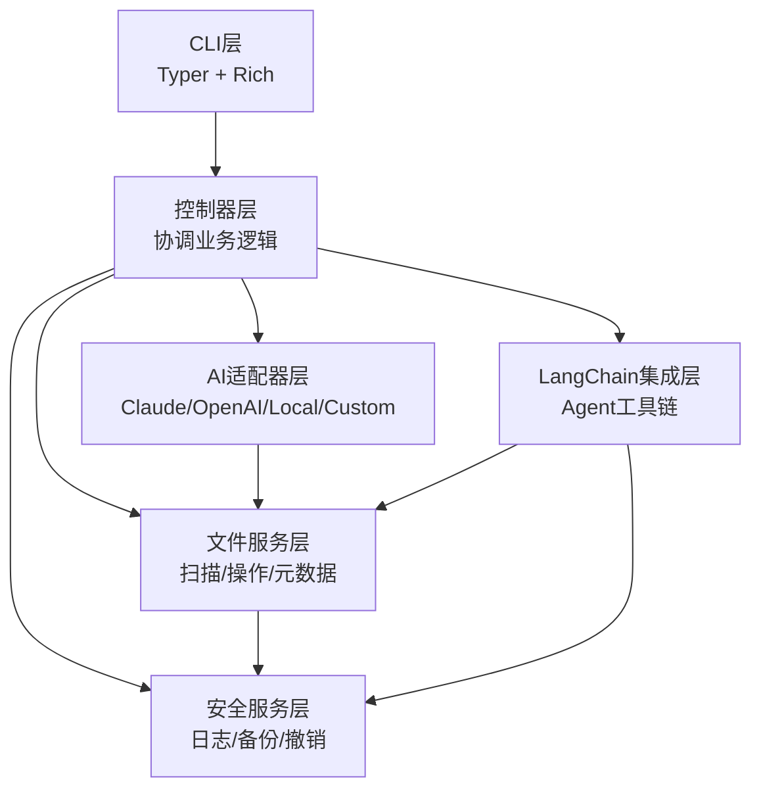
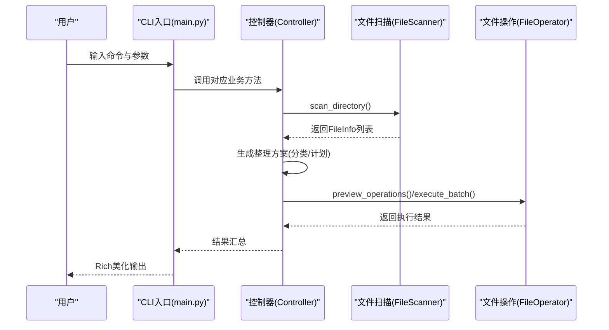
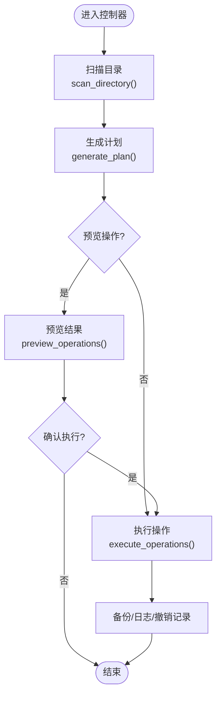
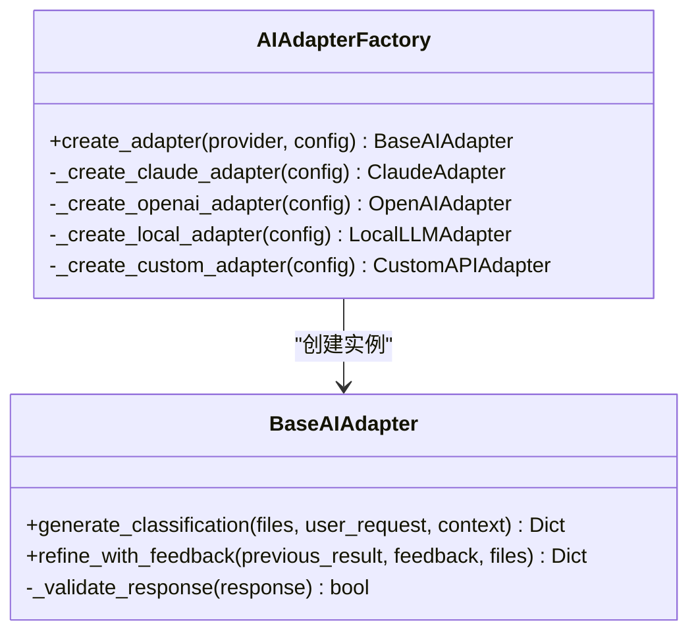
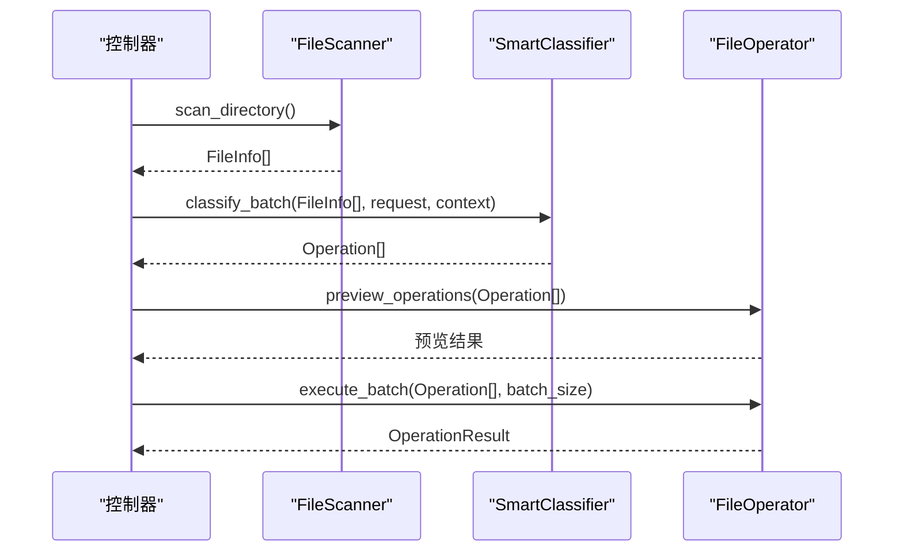
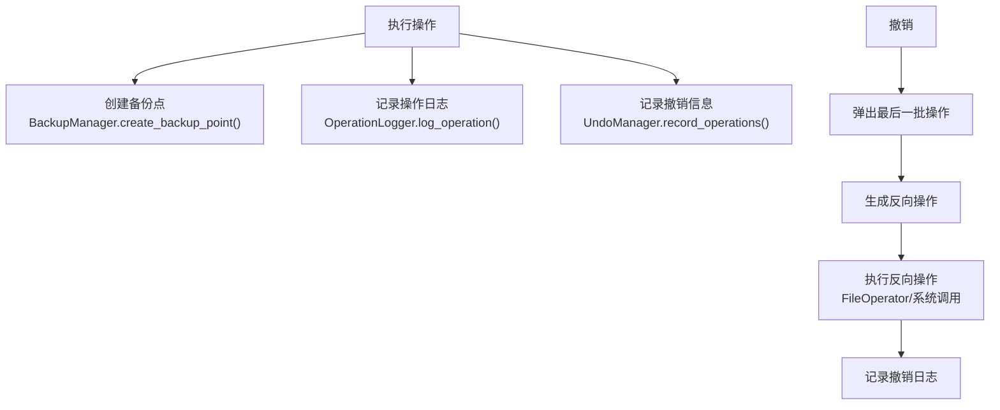
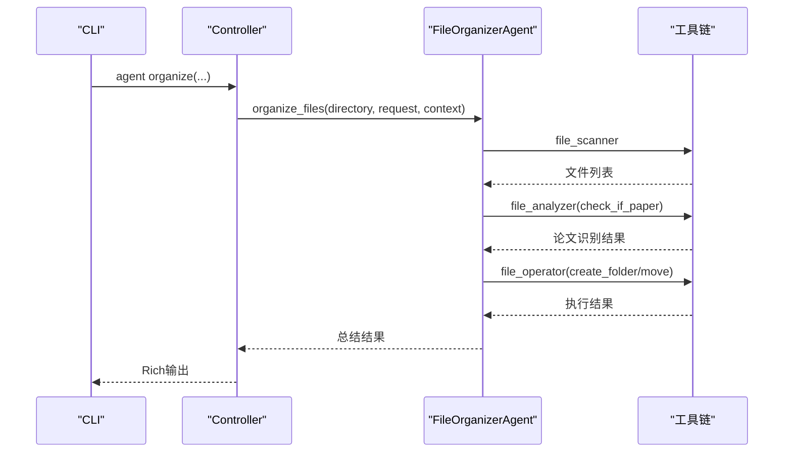
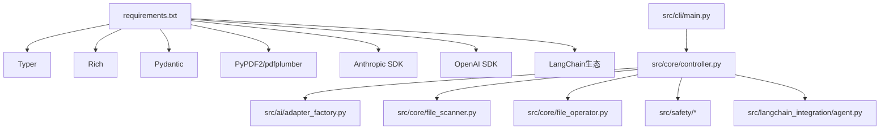
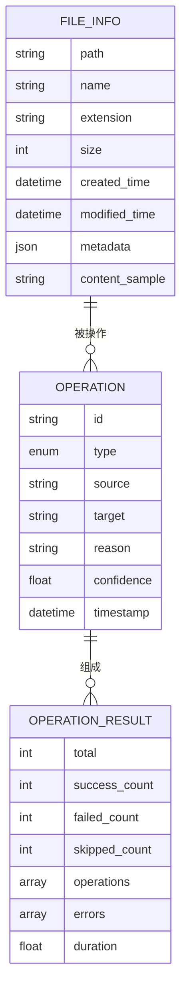

# 技术架构概览

<cite>
**本文引用的文件**
- [README.md](file://README.md)
- [requirements.txt](file://requirements.txt)
- [src/cli/main.py](file://src/cli/main.py)
- [src/core/controller.py](file://src/core/controller.py)
- [src/core/classifier.py](file://src/core/classifier.py)
- [src/core/file_scanner.py](file://src/core/file_scanner.py)
- [src/core/file_operator.py](file://src/core/file_operator.py)
- [src/ai/adapter_factory.py](file://src/ai/adapter_factory.py)
- [src/ai/base_adapter.py](file://src/ai/base_adapter.py)
- [src/langchain_integration/agent.py](file://src/langchain_integration/agent.py)
- [src/models/file_info.py](file://src/models/file_info.py)
- [src/models/operation.py](file://src/models/operation.py)
- [src/utils/config.py](file://src/utils/config.py)
- [src/safety/backup.py](file://src/safety/backup.py)
- [src/safety/operation_log.py](file://src/safety/operation_log.py)
- [src/safety/undo_manager.py](file://src/safety/undo_manager.py)
</cite>

## 目录
1. [简介](#简介)
2. [项目结构](#项目结构)
3. [核心组件](#核心组件)
4. [架构总览](#架构总览)
5. [详细组件分析](#详细组件分析)
6. [依赖关系分析](#依赖关系分析)
7. [性能考量](#性能考量)
8. [故障排查指南](#故障排查指南)
9. [结论](#结论)
10. [附录](#附录)

## 简介
本项目是一个基于AI的智能文件分类与整理工具，支持自然语言交互、批量处理、安全备份与撤销机制。系统采用分层架构设计，包括CLI层（Typer + Rich）、控制器层、AI适配器层、文件服务层、安全服务层，以及可选的LangChain Agent智能体层。通过模块化设计，系统既能在传统模式下工作，也能在Agent模式下实现自主决策与工具编排。

## 项目结构
项目采用按功能域划分的层次化组织方式：
- CLI层：命令行入口与命令定义，负责参数解析与用户交互展示
- 核心控制层：协调AI、文件扫描、文件操作、安全组件
- AI适配器层：抽象统一的AI接口，支持Claude、OpenAI、本地模型与自定义API
- 文件服务层：文件扫描、元数据提取、内容采样、批量操作
- 安全服务层：操作日志、备份、撤销管理
- LangChain集成层：Agent智能体、工具链、提示词与内容分析

图表来源
- [src/cli/main.py](file://src/cli/main.py#L1-L138)
- [src/core/controller.py](file://src/core/controller.py#L1-L310)
- [src/ai/adapter_factory.py](file://src/ai/adapter_factory.py#L1-L98)
- [src/ai/base_adapter.py](file://src/ai/base_adapter.py#L1-L70)
- [src/core/file_scanner.py](file://src/core/file_scanner.py#L1-L196)
- [src/core/file_operator.py](file://src/core/file_operator.py#L1-L246)
- [src/safety/backup.py](file://src/safety/backup.py#L1-L152)
- [src/safety/operation_log.py](file://src/safety/operation_log.py#L1-L133)
- [src/safety/undo_manager.py](file://src/safety/undo_manager.py#L1-L155)
- [src/langchain_integration/agent.py](file://src/langchain_integration/agent.py#L1-L576)

章节来源
- [README.md](file://README.md#L220-L241)
- [src/cli/main.py](file://src/cli/main.py#L1-L138)

## 核心组件
- CLI层（Typer + Rich）
  - 负责命令注册、参数校验、Rich美化输出
  - 提供 organize、interactive、agent、suggest、analyze、chat、history、undo、version 等命令
- 控制器层（Controller）
  - 协调AI适配器、文件扫描、文件操作、安全组件
  - 支持传统模式与LangChain Agent模式的回退机制
- AI适配器层
  - 工厂模式创建Claude、OpenAI、本地、自定义适配器
  - 统一接口：generate_classification、refine_with_feedback
- 文件服务层
  - FileScanner：并发扫描、元数据与内容采样
  - FileOperator：预览、批量执行、冲突处理、磁盘空间检查
- 安全服务层
  - BackupManager：备份清单与哈希校验
  - OperationLogger：JSONL日志、历史查询、清理
  - UndoManager：反向操作栈、撤销执行
- LangChain集成层
  - FileOrganizerAgent：ReAct工具编排、论文整理默认策略、对话历史

章节来源
- [src/cli/main.py](file://src/cli/main.py#L22-L138)
- [src/core/controller.py](file://src/core/controller.py#L15-L310)
- [src/ai/adapter_factory.py](file://src/ai/adapter_factory.py#L11-L98)
- [src/ai/base_adapter.py](file://src/ai/base_adapter.py#L9-L70)
- [src/core/file_scanner.py](file://src/core/file_scanner.py#L13-L196)
- [src/core/file_operator.py](file://src/core/file_operator.py#L12-L246)
- [src/safety/backup.py](file://src/safety/backup.py#L10-L152)
- [src/safety/operation_log.py](file://src/safety/operation_log.py#L11-L133)
- [src/safety/undo_manager.py](file://src/safety/undo_manager.py#L10-L155)
- [src/langchain_integration/agent.py](file://src/langchain_integration/agent.py#L21-L576)

## 架构总览
系统采用“CLI → 控制器 → 适配器/文件/安全 → Agent（可选）”的分层交互。CLI层负责用户输入与展示，控制器层作为中枢协调各子系统，AI适配器层提供统一的智能决策能力，文件服务层负责文件层面的操作，安全服务层保障可审计与可恢复性。LangChain Agent层提供ReAct工具编排与自主决策能力，作为传统模式的增强。

图表来源
- [src/cli/main.py](file://src/cli/main.py#L1-L138)
- [src/core/controller.py](file://src/core/controller.py#L1-L310)
- [src/ai/adapter_factory.py](file://src/ai/adapter_factory.py#L1-L98)
- [src/core/file_scanner.py](file://src/core/file_scanner.py#L1-L196)
- [src/core/file_operator.py](file://src/core/file_operator.py#L1-L246)
- [src/safety/backup.py](file://src/safety/backup.py#L1-L152)
- [src/safety/operation_log.py](file://src/safety/operation_log.py#L1-L133)
- [src/safety/undo_manager.py](file://src/safety/undo_manager.py#L1-L155)
- [src/langchain_integration/agent.py](file://src/langchain_integration/agent.py#L1-L576)

## 详细组件分析

### CLI层（Typer + Rich）
- 职责
  - 定义命令与选项，参数校验，Rich输出美化
  - 将命令映射到控制器层的业务方法
- 关键交互
  - organize/interactive/agent/suggest/analyze/chat/history/undo/version
- 设计要点
  - 使用Typer的强类型参数与Rich的终端渲染，提升用户体验
  - 通过统一的命令函数封装，隔离CLI与业务逻辑

图表来源
- [src/cli/main.py](file://src/cli/main.py#L35-L127)
- [src/core/controller.py](file://src/core/controller.py#L83-L107)
- [src/core/file_scanner.py](file://src/core/file_scanner.py#L28-L84)
- [src/core/file_operator.py](file://src/core/file_operator.py#L24-L100)

章节来源
- [src/cli/main.py](file://src/cli/main.py#L1-L138)

### 控制器层（Controller）
- 职责
  - 统一协调AI适配器、文件扫描、文件操作、安全组件
  - 支持Agent模式与传统模式的回退
  - 维护对话上下文，记录交互历史
- 关键流程
  - scan_directory → generate_plan → preview_operations → execute_operations
  - 支持撤销与历史查询
- 错误处理
  - 操作验证失败抛出异常，触发备份恢复与日志记录

图表来源
- [src/core/controller.py](file://src/core/controller.py#L83-L310)
- [src/core/file_scanner.py](file://src/core/file_scanner.py#L28-L84)
- [src/core/file_operator.py](file://src/core/file_operator.py#L65-L100)
- [src/safety/backup.py](file://src/safety/backup.py#L23-L70)
- [src/safety/operation_log.py](file://src/safety/operation_log.py#L24-L53)
- [src/safety/undo_manager.py](file://src/safety/undo_manager.py#L23-L49)

章节来源
- [src/core/controller.py](file://src/core/controller.py#L15-L310)

### AI适配器层（工厂与基类）
- 职责
  - 工厂根据提供商创建具体适配器
  - 基类定义统一接口：generate_classification、refine_with_feedback
- 支持提供商
  - Claude、OpenAI、本地模型、自定义API
- 配置来源
  - ConfigManager从配置文件与环境变量合并AI配置

图表来源
- [src/ai/base_adapter.py](file://src/ai/base_adapter.py#L9-L70)
- [src/ai/adapter_factory.py](file://src/ai/adapter_factory.py#L11-L98)
- [src/utils/config.py](file://src/utils/config.py#L76-L115)

章节来源
- [src/ai/base_adapter.py](file://src/ai/base_adapter.py#L1-L70)
- [src/ai/adapter_factory.py](file://src/ai/adapter_factory.py#L1-L98)
- [src/utils/config.py](file://src/utils/config.py#L1-L116)

### 文件服务层（扫描与操作）
- FileScanner
  - 并发扫描、元数据提取、内容采样（PDF/TXT等）
  - 支持递归深度与扩展名过滤
- FileOperator
  - 预览操作、批量执行、冲突处理、磁盘空间检查
  - 支持MOVE、RENAME、CREATE_FOLDER等操作类型

图表来源
- [src/core/file_scanner.py](file://src/core/file_scanner.py#L28-L196)
- [src/core/classifier.py](file://src/core/classifier.py#L24-L112)
- [src/core/file_operator.py](file://src/core/file_operator.py#L65-L100)

章节来源
- [src/core/file_scanner.py](file://src/core/file_scanner.py#L1-L196)
- [src/core/classifier.py](file://src/core/classifier.py#L1-L265)
- [src/core/file_operator.py](file://src/core/file_operator.py#L1-L246)

### 安全服务层（日志、备份、撤销）
- BackupManager
  - 备份清单（manifest.json）记录文件哈希与状态
- OperationLogger
  - JSONL日志、按日期分片、历史查询、清理
- UndoManager
  - 反向操作栈、撤销执行、历史上限控制

图表来源
- [src/core/controller.py](file://src/core/controller.py#L223-L255)
- [src/safety/backup.py](file://src/safety/backup.py#L23-L70)
- [src/safety/operation_log.py](file://src/safety/operation_log.py#L24-L53)
- [src/safety/undo_manager.py](file://src/safety/undo_manager.py#L23-L76)

章节来源
- [src/safety/backup.py](file://src/safety/backup.py#L1-L152)
- [src/safety/operation_log.py](file://src/safety/operation_log.py#L1-L133)
- [src/safety/undo_manager.py](file://src/safety/undo_manager.py#L1-L155)

### LangChain集成层（Agent）
- FileOrganizerAgent
  - ReAct工具编排：file_scanner、file_analyzer、file_operator、validation
  - 论文整理默认策略与通用整理策略
  - 对话历史管理、错误恢复与迭代控制
- LLM工厂与提示词
  - LLMFactory创建不同提供商的LLM
  - SYSTEM_PROMPT与任务提示构建

图表来源
- [src/langchain_integration/agent.py](file://src/langchain_integration/agent.py#L100-L228)
- [src/langchain_integration/agent.py](file://src/langchain_integration/agent.py#L300-L431)

章节来源
- [src/langchain_integration/agent.py](file://src/langchain_integration/agent.py#L1-L576)

## 依赖关系分析
- 技术栈选择
  - Python 3.9+：现代语法与性能特性
  - Typer：强类型CLI、自动帮助与校验
  - Rich：终端美化与结构化输出
  - Pydantic：数据模型与运行时验证
  - PyPDF2/pdfplumber：PDF内容提取
  - Anthropic/OpenAI SDK：云模型接入
  - LangChain生态：工具链与Agent编排
- 组件耦合
  - CLI层与控制器层松耦合，通过方法调用解耦
  - 控制器层与AI/文件/安全层通过接口与工厂解耦
  - Agent层可选依赖，回退到传统模式保证稳定性

图表来源
- [requirements.txt](file://requirements.txt#L1-L43)
- [src/cli/main.py](file://src/cli/main.py#L1-L138)
- [src/core/controller.py](file://src/core/controller.py#L1-L310)

章节来源
- [requirements.txt](file://requirements.txt#L1-L43)
- [README.md](file://README.md#L232-L240)

## 性能考量
- 并发与批处理
  - FileScanner使用线程池并发处理文件信息提取，结合tqdm进度条
  - FileOperator分批执行，避免一次性占用过多资源
- 内容采样与大小限制
  - PDF/TXT内容采样与最大文件大小限制，降低内存与IO压力
- 备份与日志
  - 备份仅记录清单与哈希，避免大文件复制带来的I/O开销
  - 日志按日期分片，定期清理减少磁盘占用
- Agent迭代控制
  - ReAct最大迭代次数限制，防止长时间阻塞

章节来源
- [src/core/file_scanner.py](file://src/core/file_scanner.py#L61-L83)
- [src/core/file_operator.py](file://src/core/file_operator.py#L65-L100)
- [src/safety/backup.py](file://src/safety/backup.py#L23-L70)
- [src/safety/operation_log.py](file://src/safety/operation_log.py#L111-L133)
- [src/langchain_integration/agent.py](file://src/langchain_integration/agent.py#L300-L431)

## 故障排查指南
- Agent导入失败回退
  - 若LangChain相关包缺失，控制器自动回退到传统模式
- 操作验证失败
  - 源文件不存在、目标路径非法、磁盘空间不足等会被提前发现并报错
- 备份恢复
  - 执行失败时尝试恢复备份，确保数据安全
- 撤销机制
  - 撤销最后一次操作，支持反向移动/重命名/空文件夹删除
- 日志审计
  - 按日期读取日志，定位失败原因与操作轨迹

章节来源
- [src/core/controller.py](file://src/core/controller.py#L56-L58)
- [src/core/controller.py](file://src/core/controller.py#L218-L255)
- [src/safety/undo_manager.py](file://src/safety/undo_manager.py#L50-L76)
- [src/safety/operation_log.py](file://src/safety/operation_log.py#L54-L83)

## 结论
该系统通过清晰的分层架构与模块化设计，在保证易用性的同时兼顾了可扩展性与安全性。CLI层提供友好的交互体验，控制器层统一协调AI与文件操作，AI适配器层屏蔽提供商差异，文件服务层专注数据与操作，安全服务层提供审计与恢复能力。LangChain Agent层进一步增强了智能化与自动化水平。整体架构便于新增AI提供商、扩展文件类型处理与优化性能。

## 附录
- 数据模型
  - FileInfo：文件路径、名称、扩展名、大小、时间戳、元数据、内容样本
  - Operation/OperationResult：操作类型、源/目标、置信度、时间戳、批量统计

图表来源
- [src/models/file_info.py](file://src/models/file_info.py#L9-L48)
- [src/models/operation.py](file://src/models/operation.py#L18-L54)

章节来源
- [src/models/file_info.py](file://src/models/file_info.py#L1-L48)
- [src/models/operation.py](file://src/models/operation.py#L1-L54)