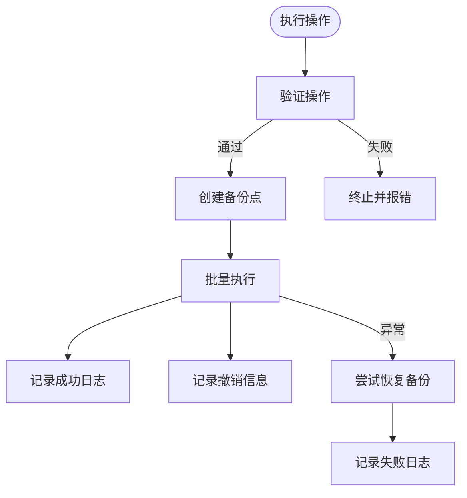

# 项目介绍与核心价值

<cite>
**本文引用的文件**
- [README.md](file://README.md)
- [QUICKSTART.md](file://QUICKSTART.md)
- [PROJECT_STRUCTURE.md](file://PROJECT_STRUCTURE.md)
- [docs/USAGE.md](file://docs/USAGE.md)
- [config/default_config.yaml](file://config/default_config.yaml)
- [src/cli/main.py](file://src/cli/main.py)
- [src/core/controller.py](file://src/core/controller.py)
- [src/core/classifier.py](file://src/core/classifier.py)
- [src/ai/base_adapter.py](file://src/ai/base_adapter.py)
- [src/langchain_integration/agent.py](file://src/langchain_integration/agent.py)
- [src/safety/backup.py](file://src/safety/backup.py)
- [src/models/file_info.py](file://src/models/file_info.py)
- [requirements.txt](file://requirements.txt)
- [examples/basic_usage.py](file://examples/basic_usage.py)
</cite>

## 目录
1. [简介](#简介)
2. [项目结构](#项目结构)
3. [核心组件](#核心组件)
4. [架构总览](#架构总览)
5. [详细组件分析](#详细组件分析)
6. [依赖关系分析](#依赖关系分析)
7. [性能考量](#性能考量)
8. [故障排查指南](#故障排查指南)
9. [结论](#结论)
10. [附录](#附录)

## 简介
智能文件整理助手（Smart File Tidy）是一个基于AI的智能文件分类与整理工具，通过自然语言交互显著提升文件管理效率。它支持多种AI提供商（Claude、OpenAI、本地模型、自定义OpenAI兼容API），提供Agent模式与传统模式两种工作流，既适合初学者快速上手，也为技术决策者提供了高度可扩展的架构与强大的安全机制。

- 核心价值主张
  - 以自然语言描述需求，AI自动理解并生成整理方案
  - 支持多轮对话与反馈优化，持续提升分类准确性
  - 安全可靠：操作前预览、自动备份、支持撤销
  - 高效批量处理：分批执行、并发扫描、智能调度
  - 友好界面：基于Typer + Rich的CLI体验，清晰的操作预览与日志

- 目标用户
  - 个人用户：整理下载文件夹、桌面、照片等
  - 研究人员：论文、报告、书籍的智能分类与组织
  - 企业文档管理员：批量整理与规范化命名
  - 开发者与技术团队：可扩展的AI适配器与LangChain集成

- 相比传统工具的优势
  - 语义理解与内容分析，超越简单的“按扩展名/日期”分类
  - 可迭代优化：通过反馈不断改进分类策略
  - 安全保障：预览、备份、撤销、日志审计
  - 多模型与多平台：Claude、OpenAI、本地模型、任意OpenAI兼容API

**章节来源**
- file://README.md#L7-L22
- file://docs/USAGE.md#L1-L245

## 项目结构
项目采用模块化分层设计，围绕“CLI层 → 控制器层 → 业务服务层（文件扫描/操作/分类）→ AI适配层 → 安全层”的架构展开，辅以LangChain Agent的工具化执行链路。

**图表来源**
- [PROJECT_STRUCTURE.md](file://PROJECT_STRUCTURE.md#L124-L152)
- [src/cli/main.py](file://src/cli/main.py#L22-L31)
- [src/core/controller.py](file://src/core/controller.py#L15-L82)
- [src/ai/base_adapter.py](file://src/ai/base_adapter.py#L9-L30)
- [src/langchain_integration/agent.py](file://src/langchain_integration/agent.py#L21-L60)
- [src/safety/backup.py](file://src/safety/backup.py#L10-L22)
- [src/models/file_info.py](file://src/models/file_info.py#L9-L20)

**章节来源**
- [PROJECT_STRUCTURE.md](file://PROJECT_STRUCTURE.md#L1-L256)
- [src/cli/main.py](file://src/cli/main.py#L1-L138)
- [src/core/controller.py](file://src/core/controller.py#L1-L310)

## 核心组件
- CLI层（Typer + Rich）
  - 提供命令式交互：organize、interactive、agent、suggest、analyze、chat、undo、history、config等
  - 统一入口与参数解析，调用控制器执行业务逻辑
- 控制器层（主控制器）
  - 协调文件扫描、分类、操作执行、安全与日志
  - 支持LangChain Agent模式与传统AI适配器模式，自动回退
- 文件扫描与操作
  - 扫描目录、提取元数据、批量操作（移动、重命名、创建文件夹）
  - 支持递归扫描、大小限制、并发元数据提取
- 智能分类器
  - 快速规则预分类 + AI二次分类 + 反馈学习与优化
  - 支持从用户反馈中提取规则，持续改进
- AI适配层
  - 统一接口的适配器基类，支持Claude、OpenAI、本地模型、自定义API
  - 工厂模式动态创建适配器
- LangChain集成
  - Agent + 工具链（扫描、分析、操作、校验）+ ReAct推理
  - 针对论文整理的默认模式与通用模式
- 安全机制
  - 操作前预览、自动备份、撤销管理、操作日志审计

**章节来源**
- [src/cli/main.py](file://src/cli/main.py#L35-L127)
- [src/core/controller.py](file://src/core/controller.py#L15-L310)
- [src/core/classifier.py](file://src/core/classifier.py#L11-L265)
- [src/ai/base_adapter.py](file://src/ai/base_adapter.py#L9-L70)
- [src/langchain_integration/agent.py](file://src/langchain_integration/agent.py#L21-L576)
- [src/safety/backup.py](file://src/safety/backup.py#L10-L152)

## 架构总览
系统采用“CLI → 控制器 → 业务服务 → AI/Agent → 安全”的分层架构，结合配置中心与工具化设计，实现高内聚、低耦合与强扩展性。

**图表来源**
- [src/cli/main.py](file://src/cli/main.py#L35-L127)
- [src/core/controller.py](file://src/core/controller.py#L83-L256)
- [src/core/classifier.py](file://src/core/classifier.py#L24-L66)
- [src/ai/base_adapter.py](file://src/ai/base_adapter.py#L12-L30)
- [src/langchain_integration/agent.py](file://src/langchain_integration/agent.py#L100-L228)

**章节来源**
- [PROJECT_STRUCTURE.md](file://PROJECT_STRUCTURE.md#L124-L152)
- [src/core/controller.py](file://src/core/controller.py#L15-L310)

## 详细组件分析

### 控制器（主控制器）
- 职责
  - 初始化AI适配器或LangChain Agent，协调扫描、分类、操作与安全
  - 支持Agent模式与传统模式的自动回退
  - 提供预览、执行、撤销、历史查询等能力
- 关键流程
  - 扫描目录 → 生成方案（Agent或分类器）→ 预览/确认 → 执行（备份/日志/撤销记录）

**图表来源**
- [src/core/controller.py](file://src/core/controller.py#L15-L310)
- [src/core/classifier.py](file://src/core/classifier.py#L11-L265)

**章节来源**
- [src/core/controller.py](file://src/core/controller.py#L15-L310)

### 智能分类器与反馈学习
- 设计要点
  - 快速规则预分类（扩展名、已知规则）+ AI二次分类
  - 从用户反馈中提取规则，形成“学习到的规则”，用于后续分类
  - 降级策略：当AI不可用时，基于请求提取目标文件夹进行简单分类
- 适用场景
  - 论文整理：默认模式识别学术论文并分类
  - 通用整理：按类型、命名模式、内容特征进行分类

**图表来源**
- [src/core/classifier.py](file://src/core/classifier.py#L24-L112)

**章节来源**
- [src/core/classifier.py](file://src/core/classifier.py#L11-L265)

### AI适配器基类与多提供商支持
- 接口约定
  - generate_classification：生成分类方案
  - refine_with_feedback：根据反馈优化方案
  - 响应格式校验：保证operations字段完整性
- 支持提供商
  - Claude、OpenAI、本地模型（Ollama）、自定义OpenAI兼容API
- 工厂模式
  - 根据配置动态创建对应适配器实例

**图表来源**
- [src/ai/base_adapter.py](file://src/ai/base_adapter.py#L9-L70)

**章节来源**
- [src/ai/base_adapter.py](file://src/ai/base_adapter.py#L1-L70)

### LangChain Agent与工具链
- Agent职责
  - 使用ReAct格式解析LLM输出，驱动工具链完成扫描、分析、操作、校验
  - 默认论文整理模式：识别论文、创建论文文件夹、移动论文
  - 通用模式：根据用户需求执行分类与整理
- 工具链
  - FileScannerTool、FileAnalyzerTool、FileOperatorTool、ValidationTool
- 对话与建议
  - analyze_file、suggest_organization、chat、clear_memory

**图表来源**
- [src/langchain_integration/agent.py](file://src/langchain_integration/agent.py#L100-L431)

**章节来源**
- [src/langchain_integration/agent.py](file://src/langchain_integration/agent.py#L21-L576)

### 安全机制与操作审计
- 备份管理
  - 创建备份点：记录文件哈希、大小、修改时间等元信息，不复制文件
  - 恢复检查：对比当前文件状态，提示被移动/删除/修改
- 撤销管理
  - 记录最近操作，支持撤销最后一次操作
- 操作日志
  - JSONL格式，记录时间戳、操作类型、源/目标、状态、错误信息
- 配置开关
  - 自动备份、确认要求、最大撤销历史、日志级别与保留天数

**图表来源**
- [src/core/controller.py](file://src/core/controller.py#L203-L256)
- [src/safety/backup.py](file://src/safety/backup.py#L23-L108)

**章节来源**
- [src/core/controller.py](file://src/core/controller.py#L203-L310)
- [src/safety/backup.py](file://src/safety/backup.py#L10-L152)

## 依赖关系分析
- 核心依赖
  - CLI：Typer、Rich
  - AI：Anthropic、OpenAI、Requests
  - 文件处理：PyPDF2、pdfplumber、python-magic、Pillow
  - 数据与配置：Pydantic、PyYAML、python-dotenv
  - LangChain：langchain、langchain-core、langchain-anthropic、langchain-openai、langchain-community、tiktoken
- 项目内部依赖
  - CLI → Controller → Scanner/Operator/Classifier → AI适配器/Agent → Safety
  - 配置default_config.yaml与.env共同决定AI提供商、批处理、安全策略等

**图表来源**
- [requirements.txt](file://requirements.txt#L1-L43)
- [src/cli/main.py](file://src/cli/main.py#L3-L21)
- [src/core/controller.py](file://src/core/controller.py#L6-L12)

**章节来源**
- [requirements.txt](file://requirements.txt#L1-L43)
- [config/default_config.yaml](file://config/default_config.yaml#L1-L79)

## 性能考量
- 并发与分批
  - 扫描阶段使用并发提取元数据，避免阻塞
  - 批处理执行文件操作，防止内存溢出与超时
- 配置优化
  - 调整扫描深度、最大文件大小、批大小、AI温度等
- 缓存与增量
  - 可扩展：文件哈希与元数据缓存、增量扫描（仅处理新增/修改文件）

**章节来源**
- [PROJECT_STRUCTURE.md](file://PROJECT_STRUCTURE.md#L242-L247)
- [docs/USAGE.md](file://docs/USAGE.md#L203-L222)

## 故障排查指南
- AI连接问题
  - 检查API Key与提供商配置；使用配置测试命令验证
- 文件未移动
  - 确认未启用dry-run；查看历史与权限；必要时手动执行
- 分类不准确
  - 提供更详细需求；使用交互式模式并提供反馈；更换模型
- 撤销与恢复
  - 使用undo命令撤销；若失败，检查备份是否存在并手动恢复

**章节来源**
- [QUICKSTART.md](file://QUICKSTART.md#L234-L260)
- [docs/USAGE.md](file://docs/USAGE.md#L178-L202)

## 结论
Smart File Tidy通过“自然语言 + AI + 工具链”的组合，将文件整理从“机械式规则”升级为“语义理解 + 迭代优化 + 安全保障”。其模块化架构与LangChain集成使其既能满足个人用户的快速上手，也能为开发者提供强大的扩展空间。在安全、性能与用户体验之间取得平衡，是该工具的核心竞争力所在。

[无需来源：总结性内容]

## 附录

### 快速开始与常用命令
- 安装与配置
  - 克隆仓库、安装依赖、安装可执行包
  - 复制.env模板，选择Claude/OpenAI/本地/自定义API
- 常用命令
  - organize：单次整理
  - interactive：交互式整理（推荐）
  - agent：Agent模式智能整理（推荐）
  - suggest/analyze/chat：建议、分析、对话
  - undo/history：撤销与历史
  - config：配置查看与测试

**章节来源**
- [README.md](file://README.md#L23-L148)
- [QUICKSTART.md](file://QUICKSTART.md#L1-L275)
- [docs/USAGE.md](file://docs/USAGE.md#L57-L245)

### 配置说明
- AI提供商与模型
  - 默认提供商、模型、max_tokens、temperature
- LangChain Agent
  - Agent类型、verbose、最大迭代次数、执行时间
- 文件操作
  - 批大小、最大文件大小、扫描深度、支持的扩展名
- 安全与日志
  - 自动备份、确认要求、撤销历史、日志级别与保留

**章节来源**
- [config/default_config.yaml](file://config/default_config.yaml#L1-L79)

### 数据模型与工具
- FileInfo：文件路径、名称、扩展名、大小、时间戳、元数据、内容样本
- PDFReader：PDF内容读取与文件名模式分析
- FileMetadataExtractor：各类文件元数据提取

**章节来源**
- [src/models/file_info.py](file://src/models/file_info.py#L9-L48)
- [PROJECT_STRUCTURE.md](file://PROJECT_STRUCTURE.md#L85-L91)