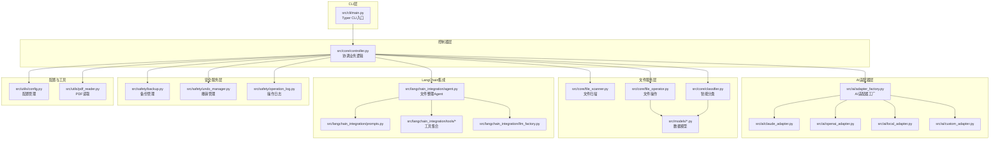
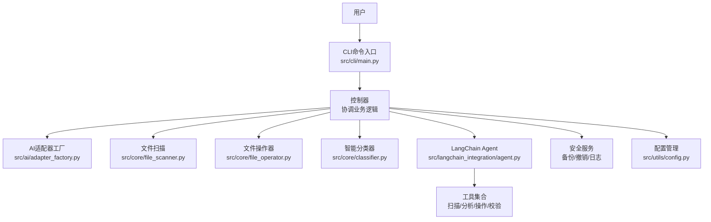
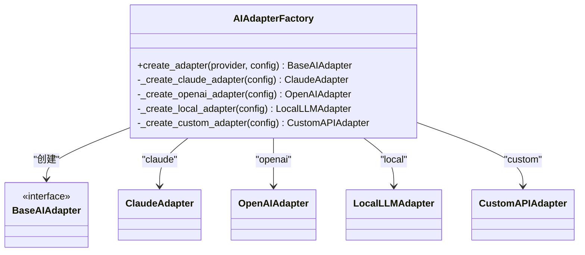
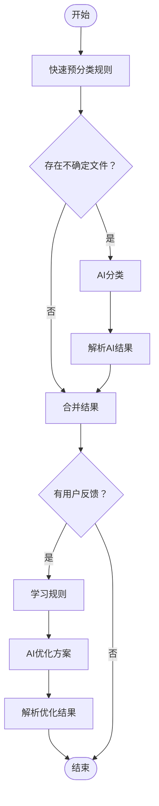
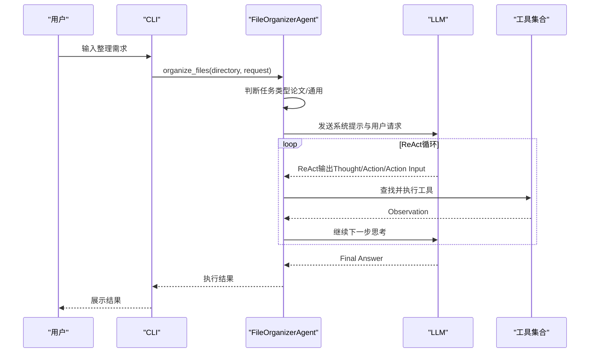
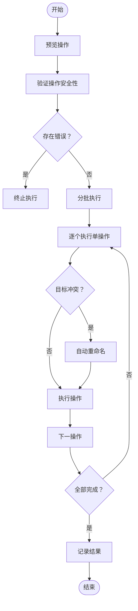
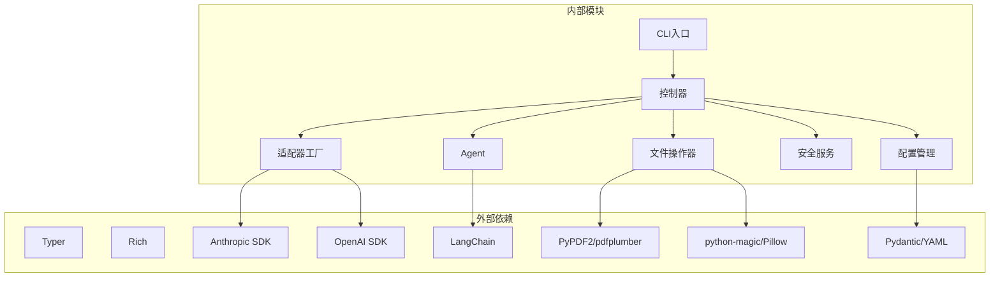

# 项目概述

<cite>
**本文引用的文件**
- [README.md](file://README.md)
- [QUICKSTART.md](file://QUICKSTART.md)
- [setup.py](file://setup.py)
- [requirements.txt](file://requirements.txt)
- [config/default_config.yaml](file://config/default_config.yaml)
- [src/__init__.py](file://src/__init__.py)
- [src/ai/adapter_factory.py](file://src/ai/adapter_factory.py)
- [src/core/classifier.py](file://src/core/classifier.py)
- [src/langchain_integration/agent.py](file://src/langchain_integration/agent.py)
- [src/cli/main.py](file://src/cli/main.py)
- [src/models/file_info.py](file://src/models/file_info.py)
- [src/safety/backup.py](file://src/safety/backup.py)
- [src/core/file_operator.py](file://src/core/file_operator.py)
- [src/utils/config.py](file://src/utils/config.py)
- [examples/basic_usage.py](file://examples/basic_usage.py)
</cite>

## 目录
1. [简介](#简介)
2. [项目结构](#项目结构)
3. [核心组件](#核心组件)
4. [架构总览](#架构总览)
5. [详细组件分析](#详细组件分析)
6. [依赖关系分析](#依赖关系分析)
7. [性能考量](#性能考量)
8. [故障排除指南](#故障排除指南)
9. [结论](#结论)
10. [附录](#附录)

## 简介
智能文件整理助手（Smart File Tidy）是一个基于AI的智能文件分类与整理工具，支持自然语言交互，帮助用户高效管理本地文件。项目通过LangChain Agent实现智能决策与自动化执行，结合多AI提供商支持（Claude、OpenAI、本地模型、自定义OpenAI兼容API）、安全操作机制（预览、备份、撤销）以及模块化的工具化设计，满足从个人用户到开发者的多样化需求。

- 核心价值主张
  - 降低文件整理门槛：无需手动分类，只需用自然语言描述需求，AI即可自动执行
  - 安全可靠：操作前预览、自动备份、支持撤销，避免误操作风险
  - 高度可扩展：模块化架构，易于接入新的AI提供商与功能扩展
  - 多场景适用：支持论文整理、图片分类、工作文档归档等多种使用场景

- 主要功能特性
  - AI Agent驱动：基于LangChain的智能Agent，自主决策与规划
  - 深度理解：语义级文件内容分析与分类
  - 工具化设计：标准化的LangChain Tools，易于扩展
  - 智能分类：基于文件名、类型、元数据和内容进行分类
  - 对话交互：支持与Agent对话，逐步优化整理方案
  - 安全可靠：操作前预览、自动备份、支持撤销
  - 批量处理：高效处理大量文件，智能分批执行
  - 友好界面：美观的CLI界面，清晰的操作预览
  - 操作日志：完整的操作记录，支持审计
  - 高度可扩展：模块化设计，易于扩展新功能
  - 广泛兼容：支持Claude、OpenAI、本地模型和任何OpenAI兼容API

- 应用场景与目标用户
  - 个人用户：整理下载文件夹、桌面、照片等
  - 办公人员：整理工作文档、按年份/项目归档
  - 学术研究：论文整理与分类，提升资料检索效率
  - 开发者与高级用户：通过CLI与API进行自动化集成

- 安装与系统兼容性
  - Python版本：3.9及以上
  - 支持平台：跨平台（Windows、macOS、Linux）
  - 安装方式：通过pip安装依赖与可执行程序
  - AI提供商：Claude、OpenAI、本地模型（Ollama）、自定义OpenAI兼容API

- 许可证
  - MIT License

**章节来源**
- [README.md](file://README.md#L1-L290)
- [QUICKSTART.md](file://QUICKSTART.md#L1-L275)
- [setup.py](file://setup.py#L1-L47)

## 项目结构
项目采用分层与功能模块相结合的组织方式，核心分为CLI层、控制器层、AI适配器层、文件服务层与安全服务层。配置文件集中管理AI提供商、LangChain Agent、文件操作与安全策略等。

**图示来源**
- [src/cli/main.py](file://src/cli/main.py#L1-L138)
- [src/core/controller.py](file://src/core/controller.py)
- [src/ai/adapter_factory.py](file://src/ai/adapter_factory.py#L1-L98)
- [src/core/file_scanner.py](file://src/core/file_scanner.py)
- [src/core/file_operator.py](file://src/core/file_operator.py#L1-L246)
- [src/core/classifier.py](file://src/core/classifier.py#L1-L265)
- [src/langchain_integration/agent.py](file://src/langchain_integration/agent.py#L1-L576)
- [src/safety/backup.py](file://src/safety/backup.py#L1-L152)
- [src/utils/config.py](file://src/utils/config.py#L1-L116)

**章节来源**
- [README.md](file://README.md#L220-L241)
- [src/cli/main.py](file://src/cli/main.py#L1-L138)
- [src/utils/config.py](file://src/utils/config.py#L1-L116)

## 核心组件
- CLI与命令入口
  - 基于Typer构建的命令行界面，提供organize、interactive、agent、suggest、analyze、chat、undo、history、config等命令，统一入口管理用户交互与流程控制。
- 控制器（Controller）
  - 协调扫描、分类、操作执行与安全控制，作为业务逻辑中枢。
- AI适配器工厂
  - 根据配置动态创建Claude、OpenAI、本地模型或自定义API适配器，屏蔽不同提供商差异。
- 智能分类器
  - 结合规则与AI进行文件分类，支持反馈学习与降级处理，确保在AI不可用时仍可执行基础分类。
- LangChain Agent
  - 基于ReAct范式的智能决策引擎，使用标准化工具（扫描、分析、操作、校验）完成复杂整理任务。
- 文件操作器
  - 安全执行移动、重命名、创建文件夹等操作，支持预览、分批执行与冲突处理。
- 安全与日志
  - 备份管理、撤销管理、操作日志，保障操作可追溯与可恢复。
- 配置管理
  - YAML配置与.env环境变量加载，支持多提供商参数注入与默认值回退。

**章节来源**
- [src/cli/main.py](file://src/cli/main.py#L1-L138)
- [src/ai/adapter_factory.py](file://src/ai/adapter_factory.py#L1-L98)
- [src/core/classifier.py](file://src/core/classifier.py#L1-L265)
- [src/langchain_integration/agent.py](file://src/langchain_integration/agent.py#L1-L576)
- [src/core/file_operator.py](file://src/core/file_operator.py#L1-L246)
- [src/safety/backup.py](file://src/safety/backup.py#L1-L152)
- [src/utils/config.py](file://src/utils/config.py#L1-L116)

## 架构总览
项目采用“CLI → 控制器 → AI适配器/文件服务/安全服务”的分层架构，LangChain Agent作为核心智能决策引擎贯穿文件扫描、内容分析与操作执行。

**图示来源**
- [src/cli/main.py](file://src/cli/main.py#L1-L138)
- [src/ai/adapter_factory.py](file://src/ai/adapter_factory.py#L1-L98)
- [src/core/file_scanner.py](file://src/core/file_scanner.py)
- [src/core/file_operator.py](file://src/core/file_operator.py#L1-L246)
- [src/core/classifier.py](file://src/core/classifier.py#L1-L265)
- [src/langchain_integration/agent.py](file://src/langchain_integration/agent.py#L1-L576)
- [src/safety/backup.py](file://src/safety/backup.py#L1-L152)
- [src/utils/config.py](file://src/utils/config.py#L1-L116)

## 详细组件分析

### AI适配器工厂与多提供商支持
- 设计要点
  - 工厂方法根据提供商名称创建对应适配器实例，统一接口屏蔽差异
  - 支持Claude、OpenAI、本地模型（Ollama）与自定义OpenAI兼容API
  - 从环境变量注入API Key与模型参数，确保配置灵活且安全
- 关键流程
  - 读取配置与环境变量
  - 校验必要参数（如API Key）
  - 实例化对应适配器并返回

**图示来源**
- [src/ai/adapter_factory.py](file://src/ai/adapter_factory.py#L1-L98)

**章节来源**
- [src/ai/adapter_factory.py](file://src/ai/adapter_factory.py#L1-L98)
- [src/utils/config.py](file://src/utils/config.py#L76-L111)

### 智能分类器与反馈学习
- 设计要点
  - 快速预分类（基于规则）与AI分类相结合，不确定项由AI处理
  - 支持用户反馈学习，持续优化分类规则
  - 降级处理：当AI不可用时，使用简单规则进行基础分类
- 关键流程
  - 规则匹配 → 不确定项AI分类 → 合并结果 → 反馈学习 → 优化方案

**图示来源**
- [src/core/classifier.py](file://src/core/classifier.py#L24-L112)

**章节来源**
- [src/core/classifier.py](file://src/core/classifier.py#L1-L265)

### LangChain Agent与ReAct执行
- 设计要点
  - 基于ReAct范式（推理-行动-观察）解析LLM输出，避免函数调用依赖
  - 内置工具：文件扫描、内容分析、文件操作、校验
  - 支持论文整理默认模式与通用整理模式，自动判断任务类型
- 关键流程
  - 构建提示词 → ReAct解析 → 工具调用 → 观察与继续 → 最终回答

**图示来源**
- [src/langchain_integration/agent.py](file://src/langchain_integration/agent.py#L100-L431)

**章节来源**
- [src/langchain_integration/agent.py](file://src/langchain_integration/agent.py#L1-L576)

### 文件操作器与安全机制
- 设计要点
  - 预览操作：统计操作类型、检查源文件存在性、目标路径合法性与冲突
  - 分批执行：控制批次大小，提升大文件集处理稳定性
  - 冲突处理：自动重命名避免覆盖
  - 安全检查：磁盘空间、路径解析异常等
- 关键流程
  - 预览 → 验证 → 分批执行 → 记录结果

**图示来源**
- [src/core/file_operator.py](file://src/core/file_operator.py#L24-L101)

**章节来源**
- [src/core/file_operator.py](file://src/core/file_operator.py#L1-L246)
- [src/safety/backup.py](file://src/safety/backup.py#L1-L152)

### 配置管理与环境变量
- 设计要点
  - YAML配置文件集中管理AI提供商、LangChain Agent、文件操作与安全策略
  - .env环境变量注入API Key与模型参数，支持多提供商切换
  - 默认提供商与配置回退策略，保证最小可用性
- 关键流程
  - 定位配置文件 → 加载YAML → 加载.env → 注入提供商参数 → 返回配置

**章节来源**
- [config/default_config.yaml](file://config/default_config.yaml#L1-L79)
- [src/utils/config.py](file://src/utils/config.py#L1-L116)

### 数据模型与工具
- 数据模型
  - FileInfo：文件路径、名称、扩展名、大小、时间戳、元数据与内容样本
- 工具
  - PDF读取、文件元数据、CLI与配置管理等

**章节来源**
- [src/models/file_info.py](file://src/models/file_info.py#L1-L48)
- [src/utils/pdf_reader.py](file://src/utils/pdf_reader.py)
- [src/utils/config.py](file://src/utils/config.py#L1-L116)

## 依赖关系分析
- 外部依赖
  - CLI框架：Typer、Rich
  - AI集成：Anthropic、OpenAI SDK、Requests
  - LangChain生态：langchain、langchain-core、langchain-community、tiktoken等
  - 文件处理：PyPDF2、pdfplumber、Pillow、python-magic
  - 工具库：Pydantic、PyYAML、python-dotenv、tqdm
- 内部模块耦合
  - CLI → 控制器 → AI适配器/文件服务/安全服务
  - 控制器 → LangChain Agent（可选）
  - 配置管理贯穿各层，提供统一参数注入

**图示来源**
- [requirements.txt](file://requirements.txt#L1-L43)
- [setup.py](file://setup.py#L26-L40)
- [src/cli/main.py](file://src/cli/main.py#L1-L138)
- [src/ai/adapter_factory.py](file://src/ai/adapter_factory.py#L1-L98)
- [src/langchain_integration/agent.py](file://src/langchain_integration/agent.py#L1-L576)
- [src/core/file_operator.py](file://src/core/file_operator.py#L1-L246)

**章节来源**
- [requirements.txt](file://requirements.txt#L1-L43)
- [setup.py](file://setup.py#L1-L47)

## 性能考量
- 批处理与并发
  - 文件操作器支持分批执行，避免一次性处理过多文件导致内存与IO压力
- AI调用优化
  - 智能分类器优先使用规则快速分类，减少AI调用次数
  - LangChain Agent采用ReAct解析，避免函数调用开销
- I/O与资源
  - PDF读取与图像处理使用流式与采样策略，控制内存占用
  - 预览阶段提前发现潜在问题，减少无效执行

[本节为通用性能讨论，不直接分析具体文件]

## 故障排除指南
- 常见问题与解决
  - 无法连接AI服务：检查API Key与网络，使用配置测试命令验证
  - 文件未移动：确认未启用dry-run，查看历史与权限
  - 分类不准确：提供更明确需求，使用交互式模式并反馈优化
- 建议流程
  - 使用dry-run预览
  - 分批整理，聚焦单一目标
  - 利用反馈学习提升准确性
  - 出现问题查看历史与日志，必要时执行撤销

**章节来源**
- [QUICKSTART.md](file://QUICKSTART.md#L234-L260)
- [README.md](file://README.md#L197-L218)

## 结论
Smart File Tidy通过模块化设计与LangChain Agent实现了“所想即所得”的文件整理体验。其多提供商支持、安全机制与可扩展架构，使其既能满足个人用户的日常整理需求，也能为开发者提供强大的集成基础。配合完善的配置与文档，用户可快速上手并在实践中不断优化整理效果。

[本节为总结性内容，不直接分析具体文件]

## 附录
- 快速开始与常用命令
  - 安装与配置：参见快速开始文档与README中的安装与配置说明
  - 常用命令：organize、interactive、agent、suggest、analyze、chat、undo、history、config
- 示例与最佳实践
  - 示例脚本展示了基本使用、交互式优化与撤销流程
  - 最佳实践建议先预览再执行、使用交互式模式、分批整理与利用反馈学习

**章节来源**
- [QUICKSTART.md](file://QUICKSTART.md#L1-L275)
- [README.md](file://README.md#L37-L148)
- [examples/basic_usage.py](file://examples/basic_usage.py#L1-L89)