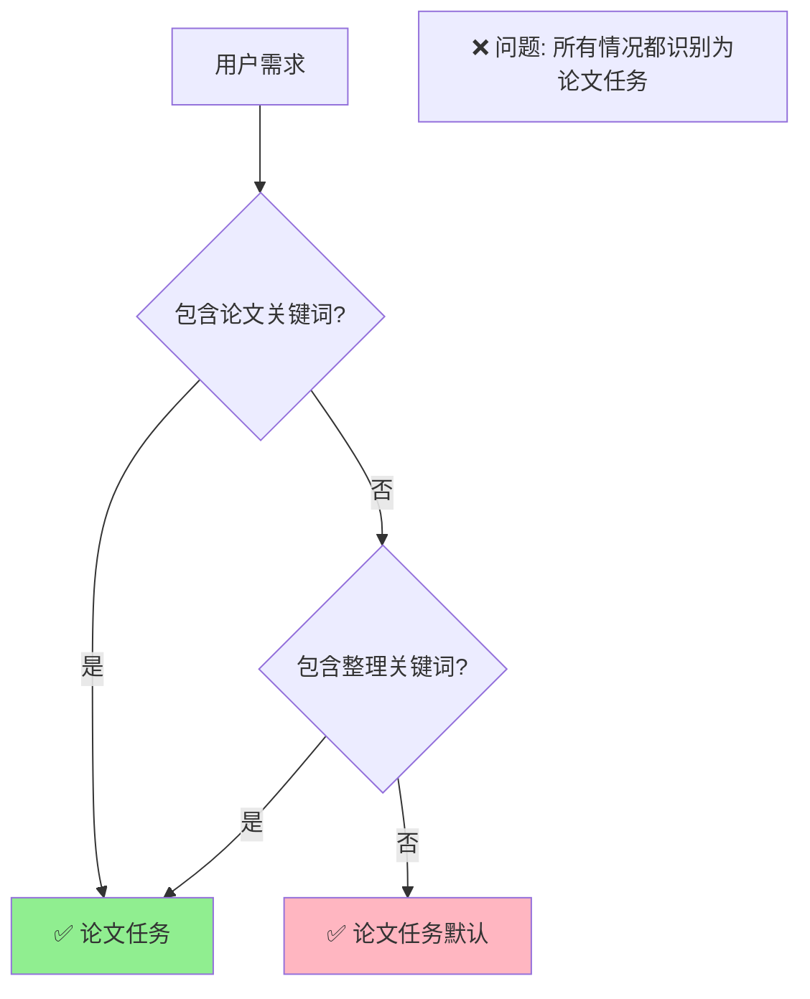
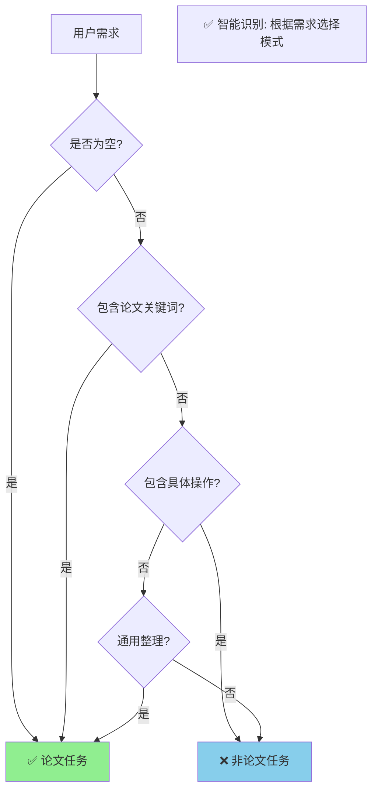
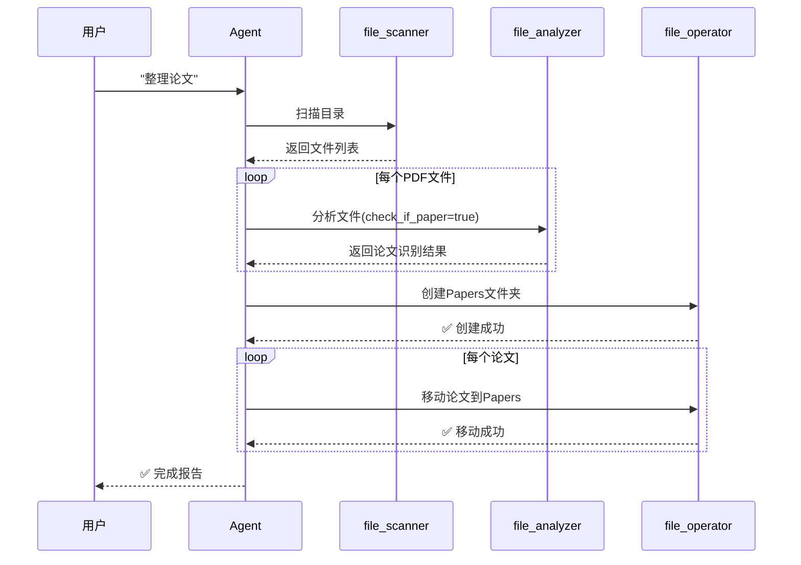
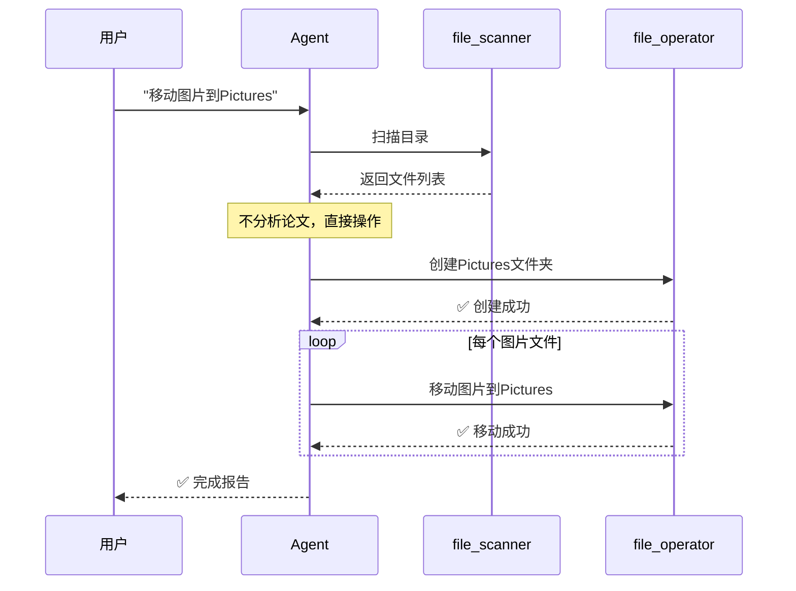

# 修复可视化指南 📊

## 问题 1: Interactive 模式修复

### 修复前 ❌


### 修复后 ✅


---

## 问题 2: 任务识别修复

### 修复前 ❌



### 修复后 ✅



---

## 执行流程对比

### 论文任务流程 📚



### 非论文任务流程 📁



---

## 关键词识别矩阵

### 论文任务关键词 ✅

```
┌─────────────────────────────────────┐
│   论文任务触发词                     │
├─────────────────────────────────────┤
│ • 论文 / paper                      │
│ • 学术 / academic                   │
│ • 文献 / literature                 │
│ • 研究 / research                   │
├─────────────────────────────────────┤
│   默认触发（无具体操作时）           │
├─────────────────────────────────────┤
│ • 整理 / organize                   │
│ • 分类 / classify                   │
│ • 组织 / tidy                       │
│ • （空需求）                        │
└─────────────────────────────────────┘
```

### 非论文任务关键词 ❌

```
┌─────────────────────────────────────┐
│   非论文任务触发词                   │
├─────────────────────────────────────┤
│ 操作类                              │
│ • 移动 / move                       │
│ • 复制 / copy                       │
│ • 压缩 / zip                        │
├─────────────────────────────────────┤
│ 文件类型                            │
│ • 图片 / image / photo              │
│ • 视频 / video                      │
│ • 音乐 / music / audio              │
│ • 代码 / code                       │
│ • 文档 / documents                  │
└─────────────────────────────────────┘
```

---

## 三种模式对比表

```
┌──────────┬─────────────┬──────────────┬─────────────┐
│   特性   │   agent     │ interactive  │  organize   │
├──────────┼─────────────┼──────────────┼─────────────┤
│   后端   │ Agent ⚡    │ Agent ⚡     │ Adapter 🛡️ │
├──────────┼─────────────┼──────────────┼─────────────┤
│ 执行方式 │ 自动执行    │ 自动执行     │ 需要确认    │
├──────────┼─────────────┼──────────────┼─────────────┤
│ 交互次数 │ 单次        │ 多轮循环     │ 单次        │
├──────────┼─────────────┼──────────────┼─────────────┤
│ 任务识别 │ ✅ 智能     │ ✅ 智能      │ ❌ 无       │
├──────────┼─────────────┼──────────────┼─────────────┤
│ 操作预览 │ ❌ 无       │ ❌ 无        │ ✅ 有       │
├──────────┼─────────────┼──────────────┼─────────────┤
│ 推荐场景 │ 一次性任务  │ 探索性整理   │ 谨慎模式    │
└──────────┴─────────────┴──────────────┴─────────────┘

图例：⚡ LangChain Agent  🛡️ 传统 AI Adapter
```

---

## 用户需求示例

### ✅ 会识别为论文任务

```
┌──────────────────────────────────────────┐
│ "整理论文"                               │
│ "整理这些学术文献"                       │
│ "organize papers"                        │
│ "整理这些文件"      ← 默认行为           │
│ "分类"              ← 默认行为           │
│ （直接回车）        ← 默认行为           │
└──────────────────────────────────────────┘
         ↓
   📚 论文整理模式
         ↓
   识别论文 + 移动到 Papers/
```

### ❌ 不会识别为论文任务

```
┌──────────────────────────────────────────┐
│ "移动图片到Pictures"                     │
│ "把PDF移动到Documents"                   │
│ "复制所有代码文件"                       │
│ "整理音乐文件"                           │
│ "压缩视频"                               │
└──────────────────────────────────────────┘
         ↓
   📁 通用整理模式
         ↓
   直接按需求执行，不识别论文
```

---

## 测试检查清单

### ✅ Interactive 模式修复验证

- [ ] 运行 `smart-tidy interactive ./test_files`
- [ ] 输入需求后看到 "Agent正在工作中..."
- [ ] 看到 "✓ 完成！" 和 Agent 报告
- [ ] 检查文件系统，文件被移动
- [ ] 不再看到 "没有需要执行的操作"

### ✅ 任务识别修复验证

- [ ] 运行 `smart-tidy agent ./test_files --request "移动图片"`
- [ ] 不看到 "任务类型：学术论文整理"
- [ ] 不看到 "识别论文" 或 "check_if_paper"
- [ ] 直接创建目标文件夹并移动文件
- [ ] 运行 `smart-tidy agent ./test_files --request "整理论文"`
- [ ] 看到 "任务类型：学术论文整理"
- [ ] 看到论文识别流程

---

## 修复时间线

```
2026-01-26
    │
    ├─ 10:00  发现 Interactive 模式不执行
    │         原因：使用旧 AI Adapter
    │
    ├─ 11:00  修复 Interactive 模式
    │         改用 LangChain Agent
    │
    ├─ 12:00  发现任务识别过于激进
    │         原因：默认总是论文任务
    │
    ├─ 13:00  修复任务识别逻辑
    │         添加具体操作关键词检测
    │
    └─ 14:00  ✅ 所有修复完成
              创建文档和测试指南
```

---

## 快速诊断

### 如何判断修复是否成功？

#### 测试 1: Interactive 执行
```bash
uv run smart-tidy interactive ./test_files
```

| 看到这个 | 状态 |
|---------|------|
| "没有需要执行的操作" | ❌ 未修复 |
| "✓ 完成！" + Agent报告 | ✅ 已修复 |

#### 测试 2: 任务识别
```bash
uv run smart-tidy agent ./test_files --request "移动图片"
```

| 看到这个 | 状态 |
|---------|------|
| "任务类型：学术论文整理" | ❌ 未修复 |
| "check_if_paper: true" | ❌ 未修复 |
| 直接创建文件夹和移动 | ✅ 已修复 |

---

**所有修复已完成！请测试验证。** ✅
